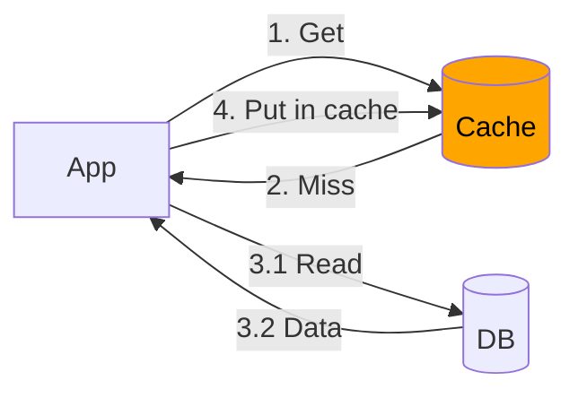
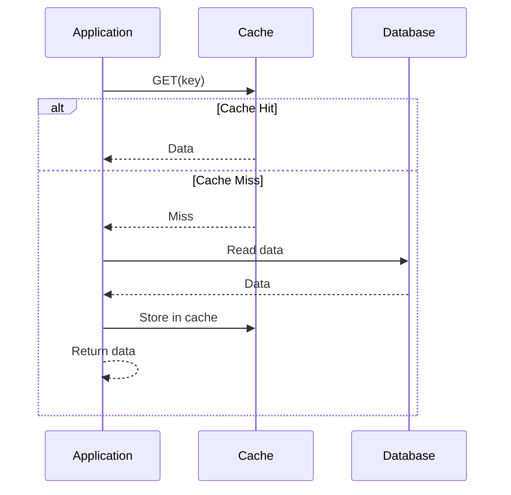
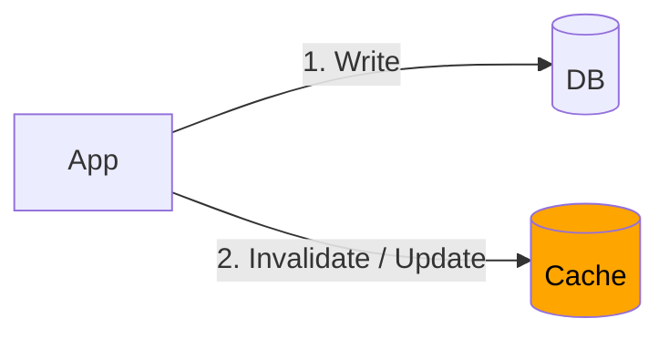
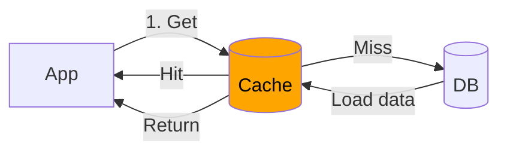
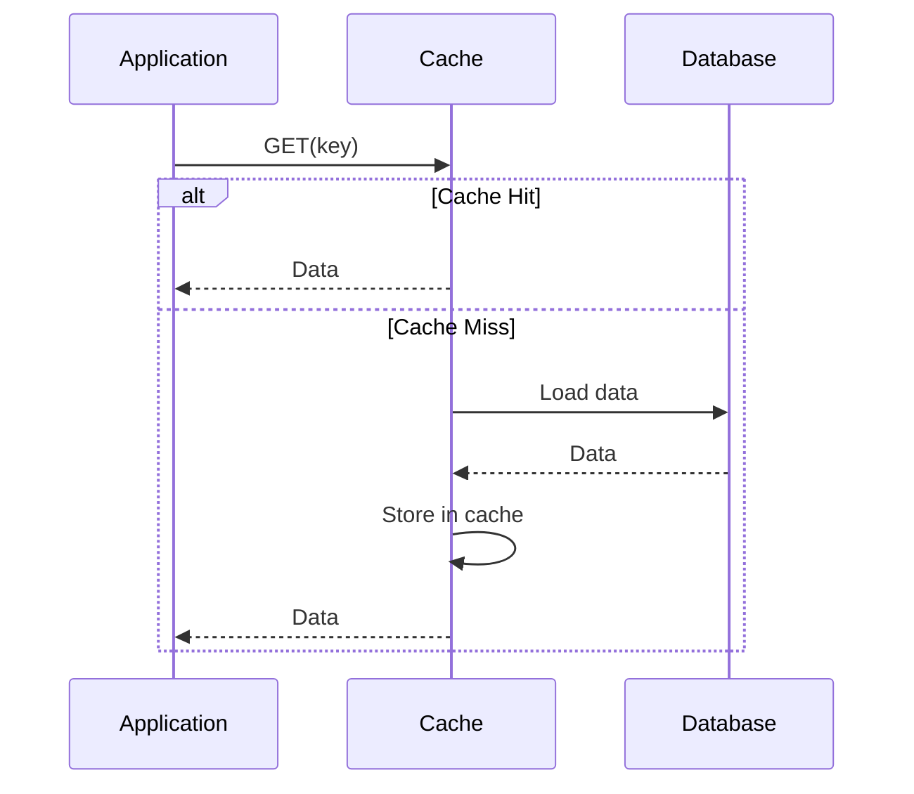
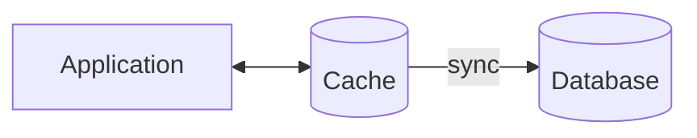
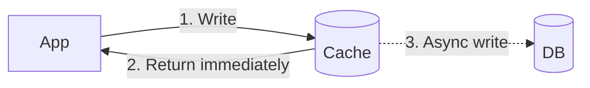

# Core building block : Caching
- https://academy.bytemonk.io/products/system-design-mastery-beta/categories/2158360644/posts/2190592600
--- 
## Overview
- [REST api_caching](../SD_08_API-Design/04_api_design_06_caching.md)
- Act as **high-speed data storage layer.**
- Definition:
  - storing frequently used data in a **different location**  
  - other from the original data source
  - to provide faster data access.
  - Reduce response time

**candidate for cache**
  - ideal for **static or immutable data**, 
    - for Dynamic data, its complex andneed to efficiently design system to:
      - `synchronize data` across multiple locations
      - `invalidate cache.`
  - if **single entity** reads or writes data
  - if **consistency or staleness** of data is not a major concern. like social-media post.👈
    - else, design a system to properly **invalidate** stale data


**When Caching is Helpful** 
- Minimizing/avoid frequent Network Calls**
- Speeding Up Computationally Expensive Operations**
- Preventing Database Overload (Data Hotspots)**
    - When many clients (e.g., millions of users) try to access the same popular data
    - reducing read requests on Database

---
## Caching pattern

```
Cache-Aside   → App manages cache
Read-Through  → Cache manages reads
Write-Through → Cache writes DB immediately
Write-Behind  → Cache writes DB later
Refresh-Ahead → Cache refreshes before expiry
```

| # | Pattern                       | Read Flow                                            | Write Flow                                    | Best Use                            | Main Risk                                |
| - | ----------------------------- | ---------------------------------------------------- | --------------------------------------------- | ----------------------------------- | ---------------------------------------- |
| 1 | **Cache-Aside**               | App checks cache → on miss read DB → put in cache    | App writes DB, then invalidates/updates cache | Most common general-purpose pattern | Stale cache / cache miss latency         |
| 2 | **Read-Through**              | App reads cache → cache itself loads from DB on miss | Usually separate write strategy               | Simplifies application code         | Cache layer becomes smarter/more complex |
| 3 | **Write-Through**             | Normal cache read                                    | Write cache → cache synchronously writes DB   | Stronger cache/DB consistency       | Higher write latency                     |
| 4 | **Write-Behind / Write-Back** | Normal cache read                                    | Write cache first → DB updated asynchronously | Very high write throughput          | Data loss if cache fails before DB write |
| 5 | **Refresh-Ahead**             | Cache refreshes hot data before TTL expires          | Usually combined with another pattern         | Predictable hot-read workloads      | Wasted refreshes / complexity            |

- Cache-Aside vs Read-Through, They look similar. The main difference is who talks to the database. 👈

### 1. cache Aside
> The **application** manages the cache miss.

Read




Write



### 2. Read-Through
> The **cache layer** fetches the data itself.

Read





### 3.1 Write-Through Cache
- When data is edited, the system writes the data to both :
    - the cache
    - the main database, **at the same time**
- Benefit: Cache and database are always in **sync**.
- Downside: **Doesn't minimize network calls**, as the database is always hit.



### 3.2  Write-Back/behind Cache
- When data is edited, the system  updates
    - the cache **immediately** + sends a response back to the client (non-blocking)
    - The database is updated **asynchronously** at a later time.
        - (e.g., randomly, scheduled every 30 seconds or 5 minutes).
- Benefit: **Faster** response to the client, because the database isn't immediately touched.
- Downside: The cache and database can **temporarily be out of sync, with stale data**.



---
## Where can Caching be Placed
### 1. Hardware Level
- CPU caches are built into hardware for faster data retrieval from memory.
- This is generally out of scope for software engineers

### 2. Client Level
- The client can store data to avoid going to the server.
- `redux`

### 3. Server Level 
### **3.1. centralized** cache
- ensuring a single source of truth
- single point of failure | SPF
- simplicity
- limited scaling

 

#### **3.2. local cache of each node**


#### [3.3. Distributed caching](../SD_06_Distributed-system/02_01_distributed-caching.md)
- fault-tolerant
- scalable
- serves the response from closest cache-node, thus improved performance
- Also suitable for session management
- **Redis** is beyond just being cache

---
## Caching Invalidation
we dont want stale data in cache
- Write-Through Cache, invalidate the old data as well, sync 👈🏻
- Write-Back Cache,invalidate the old data as well, Async 👈🏻
- TTL based eviction

---
## Cache Eviction Policies 
> Since cache memory is limited, have to free-up space

### **Least Recently Used (LRU):** 
- Removes the data that hasn't been accessed for the longest time
- oldest one

### **Least Frequently Used (LFU):** 
- Removes data that has been accessed the fewest times (4:07).
- rarely used

### **Last-In, First-Out (LIFO)**

### **First-In, First-Out (FIFO)** 

### **random eviction**

