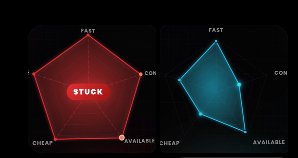
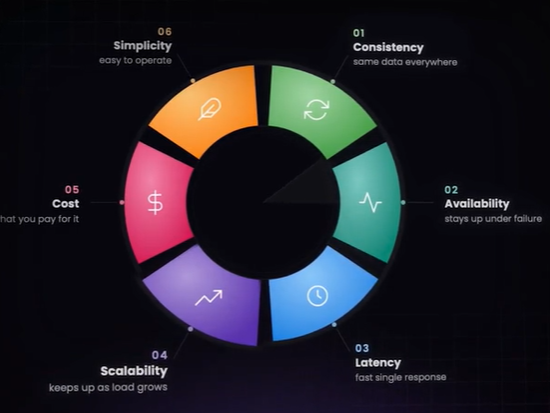
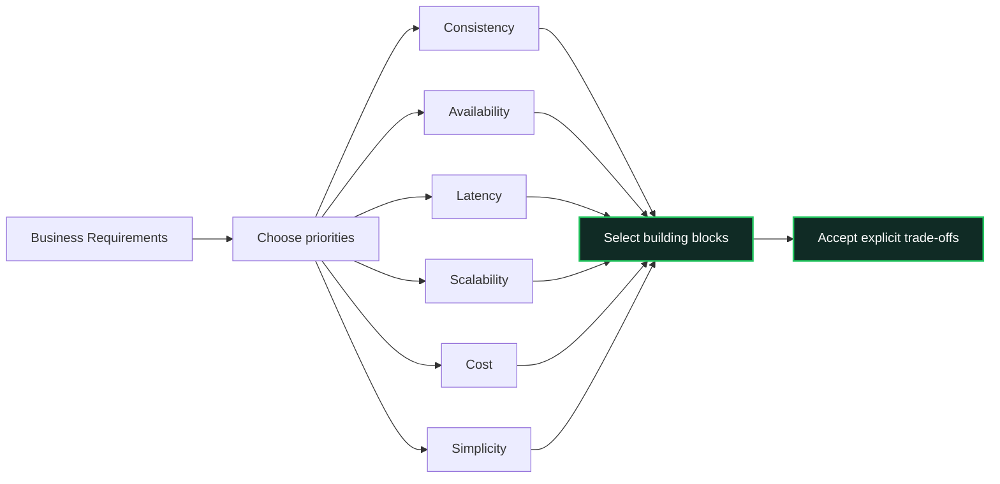

# TradeOff
- https://academy.bytemonk.io/products/system-design-mastery-beta/categories/2158360644/posts/2198441287
## Overview
- A real engineer does not try to memorize every database, cache, queue, or architecture pattern. 
- They learn how each building block changes the system’s trade-off.
- ASK: **What are we optimizing for, and what are we willing to sacrifice?**

⭐Every design decision should answer these 4:
- What problem does this solve?
- What does it improve?
- What does it make worse?
- Is that trade-off acceptable for this use case?

---
## List of common tradeoff
- Dont need to remember all, they are 100s.
- All fall under below `6 dimensions`

| Optimize for          | Likely trade-off                                        |
| --------------------- | ------------------------------------------------------- |
| High availability     | Higher infrastructure cost and complexity               |
| Strong consistency    | Higher latency and lower availability during partitions |
| Low latency           | More caching, stale data, and operational complexity    |
| Fault tolerance       | Redundant infrastructure and higher cost                |
| Low cost              | Lower redundancy, capacity, or performance              |
| High write throughput | More difficult reads, indexing, and consistency         |
| High read throughput  | Replicas, caching, and possible stale reads             |
| Simple architecture   | Limited scalability and flexibility                     |
| Global distribution   | Replication delay and conflict resolution               |
| Strong security       | More authentication overhead and development complexity |

## Tradeoff dimension (6)
eg: CAP is C vs A

| Dimension    | Core question                                  |
| ------------ | ---------------------------------------------- |
| Consistency  | Do users see the same/correct data?            |
| Availability | Does the system remain usable during failures? |
| Latency      | How quickly does it respond?                   |
| Scalability  | Can it handle growth?                          |
| Cost         | What resources and money does it consume?      |
| Simplicity   | How easy is it to build, operate, and change?  |