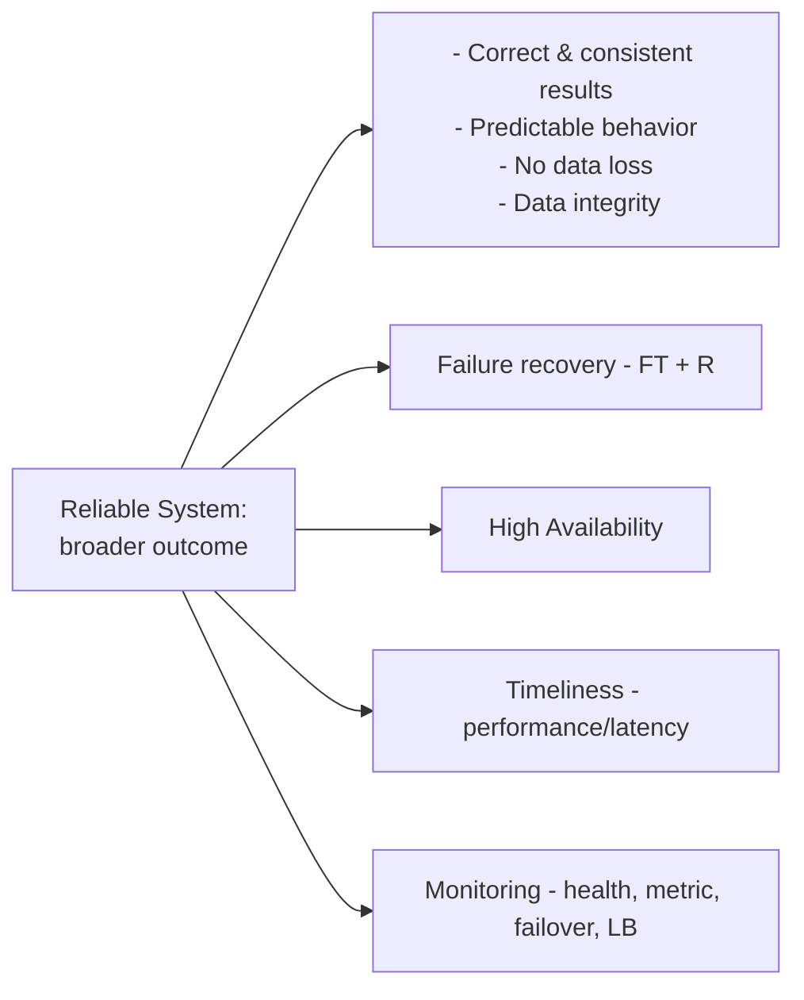
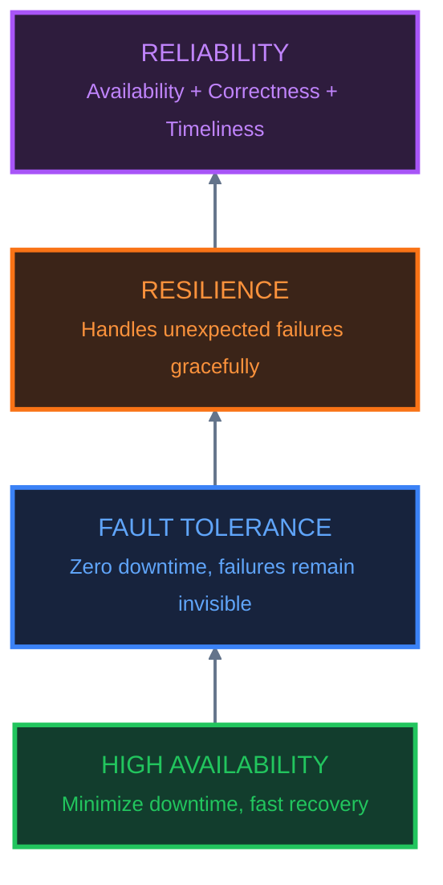

# Reliable System
## ✔️Overview
* **Core Definition:** Reliability is the **overall outcome**—ensuring the system consistently meets operational standards under normal and adverse conditions.
* **Key Pillars:**
    * **Correctness & Consistency:** Delivering accurate results with zero data loss and high data integrity.
    * **Timeliness:** Maintaining low latency and high performance.
    * **Failure Recovery:** Utilizing Fault Tolerance (FT) and Resilience (R) strategies.
    * **Continuous Monitoring:** Leveraging health checks, metrics, failover mechanisms, and load balancing.


### Correctness
- [02_NFR_04_consistency.md](02_NFR_04_consistency.md)
- [02_NFR_05_Durability.md](02_NFR_05_Durability.md)

### Availability
- [02_NFR_01_Availability.md](02_NFR_01_Availability.md)
- [02_NFR_03_Scaling.md](02_NFR_03_Scaling.md)

### Timeliness
- [02_NFR_02_Performance.md (latency,etc)](02_NFR_02_Performance-latency.md)
- [02_NFR_06_ReadWrite-ratio.md](02_NFR_06_Read-Write-ratio.md)

### Failure recovery
- [02_NFR_07_fault-tolerance.md](02_NFR_07_fault-tolerance__.md)
- [02_NFR_07_resiliency.md](02_NFR_07_resiliency__.md)

---
## ✔️Levels
> **Key Engineering Takeaway:** *The role of an engineer is to choose the right level of reliability for the specific business requirements rather than over-engineering.*

```
Each level adds (cost and complexity) 💲
⭐Engineer job : choose right level for requiremnet

High Availability   -------
        ↓
Fault Tolerance     --------------
        ↓
Resilience          ---------------------
        ↓
Reliability         ---------------------------------------
```
