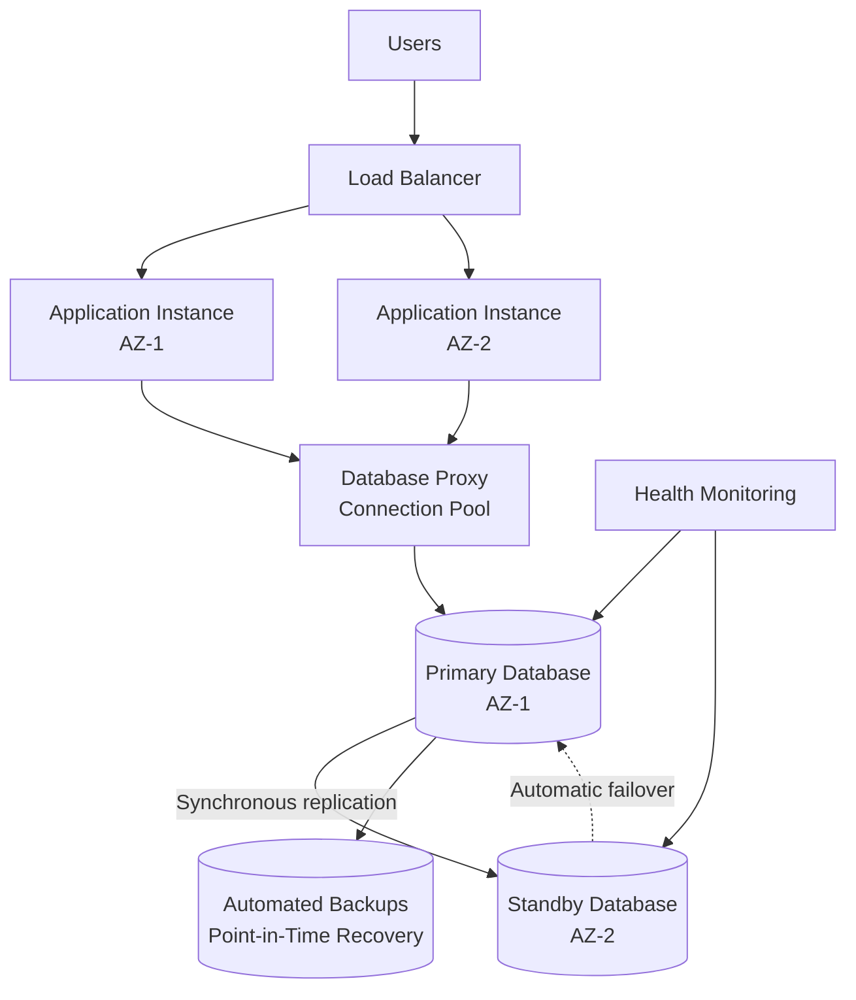
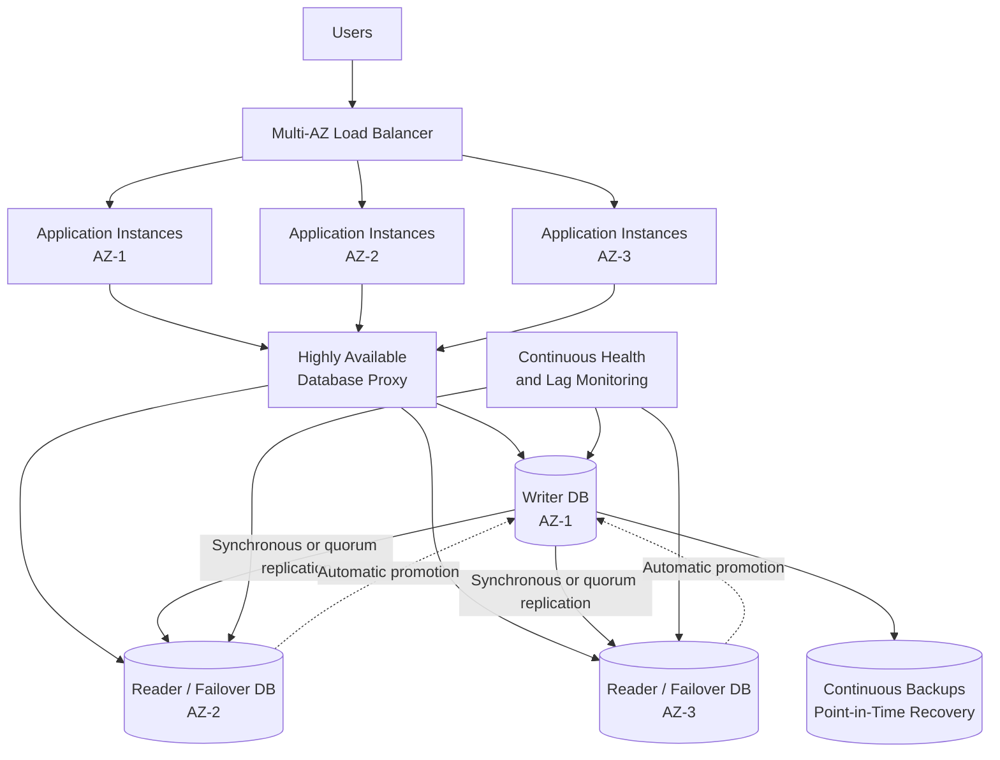
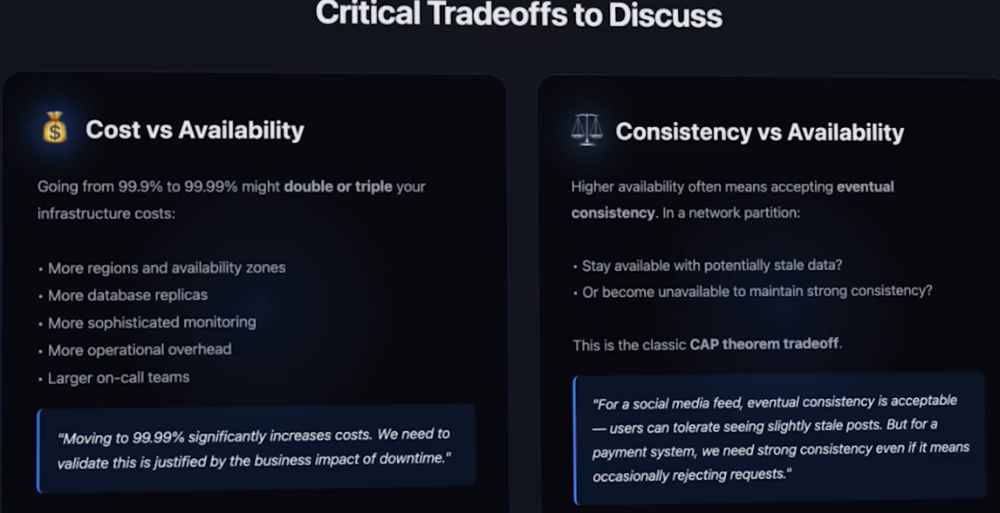

# NFR (non functional requirement)
> every decision has tradeoff ⭐
---
## BIG-1 of 3. Availability
> Availability: Can the system serve requests right now?
> Reliability: Does the system consistently produce correct results over time?
> Durability: Will stored data survive failures?

### Overview
- fundamentally shape entire arch. very important
- def: system remains accessible and can successfully serve requests
- Availability = Uptime / Total time × 100

| Availability | Approximate downtime **per year** |
| ------------ | ----------------------------: |
| 99%          |               3 days 15 hours |
| 99.9%        |            8 hours 46 minutes |
| 99.99%       |                    52 minutes |
| 99.999%      |                     5 minutes |

---
### concepts: SLA, SLI, SLO
```
SLI = What are we measuring?
SLO = What target do we want?
SLA = What have we contractually promised?
```
| Term    | Meaning                                                               | Example                                                                  |
| ------- | --------------------------------------------------------------------- | ------------------------------------------------------------------------ |
| **SLI** | **Service Level Indicator** — the actual measurement                  | API availability is **99.93%**                                           |
| **SLO** | **Service Level Objective** — the internal reliability target         | API availability should be **≥ 99.9% per month**                         |
| **SLA** | **Service Level Agreement** — the contractual commitment to customers | If availability falls below **99.5%**, customers receive service credits |

---
### Example: Improve Database availability
> Note: Database availability is not the same as system availability.
> if the application, load balancer, and database are each 99.99% available.
> then 0.9999 × 0.9999 × 0.9999 ≈ `99.97%`

#### Achieving 99.00%–99.95%
- A standard Multi-AZ primary/standby architecture is usually sufficient.

```
Application instances
        |
   DB proxy/pool
        |
 Primary DB — synchronous replication — Standby DB
    AZ-1                              AZ-2
    
Primary database and promotable standby in separate AZs
Synchronous replication
Automatic failure detection and failover | Database health monitoring and alerts
Automated backups and point-in-time recovery | Tested backup restoration
Connection pooling and automatic connection retries
Rolling or scheduled maintenance
A read replica alone does not guarantee availability. It must be capable of being promoted, preferably automatically.
```


#### Achieving 99.95%–99.99%
```
                  Applications
                       |
              Highly available DB proxy  
                       |
        ┌──────────────┼──────────────┐
        │              │              │
     DB node         DB node        DB node
      AZ-1            AZ-2           AZ-3
        └──────── Quorum replication ────────┘

Database cluster distributed across three AZs + cross region (Active-Active)
handle eventual consistency (tradeoff)
Quorum-based or synchronous replication
Continuous replication-lag monitoring

Automated failover within seconds
Multiple eligible failover targets
Regular failover and disaster-recovery testing

Application retries with exponential backoff and jitter
Highly available database proxy
Idempotent write operations
Circuit breakers and request timeouts
```
```
      Primary region
            |
      Cross-region replication
            |
      Secondary region
      
      Cross-region replication may introduce a non-zero RPO because,
      some recent writes can be lost during an abrupt regional failure.
```

---
### Tradeoff


---
### mistake:
- Dont skip to ask for avialabilty
- Over-engineer: if 99.0 is suffice needs, then dont waste infrastructure cost on 99.99
- SPF [01_concept_02_SFP.md](../SD_22_Resilient/01_concept_02_SFP.md)
- Also discuss the availability of the dependent components (3rd party API, Message broker, etc)
- dont confuse SLA,SLO,SLI
---
### More Example to improve availability 
- Remove single points of failure
  ```
  [ User → One server → One database ] --> AVOID
  
    User
    ↓
    Load Balancer
    ↓
    Multiple application instances
    ↓
    Primary database + replica
  ```
- Redundancy
- Health checks and failover
- Horizontal scaling
- Graceful degradation: If one feature fails, the whole system should not fail.
  ```
    Recommendation service unavailable
    ↓
    Show products without recommendations
  ```
- Resilience patterns
  ```
    Timeouts
    Retries with exponential backoff | uncontrolled retries can make an outage worse.
    Circuit breakers
    Bulkheads
    Rate limiting
    Message queues for asynchronous processing | worker
  ```


