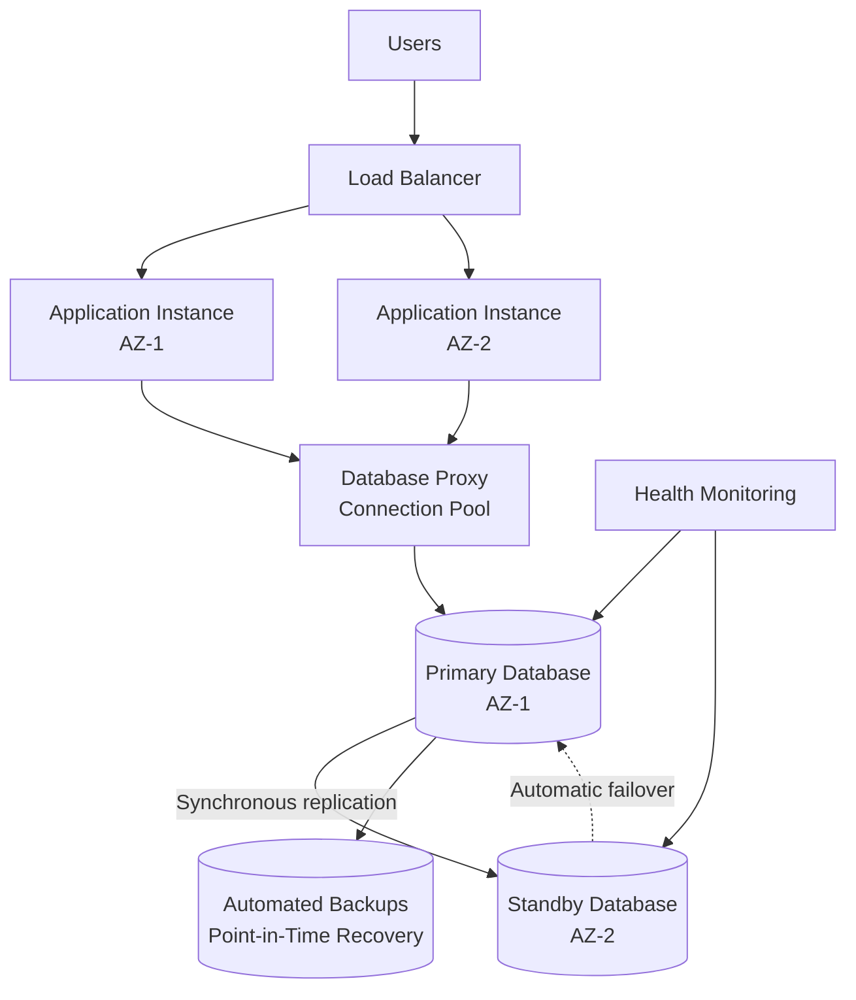
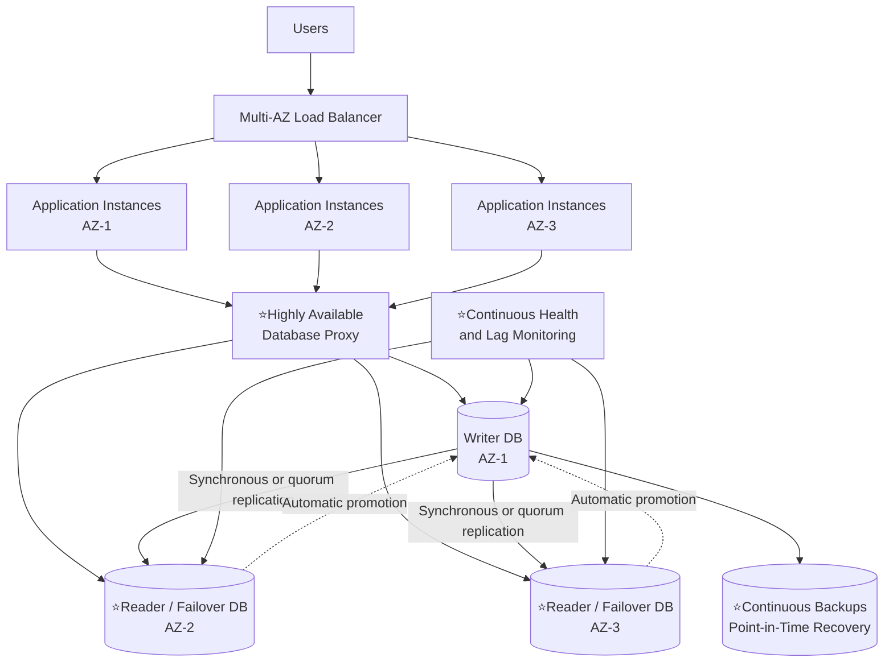

> NFR (non functional requirement) 3 Big fundamental drivers
> - every decision has tradeoff ⭐
> -    
---

# BIG-1 of 3. Availability
- https://chatgpt.com/g/g-p-6a68d3926dd4819180c1c9bf855e98f3/c/6a685942-dc2c-83e8-9507-c227af952455
- https://academy.bytemonk.io/products/system-design-mastery-beta/categories/2158857209/posts/2192532087

---
## Overview
- fundamentally shape entire arch. very important
- def: system remains accessible and can successfully serve requests
- Availability = Uptime / Total time × 100
- Highly availability achieve by : 👈
  - multi-AZ, multip-region deployment
  - fast-failover (can have some downtime but received)
  - Note: fault-tolerant system has 0 downtime

| Availability | Approximate downtime **per year** |
| ------------ | ----------------------------: |
| 99%          |               3 days 15 hours |
| 99.9%        |            8 hours 46 minutes |
| 99.99%       |                    52 minutes |
| 99.999%      |                     5 minutes |

- each component/layer in system has its own Availability
> - Database availability is not the same as system availability.
> - if the application, load balancer, and database are each 99.99% available.
> - then 0.9999 × 0.9999 × 0.9999 ≈ `99.97%`

---
## concepts: SLA, SLI, SLO
```
SLI = What are we measuring?
SLO = What target do we want?
SLA = What have we contractually promised?
```
| Term    | Meaning                                                               | Example                                                                  |
| ------- | --------------------------------------------------------------------- | ------------------------------------------------------------------------ |
| **SLI** | **Service Level Indicator** — the actual measurement                  | API availability is **99.93%**                                           |
| **SLO** | **Service Level Objective** — the internal reliability target         | API availability should be **≥ 99.9% per month**                         |
| **SLA** | **Service Level Agreement** — the contractual commitment to customers | If availability falls below **99.5%**, customers receive service credits |

---
## Example 1: Database availability
### Achieving 99.00%–99.95%
- A standard Multi-AZ primary/standby architecture is usually sufficient.

```
Application instances
        |
   DB proxy/pool
        |
 Primary DB — synchronous replication — Standby DB
    AZ-1                              AZ-2
    
Primary database and promotable standby in separate AZs
Synchronous replication
Automatic failure detection and failover | Database health monitoring and alerts
Automated backups and point-in-time recovery | Tested backup restoration
Connection pooling and automatic connection retries
Rolling or scheduled maintenance
A read replica alone does not guarantee availability. It must be capable of being promoted, preferably automatically.
```


### Achieving 99.95%–99.99%
```
                  Applications
                       |
              Highly available DB proxy  
                       |
        ┌──────────────┼──────────────┐
        │              │              │
     DB node         DB node        DB node
      AZ-1            AZ-2           AZ-3
        └──────── Quorum replication ────────┘

Database cluster distributed across three AZs + cross region (Active-Active)
handle eventual consistency (tradeoff)
Quorum-based or synchronous replication
Continuous replication-lag monitoring

Automated failover within seconds
Multiple eligible failover targets
Regular failover and disaster-recovery testing

Application retries with exponential backoff and jitter
Highly available database proxy
Idempotent write operations
Circuit breakers and request timeouts
```
```
      Primary region
            |
      Cross-region replication
            |
      Secondary region
      
      Cross-region replication may introduce a non-zero RPO because,
      some recent writes can be lost during an abrupt regional failure.
```


---
## Example 2: Application/system
- Remove single points of failure
  ```
  [ User → One server → One database ] --> AVOID
  
    User
    ↓
    Load Balancer
    ↓
    Multiple application instances
    ↓
    Primary database + replica
  ```
- Redundancy
- Health checks and failover
- Horizontal scaling
- Graceful degradation: If one feature fails, the whole system should not fail.
  ```
    Recommendation service unavailable
    ↓
    Show products without recommendations
  ```
- Resilience patterns
  ```
    Timeouts
    Retries with exponential backoff | uncontrolled retries can make an outage worse.
    Circuit breakers
    Bulkheads
    Rate limiting
    Message queues for asynchronous processing | worker
  ```

---
## Tradeoff
- data layer --> cost + data consistency [more](02_NFR_04_consistency.md)
- application layer --> cost


---
## 🙏Interview
### Mistake
- 99.9, 99.99, 99.999, etc --> dont confuse.
- **Don't skip** to ask for availability + (SLA,SLO,SLI) for each component:
  - dependent components (3rd party API, Message broker, etc)
  - Database layer
  - Application layer
- **Over-engineer**: 
  - if `99.0` is sufficed needs, 
  - then don't waste infrastructure cost on `99.99`, etc
- **SPF** [01_concept_02_SFP.md](../SD_22_Reliability/01_concept_02_SFP.md) --> eg: no point of running expensive infra, exposed by single LB.
- 

