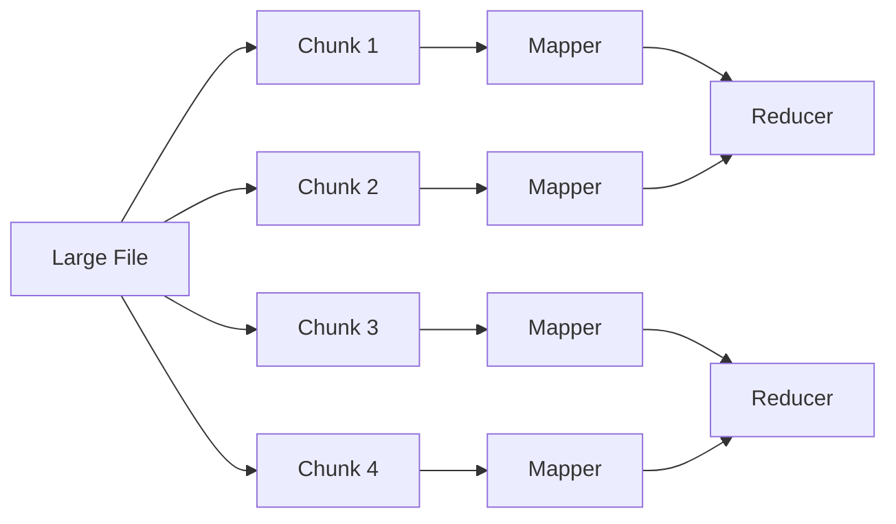
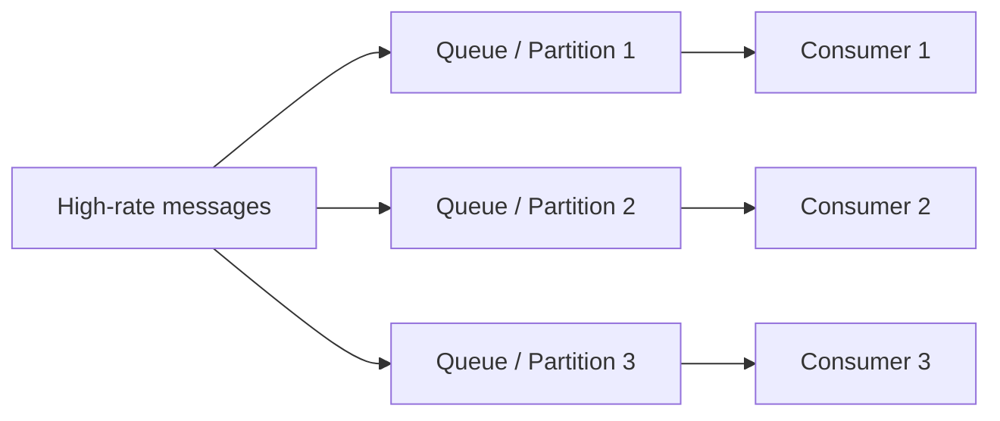
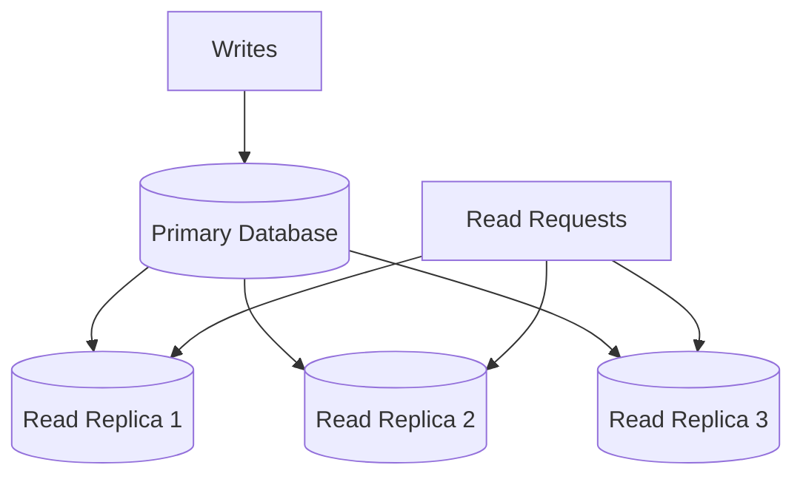

# BIG-2 of 3: Performance: Throughput
- [02_NFR_02_Performance-latency.md](02_NFR_02_Performance-latency.md)
---
## A. Overview
- measure capacity: the amount of work a computer can perform within a given time.
- Operations completed per unit time
- example:  data transferred per second, no of http req per sec
- Bitrate - use to measure video streaming.

---
## B. key relationShip
| Metric     | Meaning                                | Example                |
| ---------- |----------------------------------------| ---------------------- |
| Latency    | Time taken by one operation            | API responds in 200 ms |
| Throughput | Operations completed per unit time     | 5,000 requests/second  |
| Bandwidth  | Maximum theoretical capacity. bits/sec ||

```
A system can have:
    High throughput and low latency
    High throughput and high latency
    Low throughput and low latency
    Low throughput and high latency  

>>> System processes 10,000 requests/second,but every request takes 5 seconds.
```
---
## C. Improve throughput
### 1. reduce latency
- if reduce latency, then in same time can handle more requests.

### 2. Parallelisation
**💠MapReduce**
- Benefit: lower processing time and higher throughput.
- Trade-off: coordination, partitioning and aggregation complexity.


**💠Queue scaling**
- Add More Consumer/workers
- distributed MS system === each kafka partition as a queue


### 3. improve network bandwidth
- rate of data transfer `bits/sec`
- in real word, bandwidth (theory) == throughput(actual) 👈

### 4. scaling 
**💠Scale Read Throughput**
- a leader handles write +  replica/s handles reads
- can also be part of parallelisation
- trade-off > replication lags

---
## 🙏interview
### Ask these discuss
| Steps |    What to discuss                                |
|-------| -------------------------------------------------- |
| 1     | Clarify latency, throughput, payload and geography |
| 2     | Identify network, server and client bottlenecks    |
| 3     | Parallelize independent work                       |
| 4     | Scale consumers, queues or partitions              |
| 5     | Distinguish bandwidth from actual throughput       |
| 6     | Replicate data for read scaling                    |

