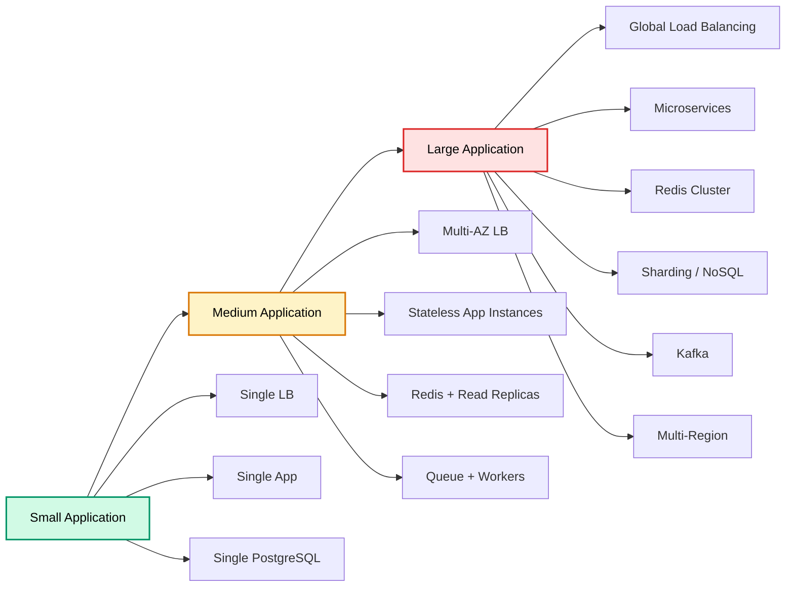
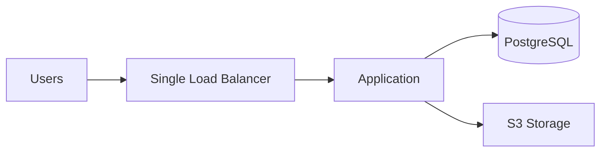
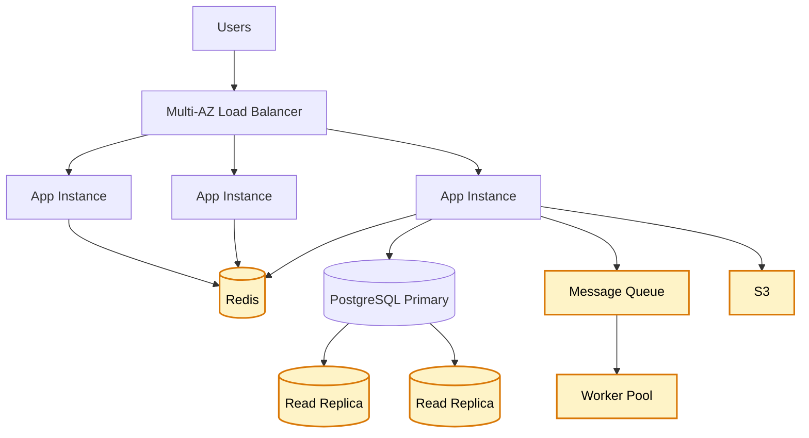
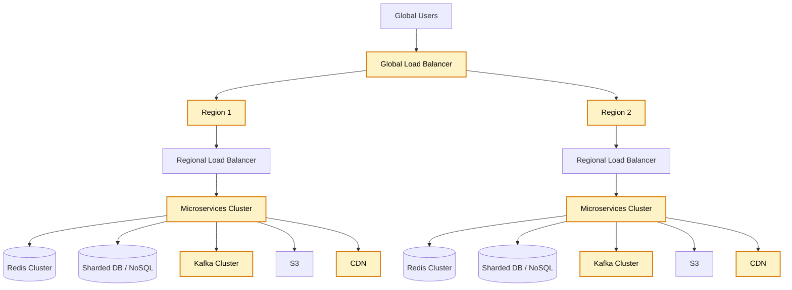
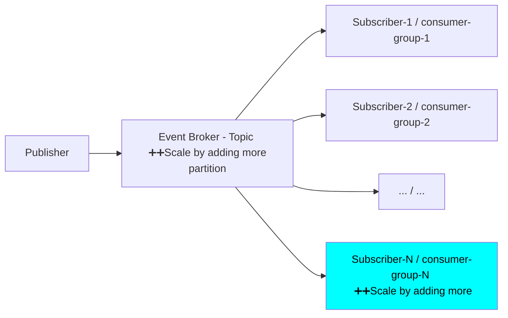

# BIG-3 of 3 | Scaling
- https://academy.bytemonk.io/products/system-design-mastery-beta/categories/2158857209/posts/2192532351
- https://chatgpt.com/g/g-p-6a68d3926dd4819180c1c9bf855e98f3-system-design-bm-acedemy/c/6a691f19-3b10-83e8-91aa-1f39e15adefc

## Overview
- Scaling means increasing a system’s capacity to **handle growth** in below:
  - Users scale (10k > 10M > 1B)
  - Data  scale (100GB > 10 TB > 1 PB)
  - Requests-Response traffic scale / Background-jobs scale (100 RPS > 10k RPS > 100k RPS)
- **plus, maintain:** 
  - Good performance/latency, 
  - High availability, 
  - Reliability, 
  - Acceptable cost
- **plus, understand growth rate**:
  - 10% / year , 3X / per, 10X per year, etc

```
Note:
- 100 M users --> 1   req/day
- 1   M users --> 100 req/day
>> looks similar in terms of capacity but totally 2 diff systems
```
---
## General Approach
1. Remember-1, Arch for 10k user, completely fall apart at 10M user.
2. Remember-2 **cost multiplication factor**: 
   - At large scale, cost explodes and becomes unmanageable. 
   - eg: 10 extra DB call in small scale stage, 
   - later multiplies at large scale stage.
3. Consider System lifecycle: **design 10x-100X from day-1**, or rebuild everything. :()
4. **Do not scale everything blindly.** 
   - Scaling is mainly a bottleneck-management problem, 
   - not just a server-count problem.
   - `so,Measure the system --> Identify the bottleneck. --> Scale the affected component. --> REPEAT`
    ```mermaid
    flowchart LR
        A[Traffic Increases] --> B[Measure System]
        B --> C[Find Bottleneck]
        C --> D{Which Layer?}
        D -->|Application| E[Add App Instances]
        D -->|Database Reads| F[Add Read Replicas]
        D -->|Database Writes| G[Partition or Shard]
        D -->|Repeated Reads| H[Add Cache]
        D -->|Heavy Processing| I[Use Queue and Workers]
    ```
## Scaling strategies by layer
| Layer               | Small Application                       | Medium Application                                 | Large Application                                                                  |
| ------------------- | --------------------------------------- | -------------------------------------------------- | ---------------------------------------------------------------------------------- |
| **Load balancing**  | Single load balancer                    | Highly available load balancer across multiple AZs | Global/geographical load balancing, regional load balancers, service-level routing |
| **Application**     | One or two application instances        | Stateless horizontal scaling with auto scaling     | Large stateless clusters, Kubernetes/ECS, independent microservice scaling         |
| **Cache**           | No cache or in-memory application cache | Single Redis, cache-aside pattern                  | Redis Cluster, partitioning, CDN, multi-layer cache, 95–99% hit rate               |
| **Database reads**  | Single PostgreSQL instance              | PostgreSQL primary with read replicas              | Multiple read replicas, distributed SQL or NoSQL for high-scale workloads          |
| **Database writes** | Single database writer                  | Table partitioning, optimized indexes, batching    | Sharding, distributed databases, content/data separation, hot/cold data storage    |
| **Async work**      | Mostly synchronous processing           | Queue with background worker pool                  | Kafka or distributed messaging, large consumer groups, millions of events/sec      |
| **Storage**         | Local disk or single S3 bucket          | S3 with lifecycle policies and CDN                 | Distributed object storage, multi-region replication, hot/warm/cold tiers          |
| **Deployment**      | Single server or simple container       | Docker with ECS/EKS and auto scaling               | Multi-cluster, multi-region, progressive deployment                                |
| **Availability**    | Single AZ acceptable                    | Multi-AZ deployment                                | Multi-region active-passive or active-active                                       |
| **Observability**   | Basic logs and metrics                  | Centralized logging, metrics, alerts               | Distributed tracing, SLOs, automated anomaly detection                             |


## Type of Application and basic arch
### small

### medium

### large


---
## Type of scaling
### Vertical Scaling
> Increase the power of a single machine.- Add more CPU, RAM, Use faster storage, Upgrade network capacity, etc

**Advantages:** 
- Simple to implement
- Minimal application changes
- Easier operations

**Limitations**
- Hardware has a maximum limit
- Can become expensive
- May remain a single point of failure
- Upgrades may require downtime

---
### Horizontal Scaling
**Advantages**
- Supports large traffic growth
- Improves fault tolerance (no SPF)
- Enables high availability
- Works well with auto-scaling

**Limitations**
- More operational complexity due to distributed nature.
  - Requires load balancing
  - Requires distributed data management (DB, cache, etc)
  - Session and consistency handling become harder

---
## Scale Cube 🧊
[01_core_06_scale-cube.md](../SD_03_Core-building-blocks/01_core_06_scale-cube.md)

---
## Scaling protects server from Death Spiral ⭐
- [death-spiral](../SD_04_protecting-servers/02_protection_00_death-spiral.md)
- [protection server:: auto-scaling.](../SD_04_protecting-servers/02_protection_01_auto-scaling.md)
