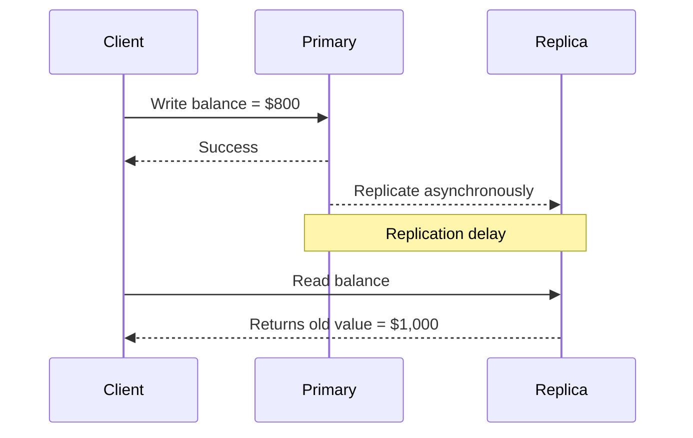
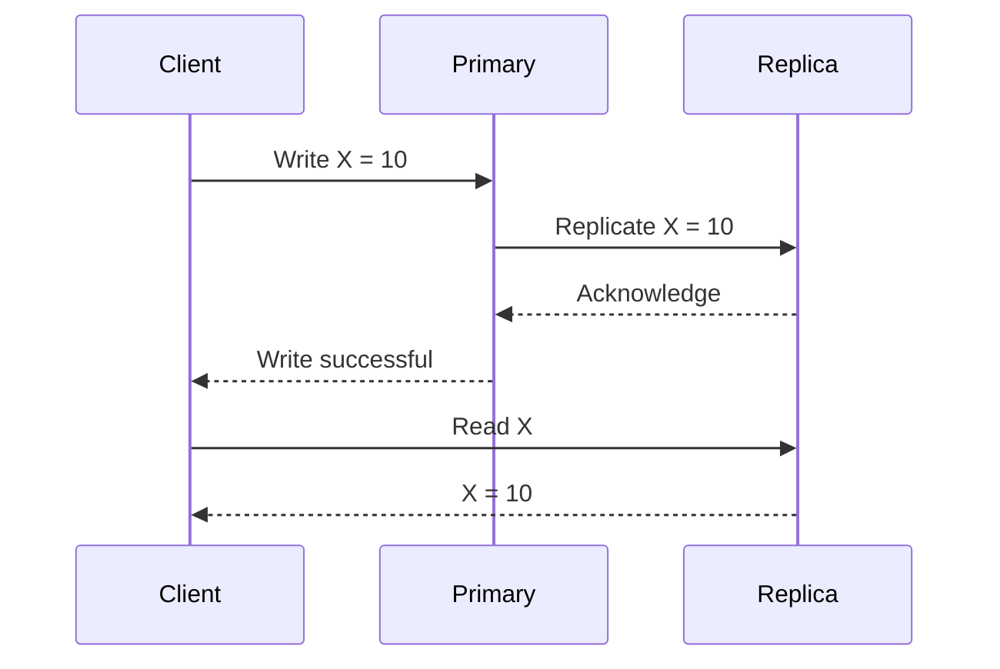
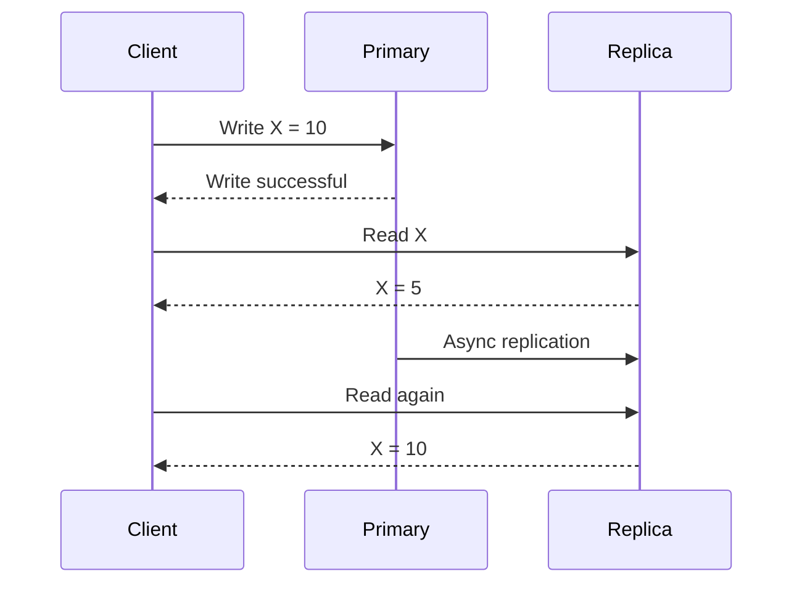
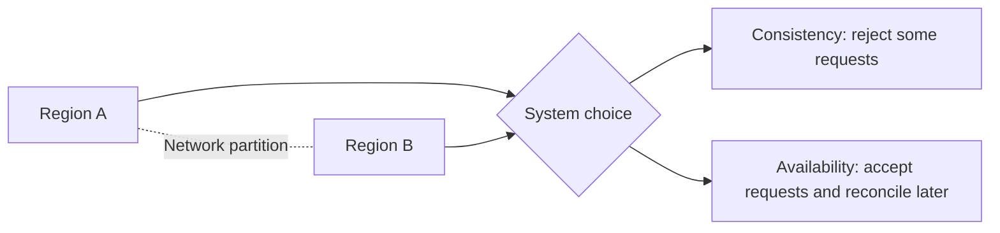
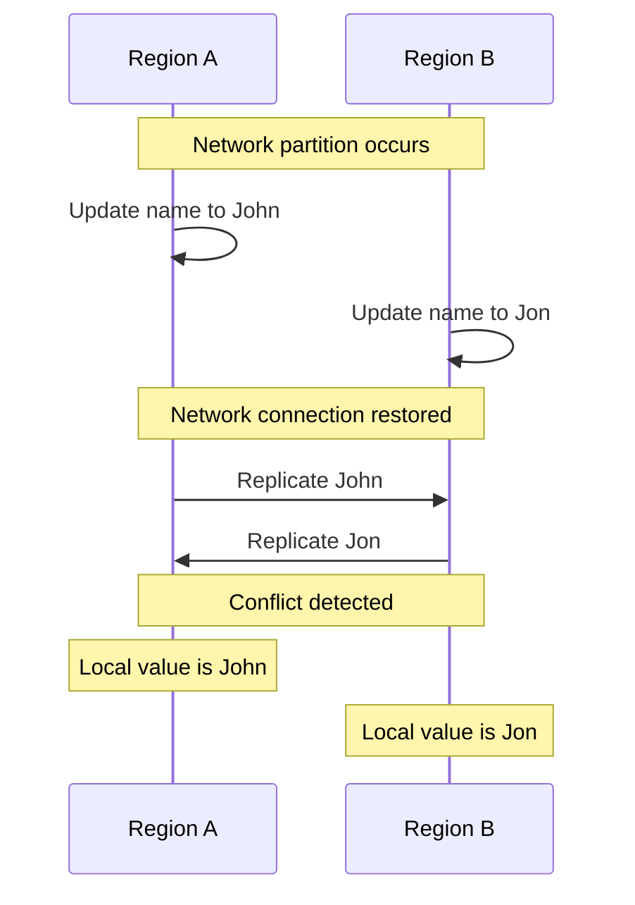

# 4. Consistency
- https://chatgpt.com/g/g-p-6a68d3926dd4819180c1c9bf855e98f3-system-design-bm-acedemy/c/6a693ba1-c418-83e8-8ae8-f0d12cce6997
- https://academy.bytemonk.io/products/system-design-mastery-beta/categories/2158857209/posts/2192532386

## Overview
- Consistency defines when a write becomes visible to other users or services.
- eventual consistency
- strong consistency

## Consistency Models (set 1)
### in-consistency

### Strong consistency  
- Every read returns the latest committed write          
- Banking, inventory reservation    

### Eventual consistency
- Replicas become consistent after some time             
- Social feeds, likes, analytics     

## Consistency Models (set 2)
| **More Model**          | Guarantee                                              | Typical use case                   |
|---------------------| ------------------------------------------------------ | ---------------------------------- |
| Read-your-writes    | A user sees their own latest updates                   | Profile update                     |
| Monotonic reads     | Once a user sees newer data, they never see older data | Notifications, dashboards          |
| Causal consistency  | Related operations appear in causal order              | Comments and replies               |
| Session consistency | Guarantees apply within one user session               | Shopping cart                      |
| Linearizability     | Operations appear atomic and globally ordered          | Distributed locks, leader election |

## Consistency versus availability
- CAP theorem: durning network partition, choose between C and A

| Priority     | System behavior                                          |
| ------------ | -------------------------------------------------------- |
| Consistency  | Reject operations that cannot be safely coordinated      |
| Availability | Accept operations, even if replicas temporarily disagree |

---
## Conflicts in Eventual Consistency
| Conflict               | Example                                   |
| ---------------------- | ----------------------------------------- |
| Concurrent update      | Two users edit the same profile           |
| Duplicate operation    | Payment request processed twice           |
| Delete-update conflict | One replica deletes while another updates |
| Ordering conflict      | Events arrive in a different order        |
| Counter conflict       | Two replicas increment the same counter   |
| Inventory conflict     | Two regions sell the final item           |

### Conflict-resolution strategies
| Strategy          | How it works                      | Trade-off                            |
| ----------------- | --------------------------------- | ------------------------------------ |
| Last write wins   | Latest timestamp wins             | Can silently lose data               |
| First write wins  | First accepted update wins        | Later valid changes are rejected     |
| Version number    | Reject update if version is stale | Client must retry                    |
| Vector clock      | Tracks concurrent versions        | More metadata and complexity         |
| Merge             | Combine compatible changes        | Requires business logic              |
| CRDT              | Data automatically converges      | Only works for suitable data models  |
| Manual resolution | User chooses the correct version  | Slow but safest for complex data     |
| Single writer     | Only one leader accepts writes    | Less availability and higher latency |

---
## Interview
- Consistency should be selected **per business operation**, not for the entire system.  👈
- Critical state transitions require stronger guarantees, 
- while derived or non-critical data can use eventual consistency for lower latency and higher availability.