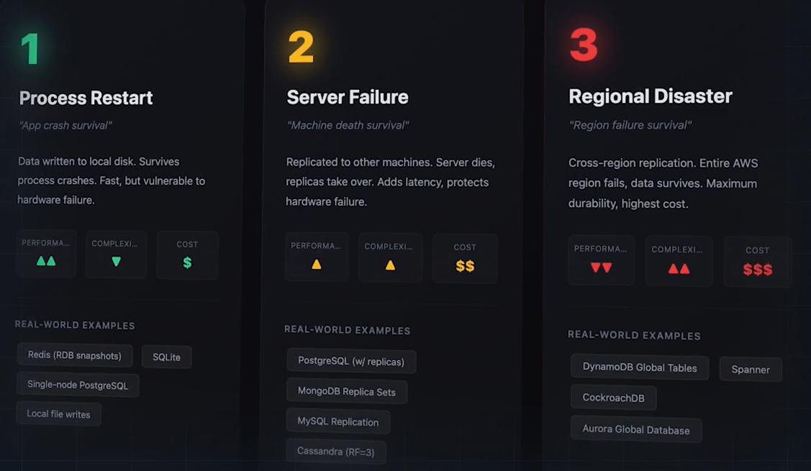
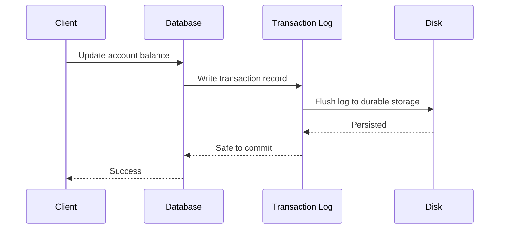
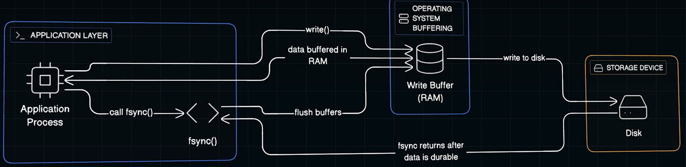

# 5. Durability
- https://chatgpt.com/g/g-p-6a68d3926dd4819180c1c9bf855e98f3-system-design-bm-acedemy/c/6a694188-a6e8-83e8-ae3b-3b1b94feb882
- https://academy.bytemonk.io/products/system-design-mastery-beta/categories/2158857209/posts/2192892094

## Overview
- Durability means that once data is successfully committed, it should not be lost—even after crashes, restarts, hardware failures, or network issues.
- A system can be:
  - **Available but not durable**: accepts writes, but loses them after restart.
  - **Durable but temporarily unavailable**: data is safe, but the database is down.

- **Recovery**

| Recovery Metric  | Meaning                                  |
|------------------| ---------------------------------------- |
| RPO              | Maximum acceptable amount of data loss   |
| RTO              | Maximum acceptable recovery time         |
| Backup retention | How long historical backups are retained |
| Replication lag  | Delay between primary and replica        |

- lower RPO/RTO has tradeoff with **10x cost + latency**

---
## Durability Level

| Durability Level | Example Architecture               | Protection             |
| ---------------- | ---------------------------------- | ---------------------- |
| Low              | In-memory storage only             | Process lifetime       |
| Basic            | Single database with disk          | Application restart    |
| Medium           | Database + WAL + backups           | Server or disk failure |
| High             | Synchronous Multi-AZ replication   | AZ failure             |
| Very high        | Multi-region replication + backups | Regional disaster      |

---

## Techniques Used to Achieve Durability
| Technique                    | Purpose                                              |
|------------------------------| ---------------------------------------------------- |
| **Write-Ahead Log**   ⭐      | Records changes before modifying database pages      |
| Replication (sysn/async)     | Keeps copies on multiple database nodes              |
| Multi-AZ deployment          | Protects against an availability-zone failure        |
| **Backups**   ⭐              | Recovers from deletion, corruption, or major failure |
| **Point-in-time recovery** ⭐ | Restores the database to a specific time             |
| Cross-region replication     | Protects against regional disasters                  |
| Checksums                    | **Detects corrupted data**                               |
| Object versioning            | Recovers overwritten or deleted objects              |

### WAL | Write-Ahead Log
- replay the logs

### Fsync
- skip OS buffer
- enable in postgres by default to every commit.
- enable for mongo, redis, etc
- but has tradeoff with speed/performance

---

## Interview 
Clarify these requirements:
- Can acknowledge writes ever be lost?
- What is the required RTO/RPO?
- Must the system survive an AZ | regional failure?
- Is async | synchronous replication acceptable?
- How long should backups be retained?
- Are accidental deletion and corruption in scope?