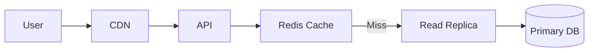

# 6. NFR - Read Write ratio
- https://academy.bytemonk.io/products/system-design-mastery-beta/categories/2158857209/posts/2193918304
- https://chatgpt.com/g/g-p-6a68d3926dd4819180c1c9bf855e98f3/c/6a6ad42e-7894-83e8-894e-48f6dbcd2c81

---
## Overview
- `Read–Write Ratio = Number of Reads : Number of Writes`
- Check AWS RDS metrics

| Ratio   | Meaning               | Example                     |
| ------- | --------------------- | --------------------------- |
| `100:1` | Read-heavy            | News website                |
| `10:1`  | Mostly reads          | E-commerce product catalog  |
| `1:1`   | Balanced              | Collaboration application   |
| `1:10`  | Write-heavy           | Logging or telemetry system |
| `1:100` | Extremely write-heavy | IoT sensor ingestion        |

**understand underlying Data-structure**:
  - [B-tree](../../SE_99_case-studies/03_ByteMonk/05_username_suggestion.md) , [LSM-tree](../SD_51_algo/03_algo_06_LSM-tree__.md)
  - [B-tree and LSM (2)](../SD_53_DataStructure/04_Btree%2BLSM_2.md)
  - [BloomFilter](../SD_53_DataStructure/01_core_01_BloomFilter.md)
  - [caseStudy : username-suggestion](../../SE_99_case-studies/03_ByteMonk/05_username_suggestion.md)

---
## Optimized READ

| Category            | Strategy               | Purpose                                   |
| ------------------- | ---------------------- | ----------------------------------------- |
| Edge caching        | **CDN**                | Serve static or public content near users |
| Application caching | **Redis cache**        | Avoid repeated database reads             |
| Database scaling    | **Read replicas**      | Distribute read traffic                   |
| Query optimization  | **Indexes**            | Speed up lookup, filtering, and sorting   |
| Storage structure   | **B+ Tree indexes**    | Optimize point and range queries          |
| Data modeling       | **Denormalization**    | Reduce joins                              |
| Precomputation      | **Materialized views** | Store results of expensive queries        |
| API optimization    | **Pagination**         | Avoid loading large datasets              |
| Specialized storage | **Search engine**      | Support full-text and complex searches    |
| Read avoidance      | **Bloom filter**       | Prevent unnecessary disk lookups          |

---
## Optimized Write
| Category              | Strategy                  | Purpose                                      |
|-----------------------| ------------------------- | -------------------------------------------- |
| Buffering             | **Kafka / message queue** | Absorb traffic spikes                        |
| Batching              | **Batch writes**          | Reduce database round trips                  |
| Partitioning          | **Sharding**              | Distribute writes across nodes               |
| Partitioning          | **Good partition key**    | Spread writes evenly                         |
| Storage engine        | **LSM Tree**              | Convert random writes into sequential writes |
| Database optimization | **Fewer indexes**         | Reduce index-update overhead                 |
| Durability            | **Write-ahead log**       | Persist writes safely before applying them   |
| Concurrency           | **Optimistic locking**    | Reduce lock contention                       |

## CQRS
- Best fit: complex systems with very different read/write workloads.
- [CQRS.md](../SD_52_architecture/02_arch_07_CQRS.md)

## Summary
| Decision Area        | Read-Heavy System                    | Write-Heavy System                            |
| -------------------- | ------------------------------------ | --------------------------------------------- |
| **Storage engine**   | B-Tree / B+ Tree                     | LSM Tree                                      |
| **Data model**       | Denormalize for faster reads         | Normalize to reduce duplicate writes          |
| **Fan-out strategy** | Fan-out on write; precompute results | Fan-out on read; compute when requested       |
| **Caching**          | Aggressive caching, longer TTL       | Careful caching, shorter TTL and invalidation |
| **Indexes**          | More useful indexes                  | Fewer indexes to reduce write overhead        |
| **Scaling**          | Cache, replicas, CDN                 | Sharding, batching, queues                    |

