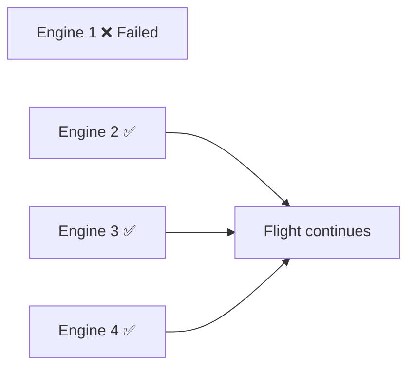
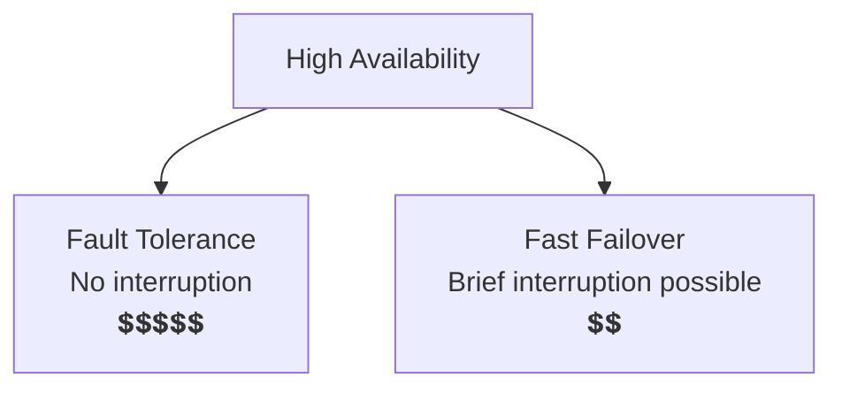
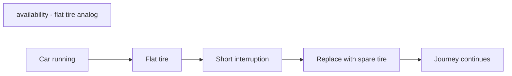
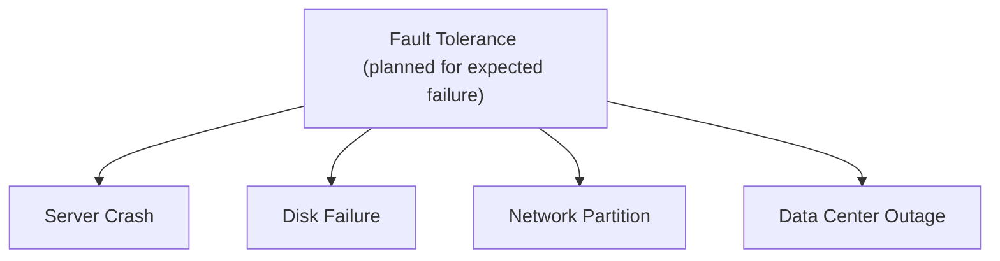

# Fault tolerance
## references
- https://chatgpt.com/g/g-p-6a68d3926dd4819180c1c9bf855e98f3-system-design-bm-acedemy/c/6a6bf42e-5fa0-83e8-8bbb-c332211494b3
- https://academy.bytemonk.io/products/system-design-mastery-beta/categories/2158857209/posts/2193918304

---
## Overview
> - **Failure is expected** : The system should degrade gracefully instead of completely stopping.
> - **server failures**: servers crash, solar flares can flip bits, power can be cut.
> - **network failures**: Cables get cut, routers fail, and packets get dropped 
>   - "the network is reliable" is one of the most dangerous assumptions in distributed systems.
>   - Always design with the expectation that network calls will fail, be delayed, or return unexpected results.

- 0 downtime | **highly available** system can have downtime.
- Fault tolerance is the ability of a system to continue operating when one or more components fail.

| Concept           | Focus                               |
| ----------------- | ----------------------------------- |
| High availability | Minimize downtime                   |
| Fault tolerance   | Continue operating despite failure  |
| Disaster recovery | Restore service after major failure |

---

## Airplane analogy 
- has 4 engines, but it does not require all four to remain operational.
- Engine 1 fails
- Engines 2, 3, and 4 continue working

## key relationship
### Fault tolerance vs High availability

---
### Fault tolerance vs Resilience
- EXPECTED FAILURES
- UN-EXPECTED FAILURES (Resilience, planned for it)

---
## Strategies
todo

