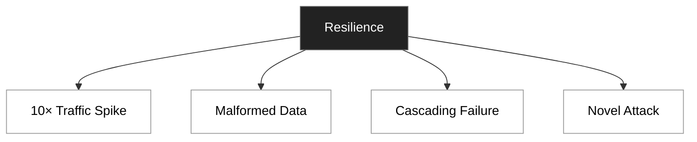

# Resilient System
## reference
- https://www.hellointerview.com/learn/courses/system-design/lesson/foundations/networking-essentials#handling-failures-and-fault-modes
- [protecting-servers](../SD_03_protecting-servers)

---
## Overview




---
## Strategies/patterns

```
Retry → try again
Backoff → increase the delay between attempts
Jitter → add randomness so many clients don’t retry at exactly the same time
```

### 1 Timeout + retries
- most elementary hygiene for handling **network failures** is to use timeouts and retries
- If a server is temporarily slow, we can retry the request and it will likely succeed.
- Retries can be a double-edged sword, so do backoff
  - Instead of retrying immediately, we wait a short amount of time before retrying 
  - This gives the system time to recover and reduces the load on the system.
- Retries are cool except when they have side effects
  - The idempotency key is a unique identifier for a request that we can use to make sure the same request is idempotent.

### 2 Circuit Breaker pattern
- [03_resiliency_pattern_02_circuit-breaker.md](../SD_21_microservice/03_resiliency_pattern_02_circuit-breaker.md)

**Purpose**: 
- Prevent cascading failures in distributed systems.

**Implementation**:
- Use libraries like `Resilience4j` or `Hystrix.`
- Define thresholds (e.g., failure rate, timeout) to trip the circuit.
- Implement fallback mechanisms (e.g., cached responses, default values).

**Use Case**: 
- External API calls to third-party services
- Database connections and queries
- Service-to-service communication in microservices
- Resource-intensive operations that might time out
- Any network call that could fail or become slow

**working**
- The circuit breaker monitors for failures when calling external services
- When failures exceed a threshold, the circuit "trips" to an open state
- While open, requests immediately fail without attempting the actual call
- After a timeout period, the circuit transitions to a "half-open" state
- A test request determines whether to close the circuit or keep it open

**advantages**:
- Fail Fast: Quickly reject requests to failing services instead of waiting for timeouts
- Reduce Load: Prevent overwhelming already struggling services with more requests
- Self-Healing: Automatically test recovery without full traffic load
- Improved User Experience: Provide fast fallbacks instead of hanging UI
- System Stability: Prevent failures in one service from affecting the entire system

---
### 3 Decouple system with message broker
- [PE_03_message-broker](../../PE_03_message-broker)

### 4 rate limiting
- [02_protection_03_RateLimiting.md](../SD_03_protecting-servers/02_protection_03_RateLimiting.md)

### 5 bulk head
- [03_resiliency_pattern_01_bulkhead.md](../SD_21_microservice/03_resiliency_pattern_01_bulkhead.md)

### 5 Gracefully degradation

### 5 Chaos engineering


