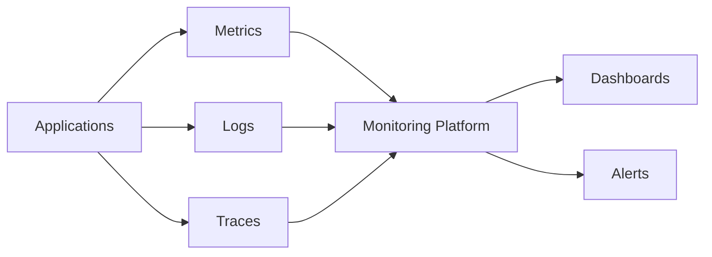
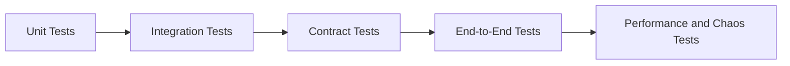
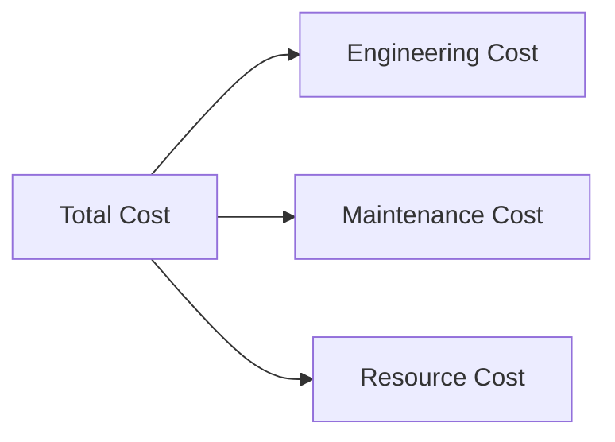
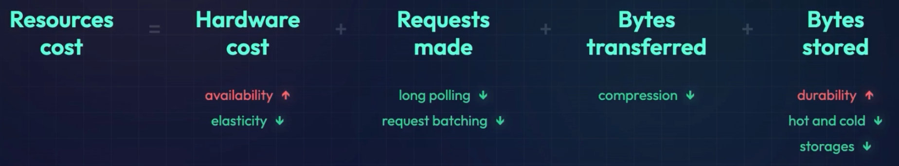

# NFR - 8. maintenance and cost
- https://academy.bytemonk.io/products/system-design-mastery-beta/categories/2158857209/posts/2195014029
- https://chatgpt.com/g/g-p-6a68d3926dd4819180c1c9bf855e98f3-system-design-bm-acedemy/c/6a6cdb87-7288-83e8-9a45-657a36a4f564

> - A good system design must be easy to operate, update, troubleshoot, and financially sustainable
> - Design for long-term operational simplicity.
---
## Maintenance
### 1. Failure Modes and Mitigations
| Failure                    | Possible Impact          | Mitigation                                                |
| -------------------------- | ------------------------ | --------------------------------------------------------- |
| Application instance fails | Some requests fail       | Multiple instances, load balancer, health checks          |
| Database primary fails     | Reads/writes stop        | Replication and automatic failover                        |
| Cache fails                | Database load increases  | Cache bypass, fallback to database                        |
| Message broker fails       | Async processing stops   | Replicated broker, retry, durable messages                |
| External API fails         | Request chain fails      | Timeout, retry, circuit breaker, fallback                 |
| Network partition          | Nodes cannot communicate | Choose consistency or availability based on business need |

### 2. Monitoring


Important production metrics:
```
Request rate
Error rate
p95 and p99 latency
CPU and memory utilization
Database connections
Queue depth and consumer lag
Cache hit ratio
...
...
```
### Rolling new feature.

| ✔️**Deploymnet Strategy**   | Description                                  | Trade-off                                     |
|-----------------------| -------------------------------------------- | --------------------------------------------- |
| Rolling deployment    | Replace instances gradually                  | Simple, but old and new versions coexist      |
| Blue-green deployment | Switch traffic between two environments      | Fast rollback, but higher infrastructure cost |
| Canary deployment     | Send small traffic percentage to new version | Reduces risk, but requires strong monitoring  |
| Feature flags         | Enable features independently of deployment  | Flexible, but flags require cleanup           |

### Testing new feature

| ✔️**Testing Type**  | Purpose                                                |
|---------------------| ------------------------------------------------------ |
| Unit testing        | Test individual functions and classes                  |
| Integration testing | Test service interaction with database, cache or queue |
| Contract testing    | Validate API compatibility between services            |
| End-to-end testing  | Test the complete user flow                            |
| Load testing        | Verify performance under expected traffic              |
| Stress testing      | Find the system breaking point                         |
| Chaos testing       | Validate behavior during infrastructure failures       |

### Automation
### Documentation
### increasing performance
### More ...

---
## Total Cost 💲
### Overview


| Cost Category        | Includes                                                                                   |
| -------------------- |--------------------------------------------------------------------------------------------|
| **Engineering cost** | System design, implementation, testing, deployment                                         |
| **Maintenance cost** | Bug fixes, new features, performance improvements, test coverage, documentation            |
| **Resource cost**    | Hardware, cloud infrastructure, databases, networking, software licenses |

> ** AWS cost - data transferred, hourly rate, storage cost, network cost, no of req made

The cheapest infrastructure is not always the cheapest system. ⭐
```
- Self-managed Kafka may reduce license cost.
- Managed Kafka may reduce engineering and maintenance cost.

- Microservices may scale independently but increase deployment, monitoring, and operational cost.
- A simpler monolith may have a lower total cost for a small application.

>> Optimize total cost of ownership, not only the monthly cloud bill.

```

### reduce Cost
1 Engineering cost
- won't ask in interview

2 Maintenance cost
- Keep services loosely coupled.
- Automate infrastructure using Terraform.
- Automate build, testing and deployment.
- Apply security patches regularly.
- Upgrade databases and dependencies gradually.
- Maintain runbooks for common failures.
- Remove unused services, resources and feature flags.
- Define service ownership clearly.

Resource cost




