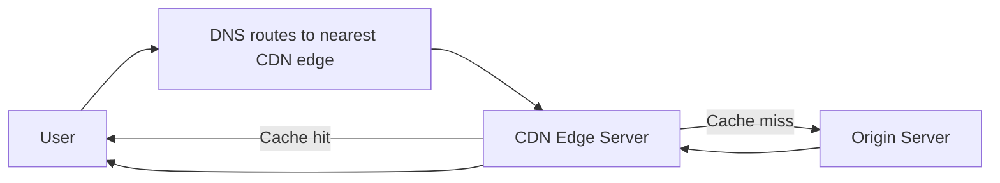

# CDN
- https://academy.bytemonk.io/products/system-design-mastery-beta/categories/2158360644/posts/2192532375
- https://chatgpt.com/g/g-p-6a68d3926dd4819180c1c9bf855e98f3-system-design-bm-acedemy/c/6a6d3584-9848-83e8-9697-a27a2cc06703
## Overview

---
## Benefits
| Benefit              | Explanation                                        |
| -------------------- | -------------------------------------------------- |
| Lower latency        | Content is served from a nearby edge location      |
| Reduced origin load  | Fewer requests reach application servers           |
| Higher availability  | Traffic can be served from multiple edge locations |
| Better scalability   | CDN absorbs large traffic spikes                   |
| DDoS protection      | Malicious traffic can be filtered at the edge      |
| Lower bandwidth cost | Cached content avoids repeated origin transfers    |

## Tradeoff
- but introduces **cache consistency and invalidation complexity.**
---
## Best content for CDN
| Content type    | Example                                                  |
| --------------- | -------------------------------------------------------- |
| Static content  | Images, CSS, JavaScript, fonts                           |
| Video/audio     | Streaming and downloadable media                         |
| Large files     | Software packages, reports                               |
| Cacheable APIs  | Product catalog, public profiles                         |
| Dynamic content | Accelerated through optimized routing, not always cached |
