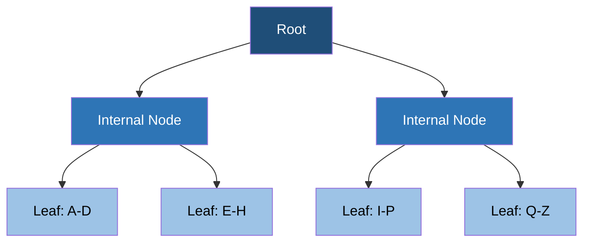

# B tree | B+ tree
## Overview
- used in relational DB

## Read behavior (fast)
- Root → Internal Node → Leaf Page → Record
- Reads are efficient because the database can quickly navigate to the required page.

## Write behavior (Slow)
A write may require:
- Finding the target page
- Updating an existing disk page
- Splitting a page when it becomes full
- Updating indexes 👈
- Writing to the transaction log
- > Therefore, writes can involve random disk I/O.