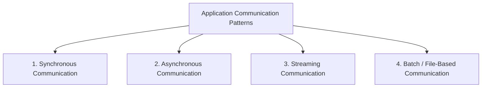

# Client-Server Architecture
## ✔️concepts
### 1. DNS `nslookup`
- [AWS_SSA - DNS + Rout53.md](../../CE_02_AWS_SAA/04_network/02_Rout53.md)
- [byteMonk - DNS](https://academy.bytemonk.io/products/system-design-mastery-beta/categories/2158360643/posts/2192892033)

### 2. Socket
- [Socket](../SD_01_foundation/05_concept_03_socket.md) 

---
## ✔️Communication Patterns
| Category     |         Caller waits? | Connection                           | Common examples                  |
| ------------ | --------------------: | ------------------------------------ | -------------------------------- |
| Synchronous  |                   Yes | Usually short-lived                  | REST, HTTP, unary gRPC           |
| Asynchronous |                    No | Decoupled through broker or callback | Kafka, RabbitMQ, SQS, webhook    |
| Streaming    |            Continuous | Long-lived                           | WebSocket, SSE, gRPC streaming   |
| Batch        | No real-time response | Periodic or file-based               | SFTP, S3 files, Spark, MapReduce |

### [A. Synchronous: Request/Response](../SD_03_54_Communication-pattern/01_synchronous.md)
### [B. Asynchronous Communication](../SD_03_54_Communication-pattern/02_asynchronous.md)
### [C. Streaming](../SD_03_54_Communication-pattern/03_streaming.md)
### [D. Batch/File-based](../SD_03_54_Communication-pattern/04_batch_file_based.md)
### [More](../SD_03_54_Communication-pattern/05_more.md)

