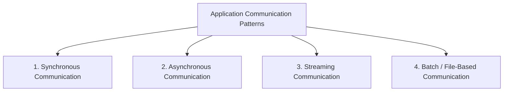

# Client-Server Architecture
## Core concepts
- [AWS_SSA - DNS + Rout53](../../../CE_02_AWS_SAA/04_network/02_Rout53.md) | [DNS 2](https://academy.bytemonk.io/products/system-design-mastery-beta/categories/2158360643/posts/2192892033)
- [network-essentials](../SD_03_53_network)
- [API-Design](../../SD_08_API-Design)
- [microservice](../../SD_21_microservice)

---
## Communication Patterns

| Category     |         Caller waits? | Connection                           | Common examples                  |
| ------------ | --------------------: | ------------------------------------ | -------------------------------- |
| Synchronous  |                   Yes | Usually short-lived                  | REST, HTTP, unary gRPC           |
| Asynchronous |                    No | Decoupled through broker or callback | Kafka, RabbitMQ, SQS, webhook    |
| Streaming    |            Continuous | Long-lived                           | WebSocket, SSE, gRPC streaming   |
| Batch        | No real-time response | Periodic or file-based               | SFTP, S3 files, Spark, MapReduce |

> layer 7 network protocol:

### [A. Synchronous: Request/Response](../SD_03_54_IPC/01_synchronous.md)
- http  / tcp handshake
- https / tls handshake
- grpc (http2.0)
- graphQL (http)

### [B. Asynchronous Communication](../SD_03_54_IPC/02_asynchronous.md)
- event based - fanOut, webhook, event sourcing/CQRS
- message based - p2p, pubSub
- polling - short / long

### [C. Streaming](../SD_03_54_IPC/03_streaming.md)
- ws / wss
- gRPC stream

### [D. Batch/File-based](../SD_03_54_IPC/04_batch_file_based.md)
- FTP
- object: AWS S3
- ...

---
### [More](../SD_03_54_IPC/05_more.md)
- webRTC
- Video stream

