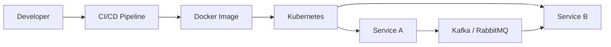

# Microservice Architecture
## ✔️References
- [monolith-arch](01_core_01_monolith-arch.md)
- [API-Design](../../SD_08_API-Design)
- [02_arch_04_event-driven-arch.md](02_pattern_06_event-driven.md)
- [02_arch_05_service-mesh-arch.md](02_pattern_10_service-mesh.md)
- gpt:
  - https://chatgpt.com/c/2f54de12-b416-4a76-80a0-ebd286b0c467 | ms arch
  - https://chat.deepseek.com/a/chat/s/6e7456d4-cc1b-42be-ae19-c3ede730936f | ms comm
  - https://chat.deepseek.com/a/chat/s/3d8b4d99-81b7-4dac-ad69-519f9bc33dea | deployment arch - `event-driven` vs `deployment-driven`

---
## ✔️Overview
- Application is divided into small, independent services, Each  focusing on a specific:business capability,domain,feature
- Services can usually be:
  - developed + deployed independently
  - scaled independently
  - built using different technologies
- **Distributed nature**
  - The application is distributed across multiple services.
  - Services communicate over the network using:REST, gRPC, messaging, event-driven communication

| Monolith                           | Microservices                                  |
| ---------------------------------- | ---------------------------------------------- |
| Simpler development and operations | Better independent scaling and deployment      |
| Lower network complexity           | Better service isolation                       |
| Easier transactions                | More distributed-system complexity             |
| Lower initial cost                 | Higher operational cost                        |
| Good for small or medium systems   | Useful for large systems and independent teams |

---
## ✔️ Key concept
### 1. Service-discovery
- process of automatically detecting network locations of service instances.
- service registry service -  Netflix Eureka
- k8s services ✔️
- [service-discovery](01_concept_02_service-discovery.md)

### 2. Communication architecture
- [event-driven-arch 👈🏻](02_pattern_06_event-driven.md)
- [service-mesh-arch 👈🏻](02_pattern_10_service-mesh.md) | Side car pattern
- [02_pattern_06_API-gateway.md](../../SD_08_API-Design/03_pattern_01_API-gateway.md)
- [02_pattern_01_BFF.md](../../SD_08_API-Design/01_concept_01_BFF.md)

### 3. Data Consistency pattern
- [distributed-Transaction](../../SD_06_Distributed-system/02_03_distributed-Transaction.md)
- [distributed-Locking](../../SD_06_Distributed-system/02_02_distributed-Locking.md)

### 4. [Fault-tolerance](../SD_02_Non-functional-req/02_NFR_07_fault-tolerance__.md)

### 5. [resilience](../SD_02_Non-functional-req/02_NFR_07_resiliency__.md)
Solution:
- Retry-pattern
- [Circuit-breaker-pattern](02_pattern_02_circuit-breaker-pattern.md)
- Load balancer with health mechanism

---
## ✔️Benefits
- Can deploy on Cloud and take full advantage of On-demand **scalability**
- Run on **matching hardware-requirement** | efficient and low cost.
- **No downtime**: Seamless updates(rollout)/rollbacks without any downtime of whole application
- **Mix of technologies**

> These benefits are not automatic. 
> - They require good service boundaries, observability, automation, fault isolation, and disciplined ownership. 
> - Otherwise, microservices can become harder to debug and less reliable than a monolith.

| Benefit                    | Meaning                                                           |
| -------------------------- | ----------------------------------------------------------------- |
| **Independent scaling**    | Scale only the busy service instead of the entire application.    |
| **Faster deployment**      | Deploy one service without releasing the whole system.            |
| **Better reliability**     | Failure in one service may not bring down the entire application. |
| **Team independence**      | Teams can own and develop separate services in parallel.          |
| **Technology flexibility** | Each service can use the technology best suited to its needs.     |
| **Easier debugging**       | Problems can be isolated to a specific service more easily.       |

---
## ✔️ Challenges
- Network latency and failures
- Distributed transactions
- Data consistency
- Service discovery
- Observability and debugging
- Deployment and operational complexity
- Higher infrastructure cost

---
## ✔️ Microservices: Tooling ecosystem

| Tool                | Role                                                                                |
| ------------------- | ----------------------------------------------------------------------------------- |
| **Docker**          | Packages each service with its dependencies into a portable container.              |
| **Kubernetes**      | Deploys, scales, restarts, and load-balances containers.                            |
| **Message brokers** | Enable asynchronous communication and decouple services. Examples: Kafka, RabbitMQ. |
| **CI/CD pipelines** | Automate testing, deployment, rollback, and independent service releases.           |

