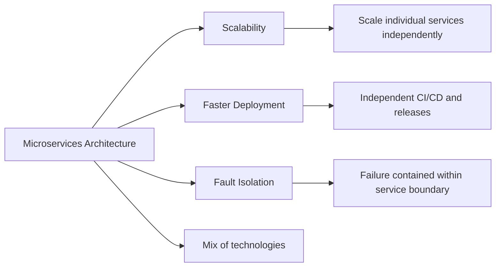

# Microservice Architecture
References
- [SD_21_microservice](../../SD_21_microservice) 👈
- https://youtube.com/watch?v=pq9WUeKSjTM | when to use ms.
- https://chatgpt.com/c/2f54de12-b416-4a76-80a0-ebd286b0c467 | ms arch
- https://chat.deepseek.com/a/chat/s/6e7456d4-cc1b-42be-ae19-c3ede730936f | ms comm
- https://chat.deepseek.com/a/chat/s/3d8b4d99-81b7-4dac-ad69-519f9bc33dea | deployment arch - `event-driven` vs `deployment-driven`

---
## ✔️Overview
- Application is divided into small, independent services, Each  focusing on a specific:business capability,domain,feature
- Services can usually be:
  - developed + deployed independently
  - scaled independently
  - built using different technologies
- **Distributed nature**
  - The application is distributed across multiple services.
  - Services communicate over the network using:REST, gRPC, messaging, event-driven communication

| Monolith                           | Microservices                                  |
| ---------------------------------- | ---------------------------------------------- |
| Simpler development and operations | Better independent scaling and deployment      |
| Lower network complexity           | Better service isolation                       |
| Easier transactions                | More distributed-system complexity             |
| Lower initial cost                 | Higher operational cost                        |
| Good for small or medium systems   | Useful for large systems and independent teams |

---
## ✔️Benefits

> These benefits are not automatic.
> - They require good service boundaries, observability, automation, fault isolation, and disciplined ownership.
> - Otherwise, microservices can become harder to debug and less reliable than a monolith.

| Benefit                    | Meaning                                                           |
| -------------------------- | ----------------------------------------------------------------- |
| **Fault Isolation**   | Failure of one service is less likely to bring down the whole application |
| **Independent scaling**    | Scale only the busy service instead of the entire application.    |
| **Faster deployment**      | Deploy one service without releasing the whole system.            |
| **Better reliability**     | Failure in one service may not bring down the entire application. |
| **Team independence**      | Teams can own and develop separate services in parallel.          |
| **Technology flexibility** | Each service can use the technology best suited to its needs.     |
| **Easier debugging**       | Problems can be isolated to a specific service more easily.       |

---
## ✔️ Challenges
- Network latency and failures
- Distributed transactions
- Data consistency
- Service discovery
- Observability and debugging
- Deployment and operational complexity
- Higher infrastructure cost

---
## ✔️ Core concept
- [service-discovery](../../SD_21_microservice/02_core_01_service-discovery.md)
- [comm_pattern.md](../../SD_21_microservice/04_comm_pattern.md)
- [resiliency_pattern](../../SD_21_microservice/03_resiliency_pattern.md)

---
## ✔️ Microservices: Tooling ecosystem

| Tool              | Role                                                                                |
| ----------------- | ----------------------------------------------------------------------------------- |
| **Docker**        | Packages each service with its dependencies into a portable container.              |
| **Kubernetes**    | Deploys, scales, restarts, and load-balances containers.                            |
| **Message brokers** | Enable asynchronous communication and decouple services. Examples: Kafka, RabbitMQ. |
| **CI/CD pipelines** | Automate testing, deployment, rollback, and independent service releases.           |
|**IAC** |`terraform`|
