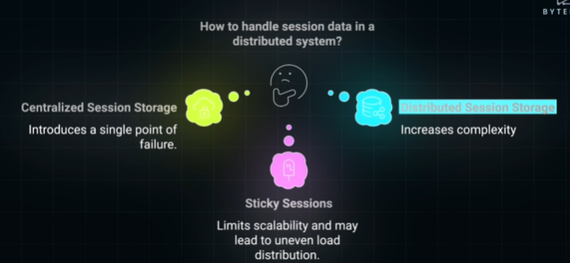
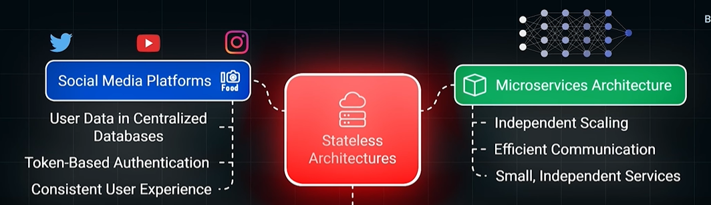

#  stateful and stateless architectures
- https://www.youtube.com/watch?v=QDiPjMWeVC0
- **examples**
  - streaming services
  - online shopping carts 
  - authentication systems (JSession vs JWT Token)

## Stateful Arch
- Stores session data on a specific server or device
- If we switch devices or the server fails, we lose your session data
- Not scalable
  - managing session data across multiple servers requires additional infrastructure.

---
## Stateless Arch
> Distributed System
> - make server/node **scalable**
> - Also contributes to **consistency** (central-state or Distributed state) 
> - **Reliability** : node-1 fail, can seamless switch to node-2, without loss of session Data.

- Every request contains ONLY all necessary information, 
- and **session-data** is stored in additional infrastructure:
  - **shared central Session storage**:
  - **distributed Session storage** : AWS (ebs,efs,s3,etc)
  - avoid sticky session ❌
- so it's not like, no-state, but state is maintained outside the node. 👈🏻

**Session in DS** (3 ways)

