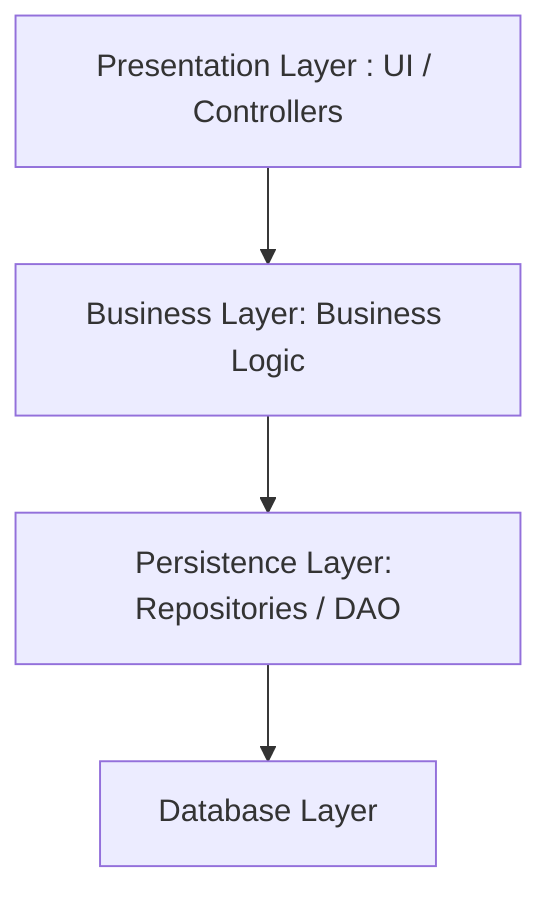
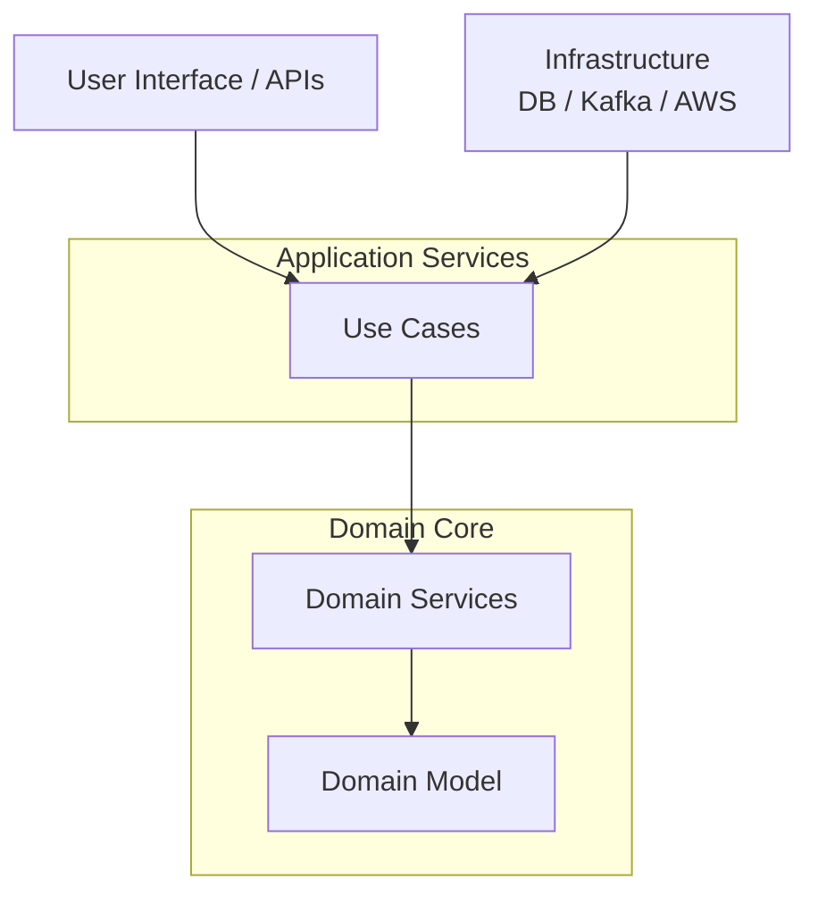
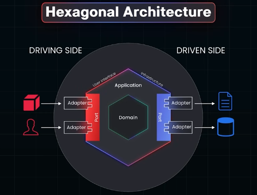
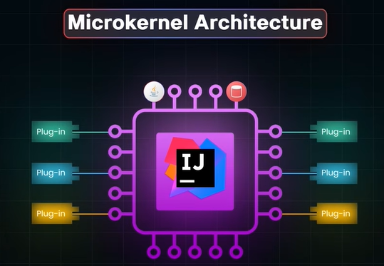
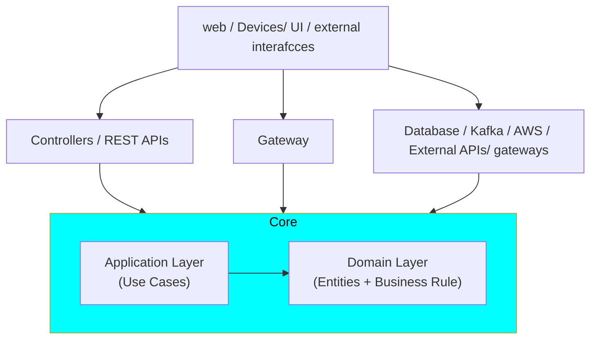
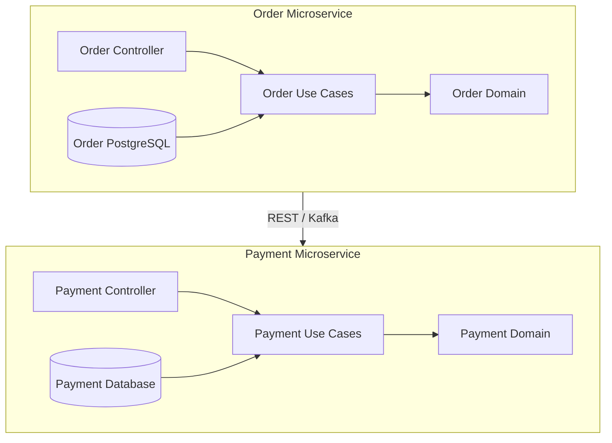

# Architecture patterns
> Focus: SCALABLE || ESAY TO MAINTAIN || FLEXIBLE
- https://youtu.be/126ALse1rWA?si=MCpIeDdOp5UWJ1P0 BM

--- 

## Summary of Architectural Patterns
1.  **Layered (N-Tier) Architecture (0:45):** Organizes code into logical layers (presentation, business logic, and data access). It is excellent for enterprise systems, allowing independent team focus on specific layers.
2.  **Onion Architecture (1:58):** Focuses on isolating business logic at the core. Outer layers (UI, infrastructure) depend on the core, but the core remains independent, making the system highly testable and refactorable.
3.  **Hexagonal Architecture (2:49):** An evolution of Onion architecture that uses "ports" and "adapters" to interact with external systems (like databases or APIs). This allows for swapping external dependencies without changing core logic.
4.  **Modular Architecture (3:41):** Breaks applications into self-contained modules communicating via well-defined interfaces. This improves maintainability and allows teams to develop and deploy modules independently.
5.  **Microkernel Architecture (4:27):** Uses a minimal core system that can be extended via plugins. This is ideal for tools that require varying features for different users, such as IDEs (e.g., *Eclipse* or *IntelliJ*).
6.  **Event-Driven Architecture (5:12):** Services communicate by reacting to events asynchronously rather than direct calls. This pattern is essential for real-time, decoupled systems like those used by *Uber* or *Netflix*.
7.  **CQRS (6:02):** Command Query Responsibility Segregation splits read and write operations, allowing each to be optimized independently for better performance and scalability.
8.  **Service-Oriented Architecture (SOA) (6:52):** Uses services that communicate over a network (often via *SOAP* or *REST*). Each service handles a specific business function (e.g., billing, inventory), making the enterprise system more flexible.
9.  **Clean Architecture (7:31):** Popularized by *Uncle Bob*, this pattern mandates that business logic remains completely independent of frameworks, UI, and databases. It ensures the core remains stable as the external environment changes.

---
## 1. Layered Architecture
- Higher layers generally depend on lower layers
- Very common for traditional enterprise applications.

---
## 2. Onion Architecture


benefits
- Business rules stay independent.
- Easier testing.
- Infrastructure can be replaced.
- Strong separation between domain and technology.
- Good for complex business domains.

---
# 3. Hexagonal Architecture 
> extension over onion with Ports and Adapters Architecture



---
## 4. Modular architecture
> Spring modulith, java Module, Angular module

- Splits one application into independent modules.
- Modules normally represent business capabilities
- A module can later be extracted into a microservice. 👈

### overview
```
src/
├── order/
│   ├── controller/
│   ├── service/
│   ├── domain/
│   └── repository/
│
├── payment/
│   ├── controller/
│   ├── service/
│   ├── domain/
│   └── repository/
│
├── inventory/
│   └── ...
│
└── customer/
    └── ...
```

benefits
- Reduces coupling in large applications.
- Easier to understand and maintain than one huge monolith.
- Easier testing and deployment than tightly coupled code.
- Can later extract a module into a microservice.
- Avoids much of the network complexity of microservices

## 5. micro kernel
> Plugin Architecture

overview:
- Has a small core system.
- Additional functionality is added through plugins.
- Core provides basic/common functionality.
- Plugins extend the system without modifying the core.



---
## 6. Event-Driven Architecture 
[02_pattern_06_event-driven.md](02_pattern_06_event-driven.md)

---
## 7. CQRS
[02_pattern_07_CQRS.md](02_pattern_07_CQRS.md)

---
## Service-Oriented Architecture (SOA)
overview:
- Organize system into reusable business services
- Often synchronous: REST, SOAP, RPC
- Request → response | NOT event based

> - SOA defines how you divide the system into services.
> - EDA defines how components communicate and react to changes.

---
## 9. Clean Architecture
Overview
- Clean Architecture organizes software so that business rules remain independent of frameworks, databases, UI, and external services.
- The domain (`order`) and application use cases (`createorder`) sit at the center.
- **Dependencies point inward**, allowing infrastructure to change without affecting core business rules.

---
Benefits
- Business logic is easier to test.
- Framework changes have limited impact.
- Database or messaging technology can be replaced.
- Controllers remain thin.
- Infrastructure concerns do not leak into domain logic.
- Code becomes easier to maintain as the system grows.

> A microservice can internally follow Clean Architecture. ⭐



```
src/
├── domain/
│   ├── Account.java
│   ├── Transaction.java
│   └── InsufficientBalanceException.java
│
├── application/
│   ├── TransferMoneyUseCase.java
│   └── ports/
│       ├── AccountRepository.java
│       └── NotificationPort.java
│
├── adapters/ 👈
│   ├── inbound/
│   │   ├── TransferController.java
│   │   └── KafkaTransferConsumer.java
│   └── outbound/
│       ├── PostgresAccountRepository.java
│       └── EmailNotificationAdapter.java
│
└── infrastructure/ 👈
    ├── SpringConfiguration.java
    ├── DatabaseConfiguration.java
    └── KafkaConfiguration.java
```
---
## More
- [microservice patterns](../../SD_21_microservice)