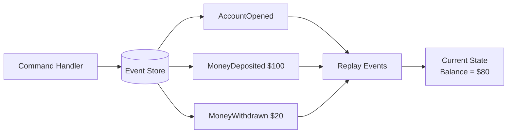
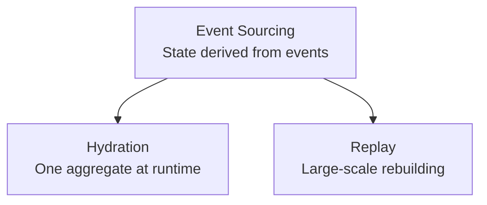
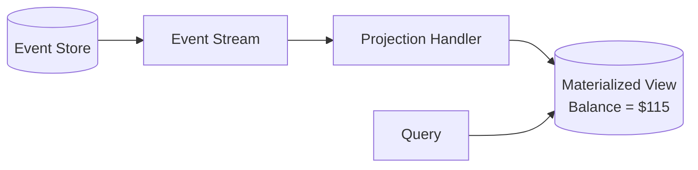

# CQRS
- https://academy.bytemonk.io/products/system-design-mastery-beta/categories/2158360668/posts/2194561781
---
## Overview
- Event Sourcing stores :
  - every state change as an immutable event.
  - complete history.
  - The system never overwrites the earlier changes/event.
  - New changes are appended as new events
- instead of storing only the latest state like Traditional database.

| Concept     | Meaning                                     |
| ----------- | ------------------------------------------- |
| Event       | Immutable fact that already happened        |
| Event store | Append-only database of events              |
| Aggregate   | Business entity rebuilt from events         |
| Replay      | Reprocess events to rebuild state           |
| Projection  | Converts events into a read-friendly view   |
| Snapshot    | Saved aggregate state to reduce replay time |

---
## Hydration vs Replay
- Both derive state from stored events, but the scope and purpose differ.

| Hydration                              | Replay                                           |
| -------------------------------------- | ------------------------------------------------ |
| Rebuilds one aggregate/entity          | Rebuilds many entities or projections            |
| Happens during normal runtime          | Usually manual, scheduled, or recovery operation |
| Operational                            | Strategic/maintenance                            |
| Reads events for one aggregate ID      | Processes a large event stream                   |
| Example: calculate one account balance | Example: rebuild the entire read database        |

---
## Snapshots vs Materialized Views

| Snapshot                                      | Materialized View                           |
| --------------------------------------------- | ------------------------------------------- |
| Saves an aggregate’s state at a point in time | Stores a query-ready projection             |
| Used during hydration                         | Used during reads                           |

>A snapshot is only an optimization. The event store remains the source of truth.

---
## use cases

> Used in [CQRS](02_pattern_01_CQRS.md)

| more Use case          | Why Event Sourcing fits                              |
|------------------------| ---------------------------------------------------- |
| Banking and payments   | Complete transaction history and auditability        |
| Trading systems        | Reconstruct positions and investigate past decisions |
| Healthcare records     | Track every diagnosis, medication, and correction    |
| Order lifecycle        | Preserve created, paid, shipped, cancelled events    |
| Inventory              | Track every stock increase and decrease              |
| Insurance claims       | Maintain complete claim-processing history           |
| **Compliance systems** | Immutable audit trail                                |
| Complex workflows      | Rebuild state and understand how it reached th       |

---
## Trade off
- Complexity
- Additional operations