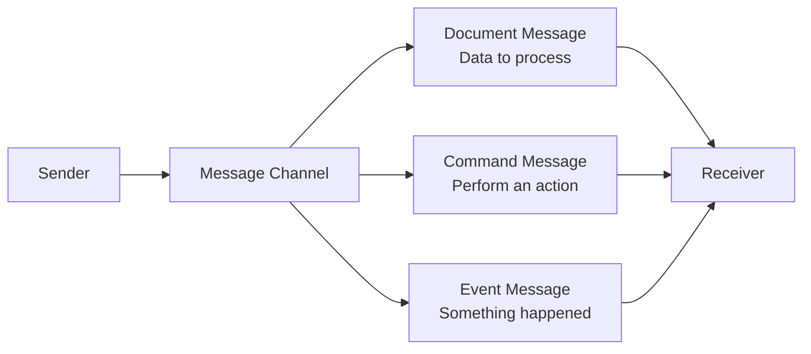
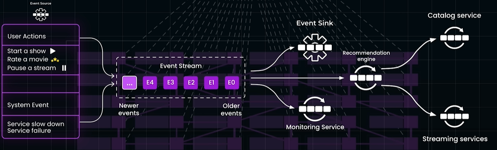
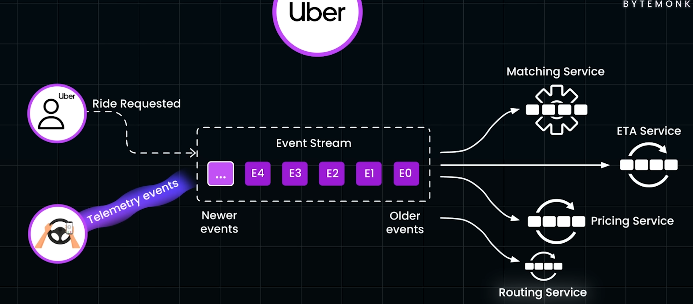

# Modern : Event-Driven Architecture (EDA)
## References
- https://academy.bytemonk.io/products/system-design-mastery-beta/categories/2158360644/posts/2190592891
- https://www.youtube.com/watch?v=hrvx8Nv9eQA
- https://youtube.com/watch?v=q7K20k6rV9E
- [evolution-of-system :: theory](../../SD_01_foundation/01_basic_01_evolution.md)
- [Message-broker / Event-broker :: complete guide](../../../PE_03_message-broker)
- [event-loop :: overview](../../SD_01_foundation/05_concept_04_event-loop.md)

---
## ✔️Asynchronous Communication pattern ⭐
- [Communication pattern :: asynchronous](../SD_03_54_IPC/02_asynchronous.md)
  - **event based** : webhook, fanOut, event-sourcing/CQRS
  - messaging based : p2p, pub-sub

---
## ✔️Overview :: EDA
> - **EDA** focuses on asynchronous, event-based communication,
> - **Service Mesh** manages synchronous communication.

- Traditional sync **request-response model** inefficient to scale, due to tight coupling.
- Modern EDA **decouples** services, 
  - enabling more scalable, flexible, and efficient systems 👈🏻
  - where services communicate through events (generation, propagation, and consumption) 
- **3 key point to consider in designing EDA system** 👈🏻
  - handle **event processing order** 
  - handle **idempotency**
  - Handle **eventual consistency** across multiple services.

---
## ✔️Architecture 

### 1. Event / message

| Type                 | Meaning                                       | Example                                              |
| -------------------- | --------------------------------------------- | ---------------------------------------------------- |
| **Document Message** | Sends data the receiver can interpret/process | `CustomerProfile`, `Invoice`, `OrderDetails`         |
| **Command Message**  | Tells a specific receiver to **do something** | `ProcessPayment`, `SendEmail`, `ReserveInventory`    |
| **Event Message**    | Announces that **something already happened** | `OrderCreated`, `PaymentCompleted`, `UserRegistered` |

### 2. Broker
- Allows producers and consumers to communicate, without direct knowledge of each other, 
- with an intermediary broker:
  - like Kafka, RabbitMQ, or Azure Service Bus
  - that **handles events** by: ⭐
    - queuing
    - streaming
    - ...
- these act as **persistence solution** as well, storing message/event.

| Technology            | Point-to-Point                                                       | Publish-Subscribe                                      |
| --------------------- | -------------------------------------------------------------------- | ------------------------------------------------------ |
| **JMS**               | Queue                                                                | Topic                                                  |
| **Kafka**             | Topic partition consumed by one consumer **within a consumer group** | Same topic consumed by **multiple consumer groups**    |
| **RabbitMQ**          | Queue, often via direct/default exchange                             | Fanout/topic exchange → multiple queues                |
| **AWS Kinesis**       | Stream/shard consumed by applications                                | Enhanced fan-out allows multiple independent consumers |
| **AWS SQS**           | Queue                                                                | Not native pub-sub by itself                           |
| **AWS SNS + SQS**     | —                                                                    | SNS topic → multiple SQS queues                        |
| **Google Pub/Sub**    | One subscription consumed by competing consumers                     | Topic → multiple subscriptions                         |
| **Azure Service Bus** | Queue                                                                | Topic → multiple subscriptions                         |

### 3. Producers 
- Microservices or any systems that generate events/message/command

### 4. Consumers  
- Services that consume events and then trigger various actions.
- **Simple** Event Processing
- **Complex** Event Processing
  - Multiple events are aggregated 
  - and analyzed to detect patterns

---
## ✔️Real-World EDA Use Cases: 
### 1. Netflix 
- Handles over a billion events daily, 
- Every user action generates an event consumed by various services, 
  - such as the **recommendation engine**. 
  - ...
- also monitors service health, generating events for alerts or automated recovery.
> - Netflix uses EDA for asynchronous user events
> - and a Service Mesh for synchronous service-to-service communication.

### 2. Uber
- Manages millions of rides daily using EDA 
- for real-time data processing and service coordination. 
- A "ride requested" event is consumed by multiple services 
  - matching 
  - ETA,
  - pricing. 
- Uber also collects real-time traffic data via telemetry events from driver phones, optimizing routes.

