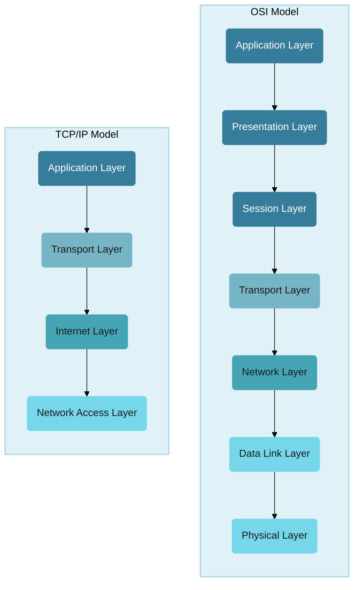
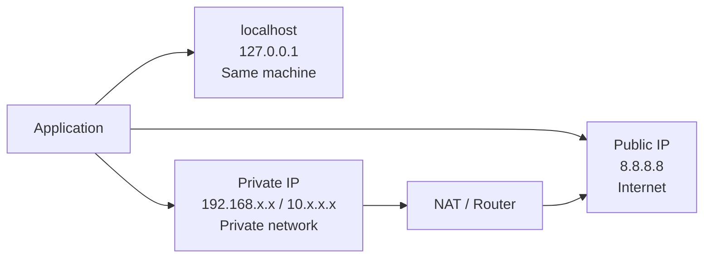
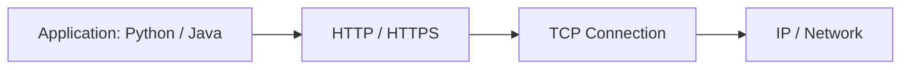
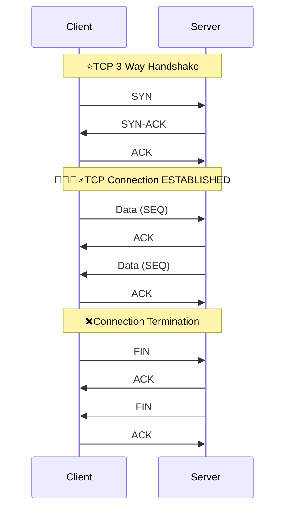

# Network Model
## reference
- https://youtube.com/watch?v=tpgoQwMg__M | bm
- https://youtu.be/SHkbPm1Wrno | hi

--- 
## Overview : OSI

```
Application   → HTTP,SMTP,TELNET/SSH, FTP,DNS request
Presentation  → TLS encryption, format (HTML,DOC,JPGG,etc)
Session       → communication/session management === SOCKET , RPC
Transport     → TCP or UDP "packet", source/destination ports
Network       → source/destination IP
Data Link     → source/destination MAC
Physical      → Wi-Fi/radio/cable bits, light pulses
```

| #     | Layer        | Main responsibility                                  | Common examples                 |
| ----- | ------------ | ---------------------------------------------------- |---------------------------------|
| **7** | Application  | Network services used by applications                | HTTP, HTTPS, DNS, SMTP, FTP     |
| **6** | Presentation | Data format, encoding, encryption, compression       | TLS/SSL, JSON, JPEG, UTF-8      |
| **5** | Session      | Establish/manage/close communication sessions        | RPC sessions, sockets concepts  |
| **4** | Transport    | End-to-end delivery, ports, reliability              | TCP /QUIC(Modern) , UDP                    |
| **3** | Network      | IP addressing and routing                            | IPv4, IPv6, ICMP, routers       |
| **2** | Data Link    | Local-network delivery using MAC addresses           | Ethernet, Wi-Fi, switches, ARP* |
| **1** | Physical     | Transmits raw bits as electrical/radio/light signals | Cable, fiber, radio             |


---
## TCP/IP vs OSI


---
## Layer 3 : Network
### IP
> IP by far the most common for system design interviews

- the protocol that handles routing and addressing.
- It's responsible for breaking the data into packets, handling packet forwarding between networks, and providing best-effort delivery to any destination IP address on the network. 
- Ipv4 (4.3 billion only)| Ipv6 (340 undecillion)
- OS is configured to switch over formats. socket.getHostByName('localhost') --> can resolve to ipv6 or ipv4
- **LocalHost**
    - localhost resolves to` 127.0.0.1/8` or `::1/8` (ipv6)| loopback interface
    - `c\:window\System32drivers\etc\host`


| Type                     | Example                        | What it means                                       |
| ------------------------ | ------------------------------ | --------------------------------------------------- |
| **Public IP**            | `8.8.8.8`, `104.26.9.238`      | Globally routable on the Internet                   |
| **Private IP**           | `192.168.1.1`, `192.168.1.100` | Used inside a private network such as your home/VPC |
| **Localhost / Loopback** | `127.0.0.1`                    | Refers back to the same machine                     |

### InfiniBand
- which is used extensively for massive ML training workloads)

---
## layer 4 : transport
> provide end-to-end communication services

```
    TCP = reliable pipe
    TLS = secure pipe
    HTTP = language spoken through the pipe
```

### TCP (reliable delivery)
**TCP connection**
- TCP handshake
- TCP connection established | tunnel
- http/https provides abstraction over TCP
- py, java, etc, all has lib to comm with http/https



**TCP handshake:**
- Creates a reliable, stateful connection between two endpoints.
- Connection starts with **3-way handshake**: SYN → SYN-ACK → ACK
- Identified by: Source IP + Source Port + Destination IP + Destination Port
- **Provides ordering, acknowledgments, retransmission, flow control, and congestion control**
- TCP itself does not encrypt data; TLS provides encryption.



### UDP
- ( best effort delivery, superfast, packet might get lost or unorders)

---
## Layer 6/7: Application
### Http/s
- https://youtube.com/watch?v=jQ6_XhsMwws
- [http-evolution](01_basic_03_http-evolution.md)
- A stateless, text-based protocol commonly used for APIs, built on top of TCP
- HTTP connection : HTTP --> TCP handshake
- HTTPS connection : HTTP --> TCP handshake --> [TLS handshake](../../SD_24_security/03_protocol_https_tls.md)
    - Also **handshake/s takes time.**
- **short live stateless connection.** : open-close, open-close, ...
- use case : RESTful-API, web pages

### DNS

### Websockets

### WebRTC