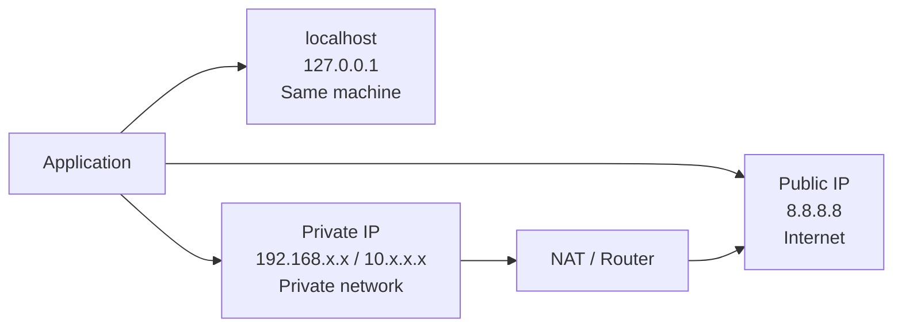

# Network

## Core concepts
- **localhost** resolves to 127.0.0.[1-255] or ::1 (ipv6)| loopback interface
- `c\:window\System32drivers\etc\host`
- Ipv4 (4.3 billion only) 
- Ipv6 (340 undecillion)
- OS is configured to each format
  - socket.getHostByName('localhost') --> can resolve to ipv6 or ipv4

| Type                     | Example                        | What it means                                       |
| ------------------------ | ------------------------------ | --------------------------------------------------- |
| **Public IP**            | `8.8.8.8`, `104.26.9.238`      | Globally routable on the Internet                   |
| **Private IP**           | `192.168.1.1`, `192.168.1.100` | Used inside a private network such as your home/VPC |
| **Localhost / Loopback** | `127.0.0.1`                    | Refers back to the same machine                     |

## 1. Topologies
- https://youtube.com/watch?v=yBY5GJtmhg0
- https://youtube.com/watch?v=4znRDbg0SYA

## 2. DNS
- https://youtube.com/watch?v=Lsd80uR9Shs (skip)

## 3. Network protocol
- https://youtube.com/watch?v=jQ6_XhsMwws
- TCP (reliable delivery)
- UDP ( best effort delivery, superfast, packet might get lost or unorders)
- HTTP (browser language, `stateless` ) 
- [http-evolution](01_basic_02_http-evolution.md)
- HTTPS 