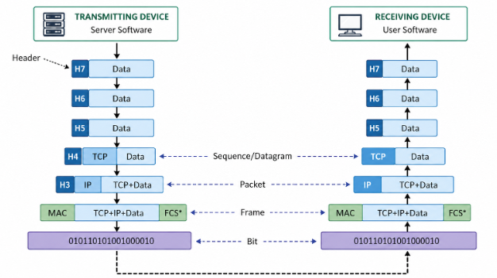
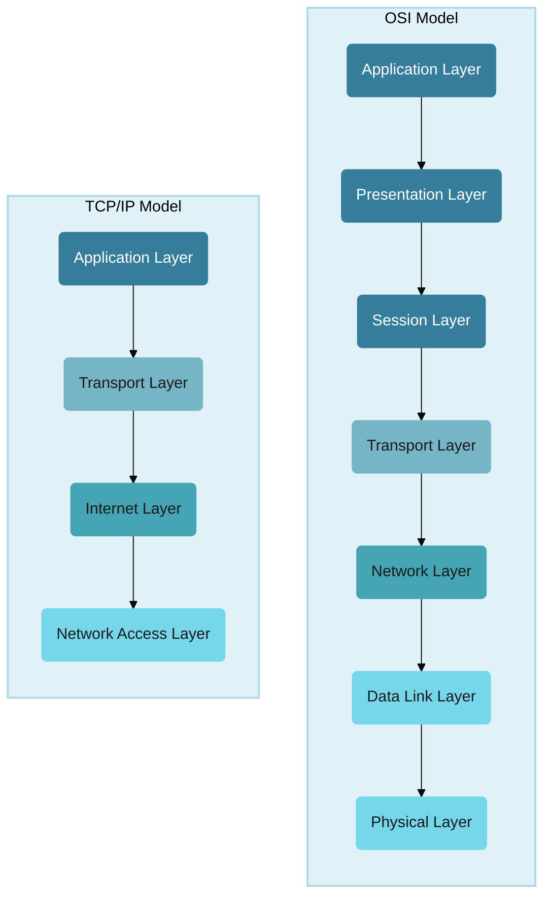

# Network Model
## reference
- https://youtube.com/watch?v=tpgoQwMg__M

## Overview : OSI

```
Application   → HTTP,SMTP,TELNET/SSH, FTP,DNS request
Presentation  → TLS encryption, format (HTML,DOC,JPGG,etc)
Session       → communication/session management === SOCKET , RPC
Transport     → TCP or UDP "packet", source/destination ports
Network       → source/destination IP
Data Link     → source/destination MAC
Physical      → Wi-Fi/radio/cable bits, light pulses
```

| #     | Layer        | Main responsibility                                  | Common examples                 |
| ----- | ------------ | ---------------------------------------------------- | ------------------------------- |
| **7** | Application  | Network services used by applications                | HTTP, HTTPS, DNS, SMTP, FTP     |
| **6** | Presentation | Data format, encoding, encryption, compression       | TLS/SSL, JSON, JPEG, UTF-8      |
| **5** | Session      | Establish/manage/close communication sessions        | RPC sessions, sockets concepts  |
| **4** | Transport    | End-to-end delivery, ports, reliability              | TCP, UDP                        |
| **3** | Network      | IP addressing and routing                            | IPv4, IPv6, ICMP, routers       |
| **2** | Data Link    | Local-network delivery using MAC addresses           | Ethernet, Wi-Fi, switches, ARP* |
| **1** | Physical     | Transmits raw bits as electrical/radio/light signals | Cable, fiber, radio             |





---
## TCP/IP vs OSI
