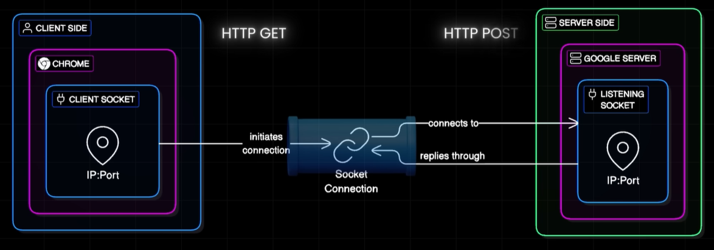
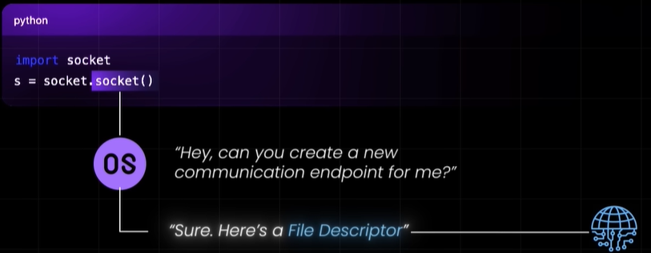
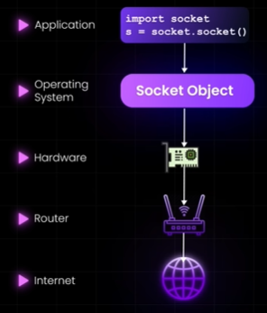
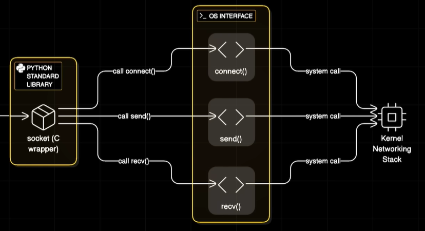
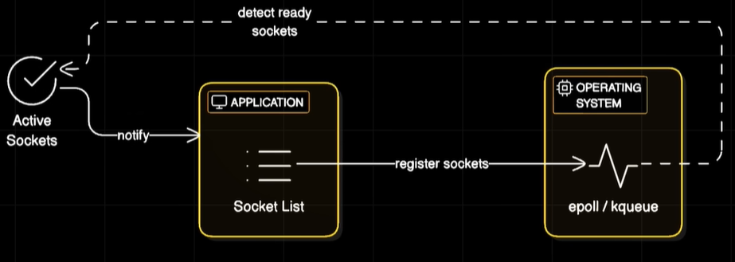

# Socket
Reference:
- https://www.youtube.com/watch?v=NvZEZ-mZsuI | Socket-1
- https://www.youtube.com/watch?v=pnj3Jbho5Ck | Socket-2
--- 
## Overview

- **socket** is opened b/w client and server when **connection (TCP/UDP)** is established.
- socket forms **two-way communication channel**, like a phone line, allowing two devices to talk
- A socket is a just software object, which talk s to OS only, not to network
- OS provides a "file descriptor"
    - that allows your program to read from and write to the network.
    - handles low-level details like IP routing and DNS resolution.
- **socket address**
  - an **IP** address (identifying a device) 
  - a **port** number (identifying an app or service on that device),
- **request**
  - data that travels inside the connection (TCP or UDP connection),
  - such as an `HTTP-Get`, `WebSocket-message`, etc

```
languages like Python, Java, Go, and Rust use their own wrappers or system calls 
to interact with the OS's underlying C-based socket APIs

- python example:
    - socket.socket
    - s.connect("abc.com", 80)
    - s.recv(8080) | s.bind('abc',8080); s.listen()
```






---
## Types of socket
### 1 Stream Sockets
- not built for browser
- `TCP` connection under the hood.
- Provide reliable, ordered communication
- where data arrives in the correct order without glitches
- eg: Netflix streaming, real-time chat apps, dashboards, file sharing
> modern: [WS, SSE, G-RPC-STREAM (not browser friendly)](../SD_03_54_IPC/03_streaming-TCP-based.md#2-websocket--wss-) 👈

### 2. Datagram Sockets
- not built for browser
- `UDP` connection under the hood.
- Offer fast communication but can lose data
- eg: used in multiplayer games where speed is more critical than perfection, IoT


---
## Advance concepts 
### Scaling with epoll and kqueue
> backbone of high-performance servers like **Nginx**
- To handle thousands of open sockets efficiently without constantly checking each one (polling), 
- modern servers use **event-based models**.
  - **epoll (Linux)** 
  - **kqueue (macOS/BSD)** 
  - they allow the OS to notify the server, only when specific sockets have data, 
  - thus preventing CPU waste

