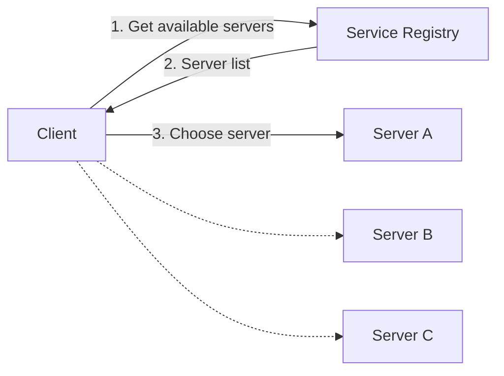
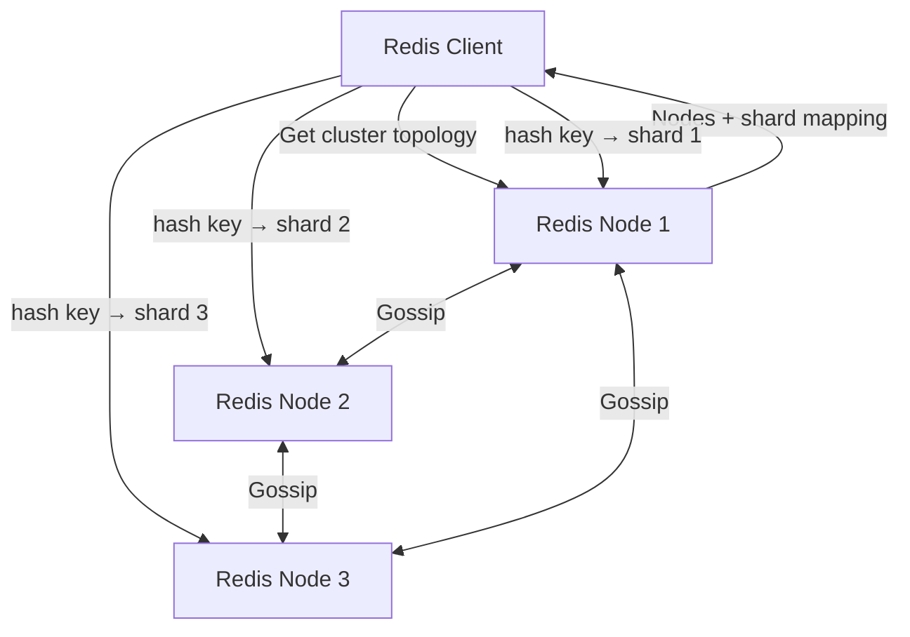
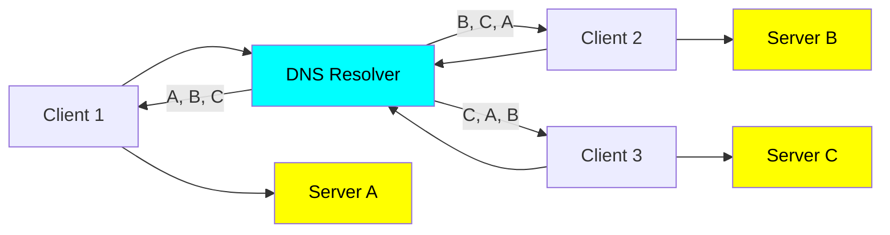

# Load balancer LB
- https://academy.bytemonk.io/products/system-design-mastery-beta/categories/2158360644/posts/2190592578
- https://youtu.be/ZcNaOuxcuyA?si=9eTTSUfpUQzi112D bm 1
- https://www.youtube.com/watch?v=BWB-S0awDnA bm 2 | algorithm

## A. Overview
- **traffic cop** between clients and multiple servers
- **main job** is to evenly distribute client requests across available servers
- **continuously monitor** server 
  - availability and performance metric
  - redirecting traffic away from unhealthy servers until they recover.
- can be **hardware-based** or **software-based**
  - with software-based being more cost-effective and customizable.

**Example**
- lb for frontend, 
- lb for backend-server
- lb for multi-DB reader instance
- lb for DNS server


---
## B. Algorithm / strategies

### B.1 Static
#### Random
- Works well when All servers are identical in capacity and performance,
- and traffic is expected to be evenly distributed over time.
- **drawback** - Does not account for server load or capacity, 
  - potentially leading to uneven distribution,
  - slower server might still receive the same number of requests, causing delays.

#### Round Robin
- Distributes requests sequentially to each server in a loop.
- same drawback - Does not account for server load or capacity
- **variation-1: Weighted Round Robin** 
  - Similar to round-robin,
  - but assigns more requests/weight to more powerful servers.
- **variation-2: Sticky Round Robin**
  - if Applications requiring session consistency
  - eg: user browsing a shopping website
  - eg: user dashboard

#### IP-based hashing
- Ensures requests from a specific client always go to the same server,
- useful for caching, session consistency
- hash(IP1) --> server-3
- hash(IP2) --> server-9
- ...


**URL Hashing**
- Similar to IP Hashing, but instead of the client's IP address, the URL path is hashed to decide the target server
- Works well for: Domain-specific workloads


---
### B.2 Dynamic
#### based on least connection
-  dynamic approach that routes incoming requests to the server with the fewest active connections

#### based on least response time (health)
- checks health 
- `dynamic algorithm` selects a servers, whose **average response**  was the lowest.


## C. Type
>Core idea:
> - Server-side LB: Client → Load Balancer → Server
> - Client-side LB: Client → discover servers → choose server directly

### Client Side



Advantages
- No extra load-balancer network hop
- Lower latency
- Client can choose based on locality, health, shard, etc.

Disadvantages
- More logic in the client
- Client must keep server information fresh

#### 💠Redix client example
 > The client learns the cluster topology, determines the shard for a key, and sends the request directly to the appropriate Redis node.


#### 💠kafka example
> Kafka uses client-side metadata-based routing, similar to redis
> - Producers and consumers learn cluster topology and communicate directly with the appropriate brokers,
> - avoiding a central request-level load balancer.

```
Producer → any broker: fetch metadata
Producer ← partition → leader mapping
Producer → correct leader broker directly
```

#### 💠 DNS

> Because each client gets a different ordering of IP addresses, 
> - they're also going to hit different servers. 
> - The DNS resolver is effectively doing client-side load balancing for us!


### Server side