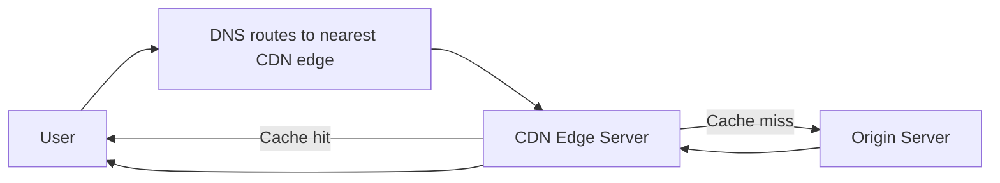

# Handle :: Latency + regionalization
- https://academy.bytemonk.io/products/system-design-mastery-beta/categories/2158360644/posts/2192532375
- https://chatgpt.com/g/g-p-6a68d3926dd4819180c1c9bf855e98f3-system-design-bm-acedemy/c/6a6d3584-9848-83e8-9697-a27a2cc06703
- https://www.hellointerview.com/learn/courses/system-design/lesson/foundations/networking-essentials#regionalization-and-latency

---
## physical constraint
> - fiber optic cables at about 2/3 the speed of light | approximately 200,000 km/s.
> - New York and London |  56ms |  before adding any processing time.
> - geographic distribution is essential for low-latency applications.
> - strategies:
>   - CDN for "latency" ✔️
>   - Regional Partitioning  for "regionalization"  ✔️

---
## A. CDN
### Overview
- servers that are strategically located around the world.
- boast hundreds or even thousands of different cities, with edge server
- If that edge server can answer a user's request, the user is going to get lightning fast response times

**Best content**

| Content type    | Example                                                  |
| --------------- | -------------------------------------------------------- |
| Static content  | Images, CSS, JavaScript, fonts                           |
| Video/audio     | Streaming and downloadable media                         |
| Large files     | Software packages, reports                               |
| Cacheable APIs  | Product catalog, public profiles                         |
| Dynamic content | Accelerated through optimized routing, not always cached |

---
### Benefits
| Benefit              | Explanation                                        |
| -------------------- | -------------------------------------------------- |
| Lower latency        | Content is served from a nearby edge location      |
| Reduced origin load  | Fewer requests reach application servers           |
| Higher availability  | Traffic can be served from multiple edge locations |
| Better scalability   | CDN absorbs large traffic spikes                   |
| DDoS protection      | Malicious traffic can be filtered at the edge      |
| Lower bandwidth cost | Cached content avoids repeated origin transfers    |

### Tradeoff
- but introduces **cache consistency and invalidation complexity.**

---
## B. Regional Partitioning 
### overview
- Another common strategy,  when we need to deal with regionalization is regional partitioning.
- If we have a lot of users in a single region, we can partition our data by region so that each region only has data relevant to it.

> eg: With the Uber app we're ordering rides from drivers in a specific city

- We can bundle together nearby cities into a single local region (e.g. "Northeast US", or "Southwest US"). 
  - Each region can have its own database hosted on distinct servers located in that geography
  - user queries can be answered by their regional services (fast), 
  - and those regional services can use a local database to process the query (very fast)