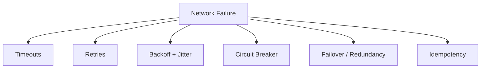

# network failure
- [check :: resiliency](../../SD_02_Non-functional-req/02_NFR_07_resiliency__.md)
- https://www.wireshark.org/

## Overview
- a network failure means two components cannot communicate reliably, even though both may still be running.
- Common forms:
```
Packet loss — some messages never arrive
High latency — messages arrive too slowly
Timeouts — response does not arrive within the expected time
Network partition — groups of nodes become isolated from each other
Connection reset/drop — an established TCP connection breaks
DNS/routing failure — the client cannot locate or reach the service
```
> You usually cannot distinguish “request failed” from “request succeeded but the response was lost.”

---
## strategies
> If the client blindly retries, the user could be charged twice. 
> That is why timeouts + retries + idempotency are often designed together.


### 1. timeout + retries

### 2. Circuit breaker