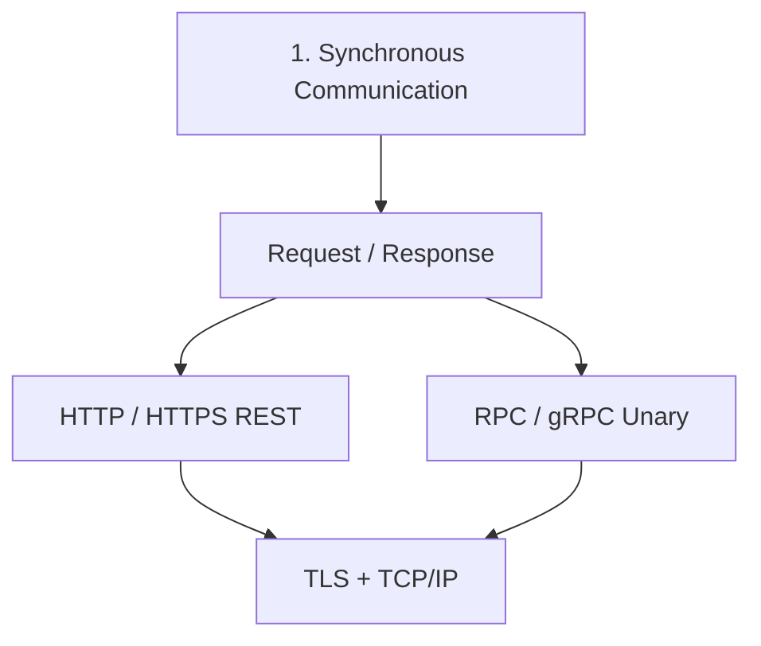
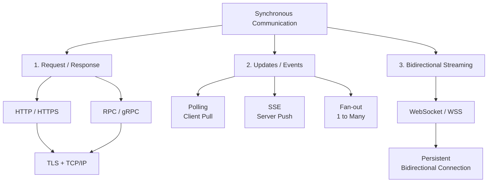
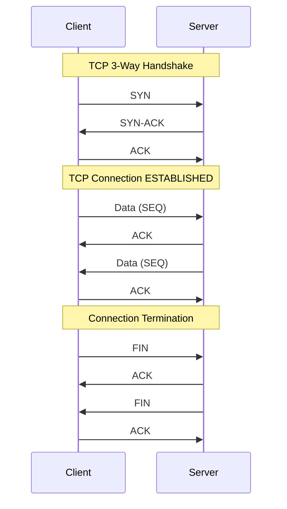

# A. Synchronous: Request/Response





---
## 1. HTTP / HTTPS(TLS)
A stateless, text-based protocol commonly used for APIs.
- HTTP connection : HTTP protocol --> TCP handshake
- HTTPS connection : [HTTP --> TCP handshake --> TLS handshake](../SD_24_security/03_protocol_https_tls.md)
- **short live stateless connection.** : open-close, open-close, ...
- Also **handshake takes time.**
- use case - REST API

---
## 2. TCP/IP (Transmission Control Protocol) 
> **PASSIVE SERVER**, reply only if client requests

TCP handshake:
- Creates a reliable, stateful connection between two endpoints.
- Connection starts with 3-way handshake: SYN → SYN-ACK → ACK
- Identified by: Source IP + Source Port + Destination IP + Destination Port
- **Provides ordering, acknowledgments, retransmission, flow control, and congestion control**
- TCP itself does not encrypt data; TLS provides encryption.

```
    TCP = reliable pipe
    TLS = secure pipe
    HTTP = language spoken through the pipe
```


---
## 3. RPC / GRPC...
- **Description**: A high-performance, open-source RPC framework by Google.
- **Key Features**:
    - Uses Protocol Buffers (Protobuf) for serialization.
    - Supports bi-directional streaming.
    - Highly efficient binary format.
- **Common Use Cases**:
    - Low-latency communication in microservices.
    - Distributed systems needing real-time communication.
- **Supported by**: Google Cloud, gRPC libraries.
