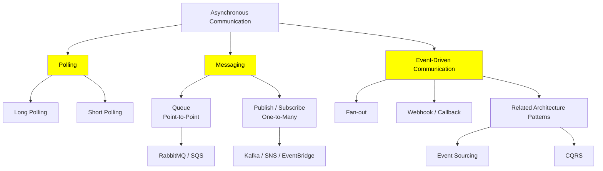
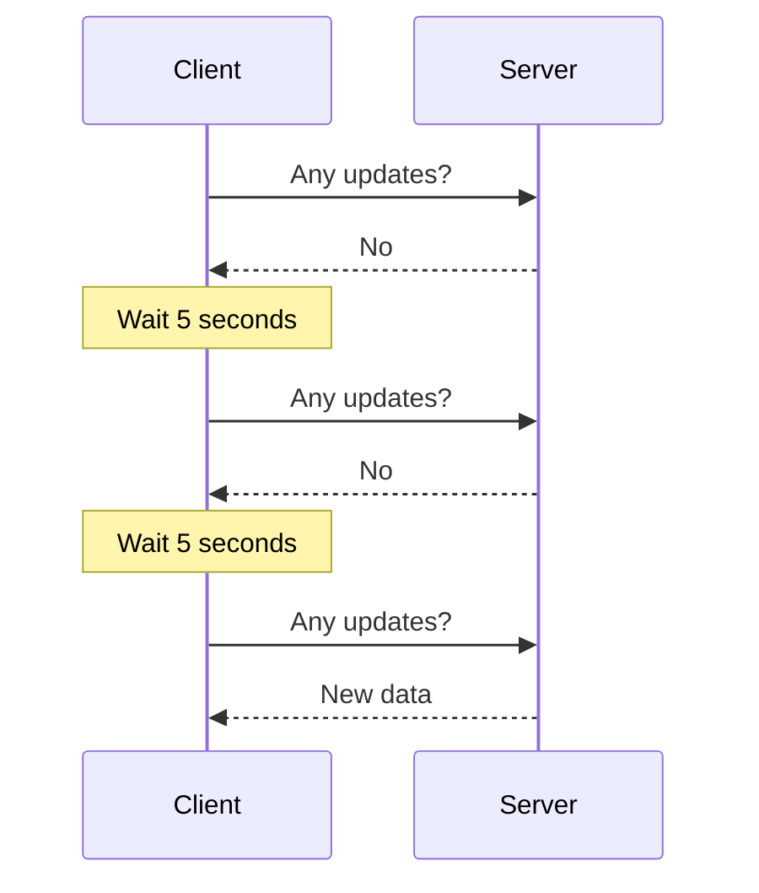
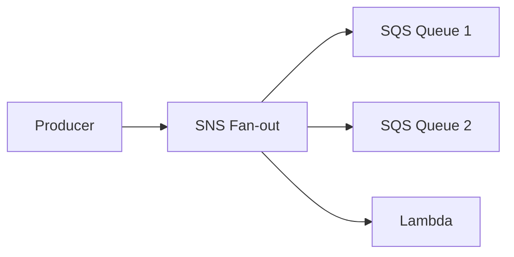
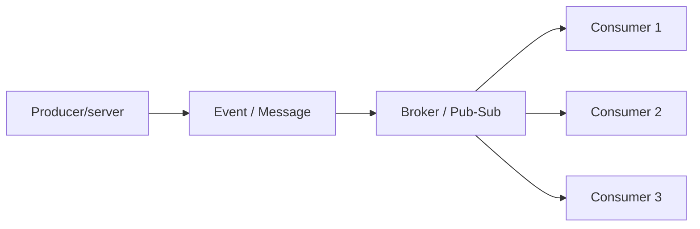
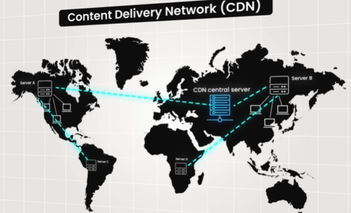
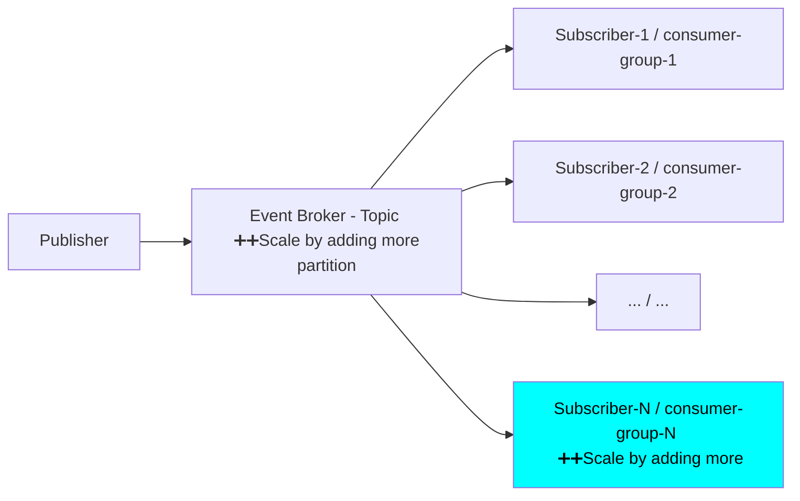
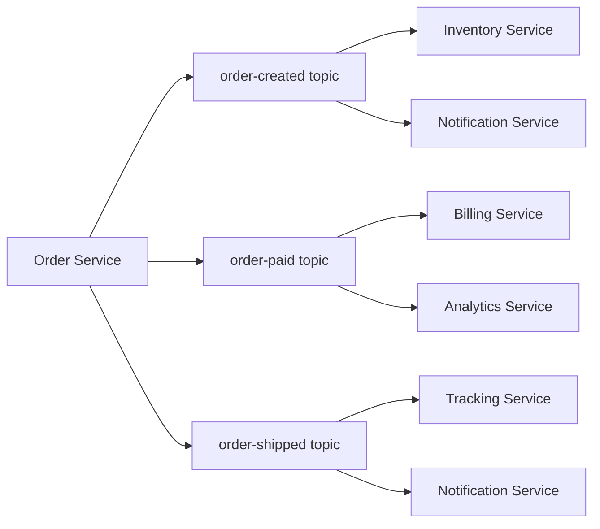
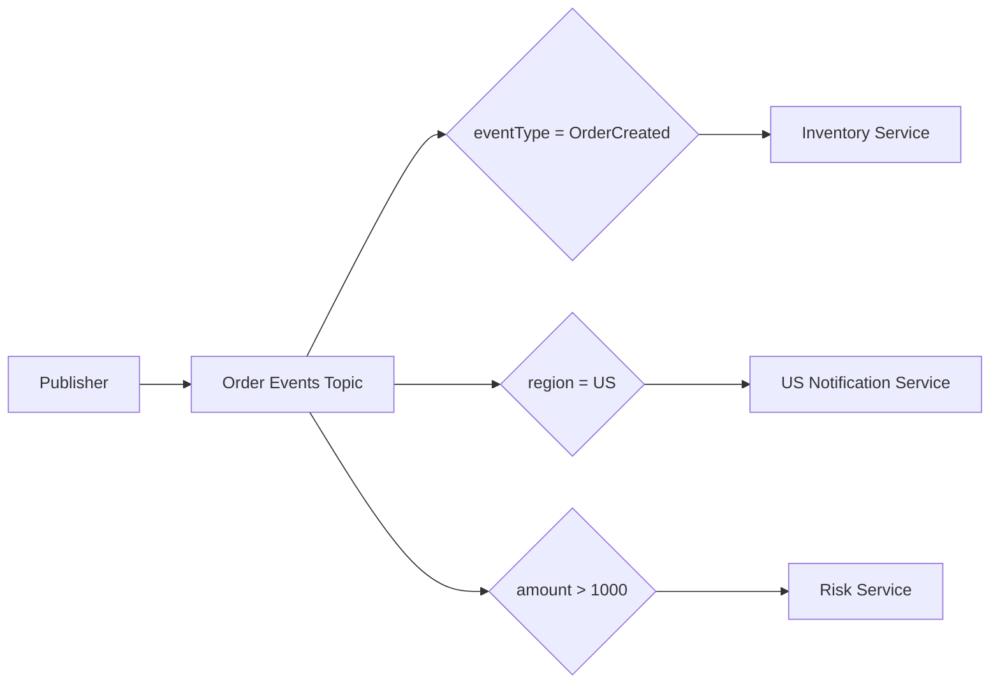

#  Asynchronous Communication


---
## 1. Polling
### 1.1. Short Polling
- https://www.youtube.com/watch?v=b4qyOpGg748
- client repeatedly requests data from a server **at set intervals** 
  - using any network protocol.eg: https, etc
- **problem** : it creates many new connections and often results in empty responses.
- eg:
  - Temperature Monitoring
  - AJAX application polls bts
  - not ideal for real-time applications like chat
- **reducing** the polling interval
  -  it significantly increases the **load on the server**, 
  - as clients send many **unnecessary requests**.
  


### 1.2. Long Polling
- A variation where the server **holds the client's request** 
  - `hanging GET (with timeout)` 👈🏻
- until data is available **or** a timeout occurs
  - This allows the server to "push" information, 
  - but clients still need to reconnect periodically after timeouts
  - https://www.youtube.com/watch?v=pnj3Jbho5Ck (02:00)

**problem**: since holds client's request, thus resource intensive.


---
## 2. Event Driven
### 2.1 Fan-out 
| Concept               | Meaning                                                                                       |
| --------------------- | --------------------------------------------------------------------------------------------- |
| **Fan-out**           | A delivery pattern: one message is copied to multiple destinations                            |
| **Publish–Subscribe** | A messaging model: publishers send to a topic, and subscribers independently receive messages |

They look similar because pub-sub usually implements fan-out

fan-out-1:



fan-out-2: implemented with pub-sub:


Twitter 2012-2013 problem : https://www.youtube.com/watch?v=FEkXjNFrL1o
```
Twitter had 150 million users 
 handled write - 6,000 tweets per second. 
 Challenge-1:
  - read requests: 300,000 requests per second to serve homepages
    - User timeline 
    - Home timeline
  - Fix-1: Adding indices speeds up reads but slows down writes.
           Since reads are more frequent than writes, this is a fair trade-off.
           
  - Fix-2: 
    - pre-computed and stored user home timelines in a Redis cluster
    - Twitter serves the cached timeline from Redis, significantly reducing latency
    - When a user tweets, the tweet is replicated into the home timeline queue of each follower, 
    - resulting in thousands of writes to redis, for a single tweet
    - this is fanOut 👈🏻
  
```


---
### 2.2 Webhook / callback
- just **Http Post** with event data.
- https://www.youtube.com/watch?v=oQaJn6RdA3
- traditional: polling, long-live connection
    - eating resources
- Webhooks allow servers
    - to notify client applications
    - only when new events occur, rather than requiring clients to check periodically.
- eg: gitHub make post call --> harness trigger (POST /api, idempotent), payload: {eventId...}
- benefit:
    - Webhooks improve system performance,
    - reduce latency,
    - and are crucial in modern microservices architectures for enabling system decoupling

**Example for CI/CD pipeline in AWS**
- https://youtu.be/9zfAqoTm4-Q?si=_PGo_F1tcNZvuxyi
- 

### 2.3 Event Sourcing
> Note: just arch pattern
- https://academy.bytemonk.io/products/system-design-mastery-beta/categories/2158360668/posts/2190592897

### 2.4 CQRS
> Note: just arch pattern
- [05_pattern_01_CQRS.md](../../SD_05_DataLayer%2Bstorage/05_pattern_01_CQRS.md)

---
## 3. Messaging
### 3.1 point-2-point
Reference
- https://www.youtube.com/watch?v=2v6KqRB7adg
- https://academy.bytemonk.io/products/system-design-mastery-beta/categories/2158360668/posts/2190592897

 




**Example of transferring large video files to thousands of machines**
1. single server approach (10 videos, 5GB each) - `15 min`
2. sharding, 5 server (2 videos each, 5GB each) - `15/5 = 3 min`
3. P2P solution - `1 sec`
    -  large file is split into small chunks and distributed among peers
    - These peers then communicate with each other in **parallel** to assemble the complete file
    - **peer discovery**
    - **peer selection strategies** within a P2P network
    - Centralized database (tracker), Gossip protocol, distributed hash table (DHT)

### 3.2 pub-sub
> Use Pub-Sub when one business event must trigger multiple independent downstream actions,
> without tightly coupling the producer to consumers.

- In event of network failure/partition, subscriber will leave and comeback and, need message again.
- that's why **at least once** delivery is required, (one or more times delivery),
    - hence keep idempotent consumer.
- Message/event are **ordered**.
- In **kafka** each topic is **distributed in nature (has partitions)**
- More:
    - separation of concern
    - content based filtering


**separation of concern** : create multiple topic

**content based filtering**: filter and then subscribe
