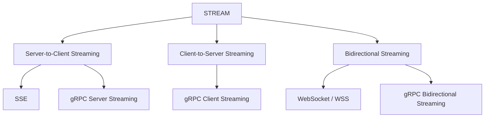
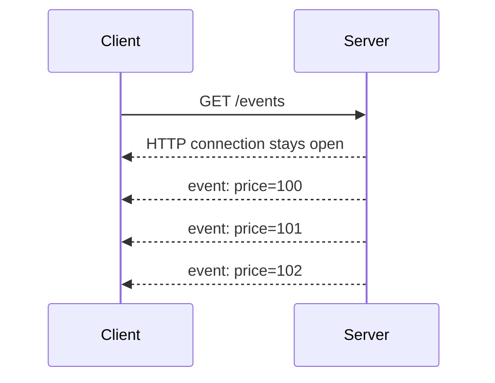
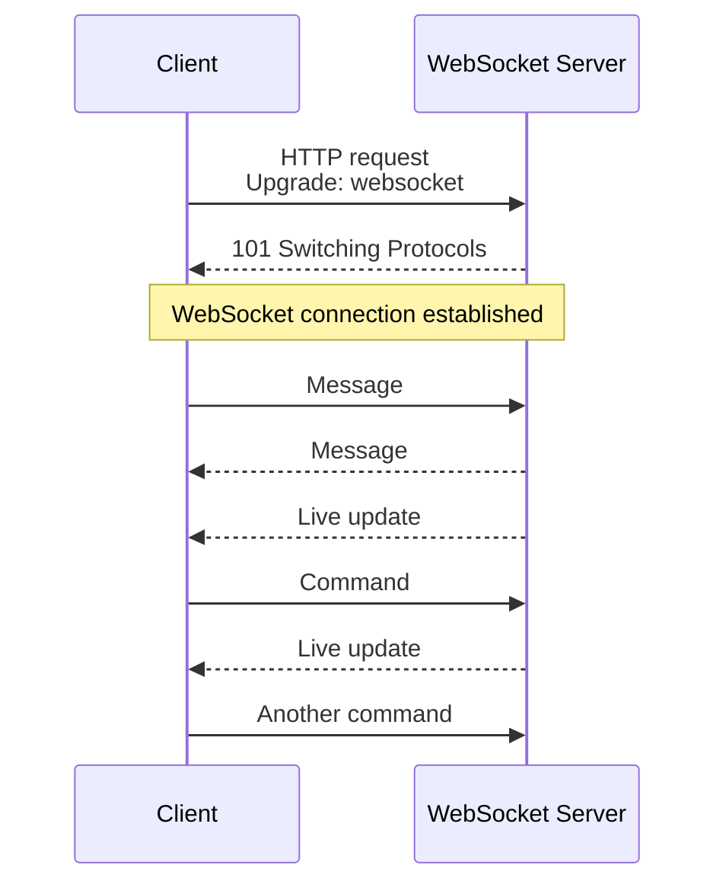
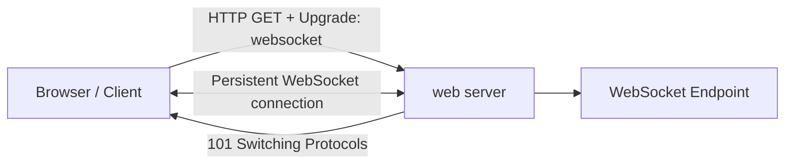

#  Streaming



## 1. Server-to-client
### 1.1. SSE
- server sent event
- designed for streaming **textual data** over HTTP
- SSE is a unidirectional protocol
- server pushes data to the client over a single, long-lived HTTP connection.



---
## 2. client-to-Server
### 2.1 grpc client streaming __

## 3. Bidirectional
### 3.1 WebSocket / WSS
- **ACTIVE SERVER**, proactively reply/push to client, with even client requesting/polling
- Streaming https://www.youtube.com/watch?v=b4qyOpGg748
- Full Duplex async messaging: - https://www.youtube.com/watch?v=pnj3Jbho5Ck  | https://www.youtube.com/watch?v=G0_e02DdH7I
- the client opening a **long-lived connection** with the server,
- typically through a **socket**, 👈
- allowing the server to **push** information **without a client request**
- Analogy: client opens a file and server can write any moment until client closes file.

```
        Persistent connection:
Client  ◄══════════════════════► Server
          send / receive
          send / receive
          send / receive
```


```mermaid
flowchart LR
    A[Browser / Angular Client]
    -->|WSS| B[LB]

    B -->|WebSocket| C[Uvicorn]

    C --> D[FastAPI / starlette]

    D --> E[@"@app.websocket('/ws')"]
```
- `ws`://localhost:8080/myapp/chat | `wss`://localhost:8080/myapp/chat
- check short and Long Polling problem.
- Flow:
    - **Https/TCP handshake** === same
    - **negotiate to upgrade** to WS with request header:
        - `Upgrade: websocket`,
        - `Connection: Upgrade`,
        - `Sec-WebSocket-Key: xxxxxxxx`
    - server validates:
        - response code `101` / Switching Protocols,
        - response header:
            - `Sec-WebSocket-Accept: zzzzzzzzz`,
            - which is generated by concatenating the client's key with a GUID
            - and applying SHA-1 hashing.
    - establishes a persistent, **bi-directional connection**/ tunnel
    - both client/server,
        - can stream **data frame**, uninterrupted 👈🏻
        - simultaneous sending and receiving
    - either, initiate close connection

**Data frame**
```
FIN bit : Indicates if it's the final fragment of a message.
RSV bits : Reserved for future use.
Opcode : Defines the type of data (text, binary, ping, et).
Mask bit : Indicates if the payload data is masked (always for client-to-server frames).
Payload length : Defines the length of the data.
Masking key : Used to obscure payload data.
```
**Masking**

**Fragmentation**
- splitting large messages into smaller chunks
- to prevent buffer overflow
- and allow for gradual delivery of data.
- The FIN bit is used to indicate whether a fragment is the final part of a message.

**Real-time applications**
```
WebSockets are ideal for:
    Stock trading websites displaying live price fluctuations 
    Chat applications
    Gaming applications that require automatic UI refreshes
```

---
### 3.2. grpc bidirectional streaming __

