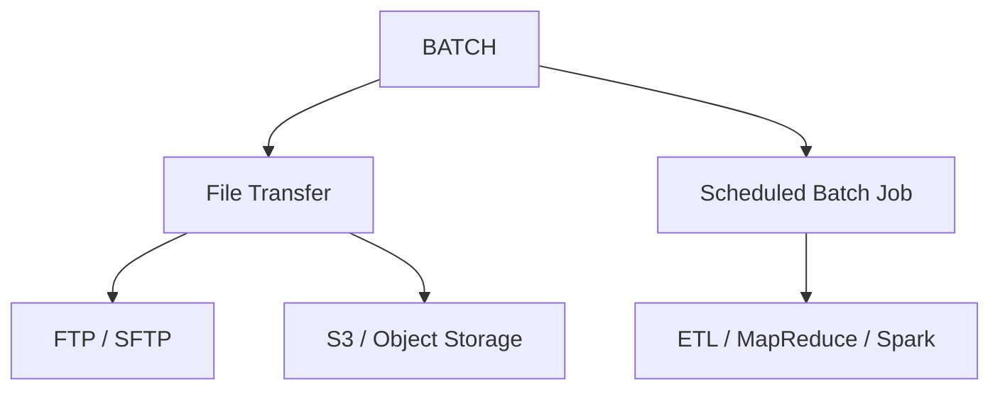

# D. Batch/File-based

```mermaid
flowchart TB
    %% Batch
    BATCH --> FILE[File Transfer]
    BATCH --> JOB[Scheduled Batch Job]

    FILE --> FTP[FTP / SFTP]
    FILE --> OBJECT[S3 / Object Storage]

    JOB --> ETL[ETL / MapReduce / Spark]
```

## D.1. File transfer
- FTP/SFTP
- AWS S3

## D.2. Scheduled batch job
- ETL
- MapReduce / spark

