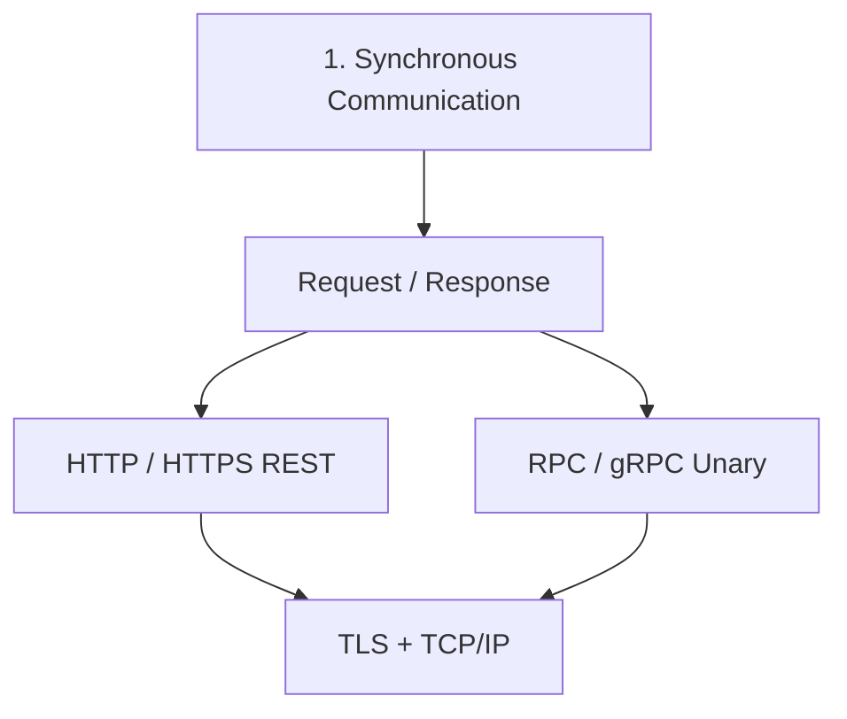

#  Synchronous: Request/Response
> [⭐ microservices :: service-mesh](../SD_03_52_architecture/02_pattern_10_service-mesh.md)

---
## Overview

---
## 1. TCP/IP (Transmission Control Protocol)

---
## 1. HTTP / HTTPS(TLS)
- [Overview](../SD_03_53_network/01_basic_01_OSI-Model.md#https)
- [http-headers](../../SD_08_API-Design/11_rest_02_http-headers.md)
- [http-evolution](../../SD_08_API-Design/11_rest_03_http-evolution.md)

---
## 2. RPC / GRPC...
- [overview](../../SD_08_API-Design/12_grpc_01_overview.md)

---
## 3. graphQL
- [overview](../../SD_08_API-Design/12_grpc_01_overview.md)

