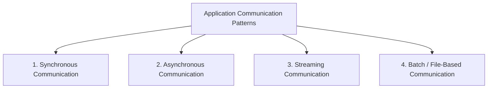
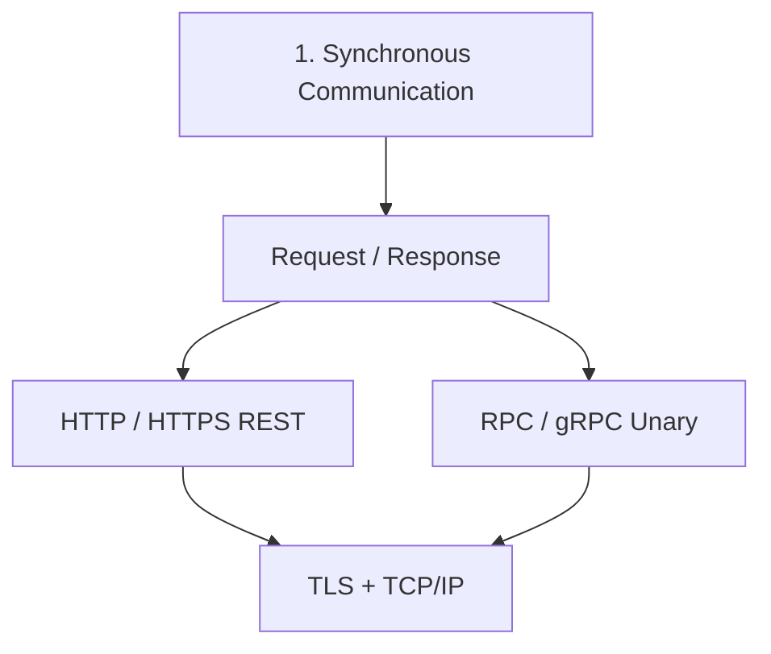

#  Inter process Communication : Synchronous
> [⭐ microservices :: service-mesh](../SD_03_52_architecture/02_pattern_10_service-mesh.md)

---
## Inter process Communication
- https://youtu.be/AMNWLz_f6qM?si=T076QSntCR53atIb | bm

IPC format:
- text based: `JSON`, `XML`
- binary: `Protobuf`, `avro`

| Communication    | One-to-One                                            | One-to-Many                   | Examples                          |
| ---------------- | ----------------------------------------------------- | ----------------------------- | --------------------------------- |
| **Synchronous**  | ✅ Request → Response                                  | ❌ Rare                        | REST, gRPC                        |
| **Asynchronous** | ✅ Queue, one-way notification, async request/response | ✅ Pub/Sub, Event Bus, Fan-out | Kafka, RabbitMQ, SNS, EventBridge |

| Category     |         Caller waits? | Connection                           | Common examples                  |
| ------------ | --------------------: | ------------------------------------ | -------------------------------- |
| Synchronous  |                   Yes | Usually short-lived                  | REST, HTTP, unary gRPC           |
| Asynchronous |                    No | Decoupled through broker or callback | Kafka, RabbitMQ, SQS, webhook    |
| Streaming    |            Continuous | Long-lived                           | WebSocket, SSE, gRPC streaming   |
| Batch        | No real-time response | Periodic or file-based               | SFTP, S3 files, Spark, MapReduce |

> layer 7 network protocol:

### [A. Synchronous: Request/Response](../SD_03_54_IPC/01_synchronous.md)
- http  / tcp handshake
- https / tls handshake
- grpc (http2.0)
- graphQL (http)

### [B. Asynchronous Communication](../SD_03_54_IPC/02_asynchronous.md)
- event based - fanOut, webhook, event sourcing/CQRS
- message based - p2p, pubSub
- polling - short / long

### [C. Streaming](03_streaming-TCP-based.md)
- ws / wss
- gRPC stream

### [D. Batch/File-based](../SD_03_54_IPC/04_batch_file_based.md)
- FTP
- object: AWS S3
- ...

---
### [More](../SD_03_54_IPC/05_more.md)
- webRTC
- Video stream

## Synchronous: Request/Response

---
## 1. HTTP / HTTPS(TLS)
- [Overview](../SD_03_53_network/01_basic_01_OSI-layers.md#https)
- [TCP](../SD_03_53_network/01_basic_01_OSI-layers.md#tcp-reliable-delivery)
- [http-headers](../../SD_08_API-Design/11_rest_02_http-headers.md)
- [http-evolution](../../SD_08_API-Design/11_rest_03_http-evolution.md)
- [https/TLS](../../SD_24_security/03_protocol_https_tls.md)

---
## 2. RPC / GRPC...
- [overview](../../SD_08_API-Design/12_grpc_01_overview.md)

---
## 3. graphQL
- [overview](../../SD_08_API-Design/12_grpc_01_overview.md)

