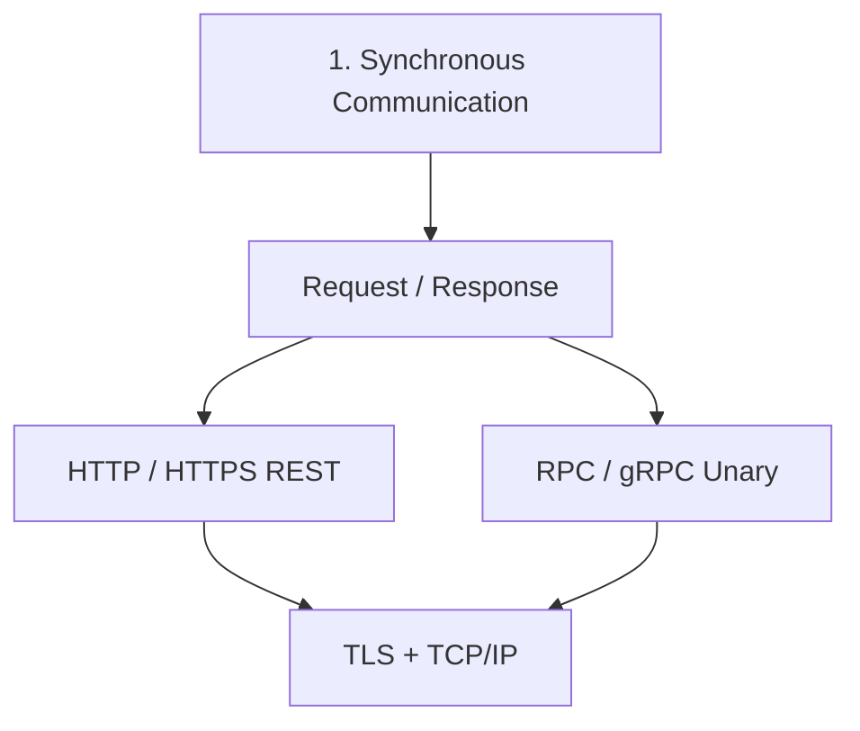
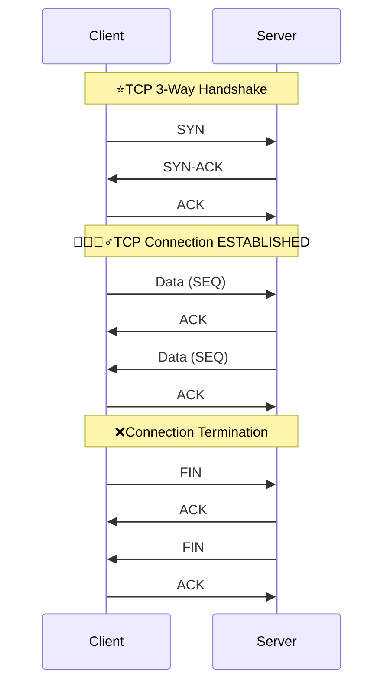

#  Synchronous: Request/Response
> [⭐ microservices :: service-mesh](../SD_03_52_architecture/02_pattern_10_service-mesh.md)

---
## Overview



---
## 1. TCP/IP (Transmission Control Protocol)
**TCP handshake:**
- Creates a reliable, stateful connection between two endpoints.
- Connection starts with **3-way handshake**: SYN → SYN-ACK → ACK
- Identified by: Source IP + Source Port + Destination IP + Destination Port
- **Provides ordering, acknowledgments, retransmission, flow control, and congestion control**
- TCP itself does not encrypt data; TLS provides encryption.

```
    TCP = reliable pipe
    TLS = secure pipe
    HTTP = language spoken through the pipe
```

---
## 1. HTTP / HTTPS(TLS)
A stateless, text-based protocol commonly used for APIs, built on top of TCP
- HTTP connection : HTTP --> TCP handshake
- HTTPS connection : HTTP --> TCP handshake --> [TLS handshake](../../SD_24_security/03_protocol_https_tls.md)
  - Also **handshake/s takes time.**
- **short live stateless connection.** : open-close, open-close, ...
- use case : RESTful-API, web pages

---
## 2. RPC / GRPC...
- [overview](../../SD_08_API-Design/12_grpc_01_overview.md)

---
## 3. graphQL
- [overview](../../SD_08_API-Design/12_grpc_01_overview.md)

