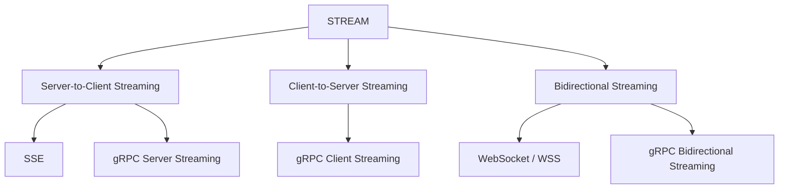
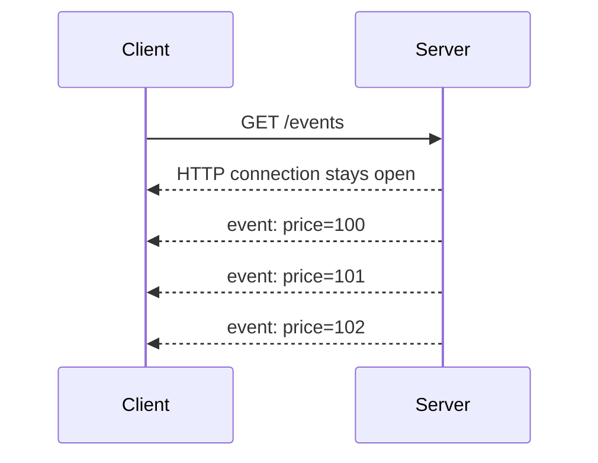
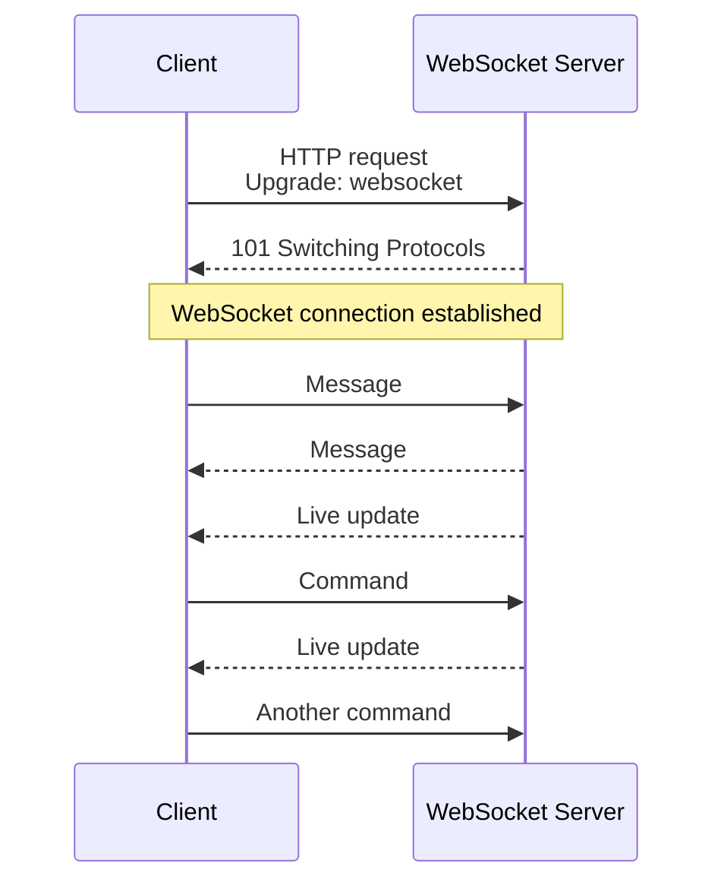
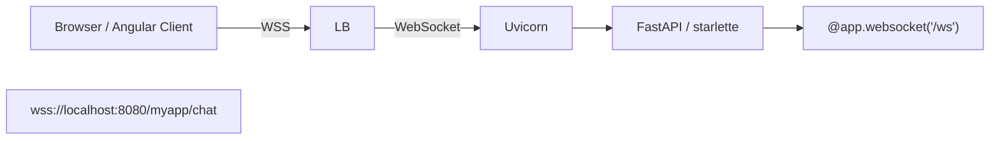
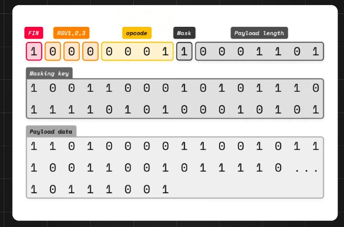

# Streaming (Http based) 

---
## Reference:
- [socket](../SD_03_53_network/01_basic_03_socket.md)
- https://www.youtube.com/watch?v=pnj3Jbho5Ck | bm ws part-1 overview (2024) 
- https://www.youtube.com/watch?v=G0_e02DdH7I | bm ws part-2 details(2024) 
- https://www.youtube.com/watch?v=BKonNa7XPdg | bm ws part-3 more deep arch (2026) 

---
## Overview


---
## A. Server-to-client
### 1. SSE (server sent event)
- designed for streaming **textual data** over HTTP
- server pushes data to the client over a single, long-lived HTTP connection through socket


### 2 grpc client streaming __

---
## B. client-to-Server
### 1 grpc client streaming __

---
## C. Bidirectional
### 1. grpc bidirectional streaming __

---
### 2. WebSocket / WSS
```
        Persistent connection:
Client  ◄══════════════════════► Server
          send / receive
          send / receive
          send / receive
```
- the client opening a **long-lived connection** with the server, typically through a **socket** 👈
- allowing the server to **push** information **without a client request** and vice versa. 
> Analogy: client opens a file and server can write any moment until client closes file.

#### use cases
- Stock trading websites displaying live price fluctuations 
- Chat applications
- Gaming applications that require automatic UI refreshes

#### connection
```
- Https/TCP handshake
- negotiate to upgrade, to WS with request header:
    - `Upgrade: websocket`,
    - `Connection: Upgrade`,
    - `Sec-WebSocket-Key: xxxxxxxx`
- server validates:
    - response code `101` / Switching Protocols,
    - response header:
        - `Sec-WebSocket-Accept: zzzzzzzzz`,
        - which is generated by concatenating the client's key with a GUID
        - and applying SHA-1 hashing.
- establishes a persistent, **bi-directional connection**/ tunnel
- both client/server, can stream **data-frame**, uninterrupted 👈🏻
- either, initiate close connection
```






#### Dataframe



| Field              | Purpose                                                       |
| ------------------ | ------------------------------------------------------------- |
| **FIN**            | `1` = Final frame of the message, `0` = More fragments follow |
| **RSV (3 bits)**   | Reserved for extensions (normally `0`)                        |
| **Opcode**         | Type of frame (Text, Binary, Ping, Pong, Close, etc.)         |
| **Mask Bit**       | `1` if payload is masked (required for client → server)       |
| **Payload Length** | Size of the payload (7, 16, or 64-bit length)                 |
| **Masking Key**    | 4-byte key used to unmask client payload                      |
| **Payload Data**   | Actual application data                                       |

Fragmentation:
- splitting large messages into smaller chunks to prevent buffer overflow
- and allow for gradual delivery of data.
- The FIN bit is used to indicate whether a fragment is the final part of a message.

#### Interview Takeaways
- WebSocket communicates using frames, not HTTP requests.
- Each frame contains a header + payload.
- FIN indicates whether more fragments follow.
- Opcode identifies the frame type (text, binary, ping, pong, close).
- Client → Server frames are masked; Server → Client frames are not masked.
- Ping/Pong maintains long-lived connections and detects disconnects.


