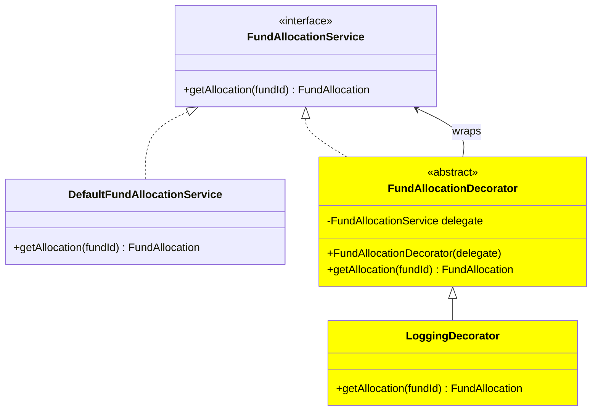
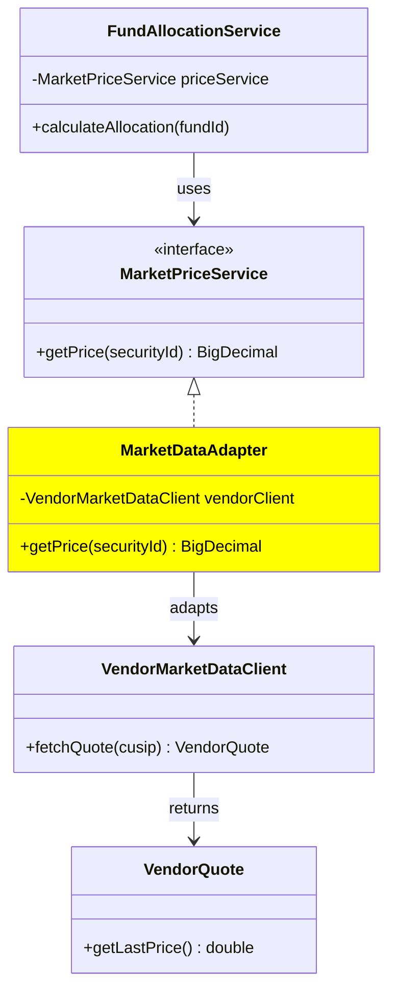
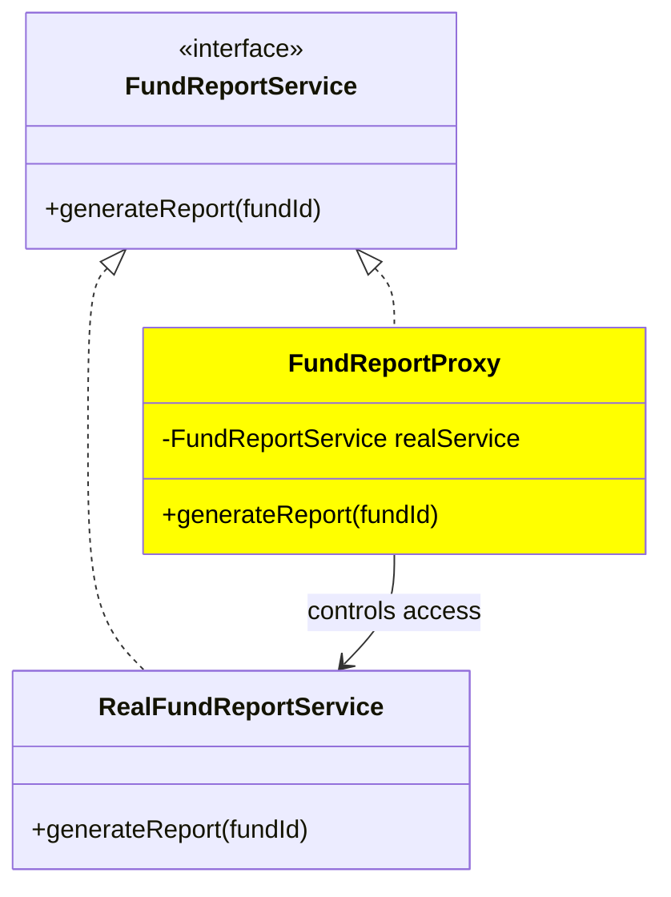
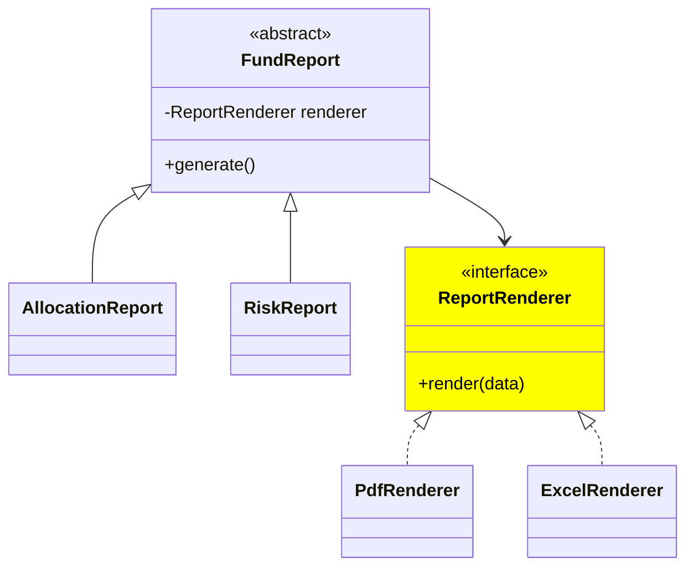
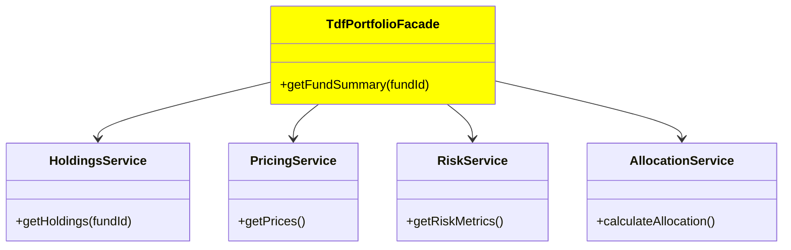
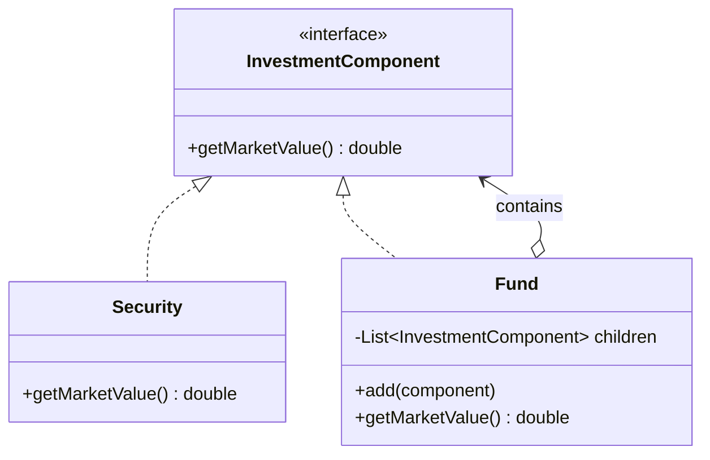

# Structural Patterns (Object composition & structure)
- Used to organize classes and objects cleanly.

## Quick summary
| Pattern       | Core Idea                                           | Simple Meaning                                 | Java / Microservice Example                                                    | When to Use                                                         |
| ------------- | --------------------------------------------------- | ---------------------------------------------- | ------------------------------------------------------------------------------ | ------------------------------------------------------------------- |
| **Adapter**   | Convert one interface into another                  | **Translator** between incompatible systems    | `FundService` talks to `BloombergAdapter` or `VendorPricingAdapter`            | External API, legacy system, protocol mismatch                      |
| **Bridge**    | Separate abstraction from implementation            | Allow **two dimensions to vary independently** | `Report` + `PDFRenderer` / `ExcelRenderer`                                     | Avoid class explosion when abstraction and implementation both vary |
| **Composite** | Treat individual objects and groups the same        | Build **tree structures**                      | Target Date Fund → multiple underlying funds → securities                      | Hierarchies, folders, portfolio trees, UI component trees           |
| **Decorator** | Add behavior by wrapping object                     | **Same interface + extra behavior**            | Add validation, logging, metrics, caching around `FundAllocationService`       | Add optional features without modifying original class              |
| **Facade**    | Provide one simple interface over complex subsystem | **Simplified front door**                      | `PortfolioFacade` internally calls pricing, holdings, NAV, compliance services | Hide complexity from client                                         |
| **Flyweight** | Share common immutable objects                      | Reuse instead of creating duplicates           | Share `SecurityMetadata` objects for same ticker/security                      | Huge number of similar objects, memory optimization                 |
| **Proxy**     | Stand in front of real object and control access    | **Gatekeeper / representative**                | `FundServiceProxy` adds auth, lazy loading, remote call, cache                 | Security, remote calls, lazy initialization, caching                |

## MindMap
```
Adapter   → translate
Bridge    → separate abstraction from implementation
Composite → tree / parent-child
Decorator → add behavior
Facade    → simplify complexity
Flyweight → share common objects
Proxy     → control access
```
---
## 1. Decorator
- https://youtu.be/USLwIwyWVIM bm
- adds new **behaviors** or functionalities to **objects** dynamically
- without altering the structure or code of the existing **classes/interface**.
- create new interface/class wraps over current, and add new feature.

```
Interface
   ↑
   ├── Concrete Component
   │
   └── Decorator ⭐
          ↑
          ├── Logging Decorator
          ├── Validation Decorator
          └── Metrics Decorator
```
```java
// Base responsibility:
public interface FundAllocationService {
    FundAllocation getAllocation(String fundId);
}

// Basic implementation:
public class DefaultFundAllocationService implements FundAllocationService {

    @Override
    public FundAllocation getAllocation(String fundId) {
        // Fetch fund-of-funds holdings and calculate allocation
        return new FundAllocation(fundId);
    }
}

/*
Now you want to add:

logging
validation
metrics
caching

You do not modify DefaultFundAllocationService.

Instead, wrap it.
*/
public class LoggingFundAllocationDecorator implements FundAllocationService 
{
    private final FundAllocationService delegate;
    public LoggingFundAllocationDecorator(   FundAllocationService delegate) {        
        this.delegate = delegate;    
    }

    @Override
    public FundAllocation getAllocation(String fundId) {
        System.out.println(            "Calculating allocation for fund: " + fundId        );
        FundAllocation result =            delegate.getAllocation(fundId);
        System.out.println(            "Allocation calculation completed"        );
        return result;
    }
}

```

---
## 2. Adapter
- https://youtu.be/USLwIwyWVIM bm
- that acts as a **bridge** between two incompatible interfaces
- **Adaptee**: The existing class with an incompatible interface.
- **Target Interface**: The interface expected by the client.
- **Adapter**:
    - Implements the target interface
    - and, wraps the adaptee,
    - translating the client's calls to the adaptee.
- eg: SOAP <--> adaptor  <-->   REST


---
## 3. Proxy
> Proxy = an object that stands in front of the real object and controls access to it.

eg: protect access to a **sensitive** fund report service.


---
## 4. Bridge 
> Bridge pattern is easiest when you think about **avoiding class explosion**.

Without Bridge, you may create:
```
AllocationPdfReport
AllocationExcelReport
RiskPdfReport
RiskExcelReport
```
with bridge


---
## 5. Facade
one simple interface in front of multiple complex services.


---
## 6. Composite  
- Composite = treat a single object and a group of objects the same way.
- Best fit for tree / hierarchy structures. 👈



---
## 7. Flyweight 
- share common **immutable data** instead of creating duplicate objects.

```
TradeOrder.status  ─────┐
                        ├──> Status.COMPLETED
ReportJob.status   ─────┘
```