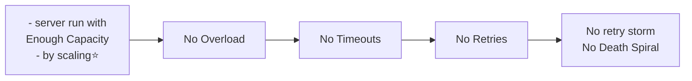
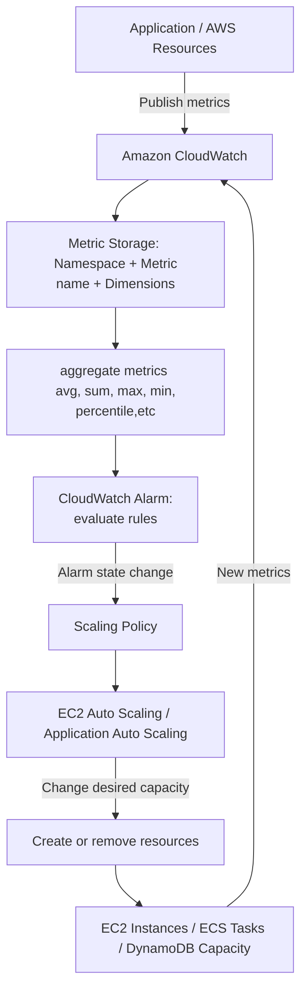
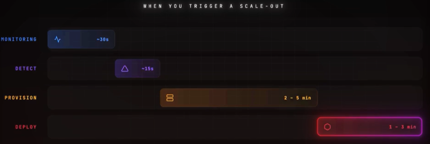

# Protection server : Auto-scaling `adaptation`
- [NFR_03_Scaling](../SD_02_Non-functional-req/02_NFR_03_Scaling.md#scaling-protects-server-from-death-spiral-)

## Overview
- Dynamically add capacity to match demand

**Scaling policies(AWS)**
- **Scheduled Scaling** : Changes capacity at known times.
- **Predictive Scaling** : Uses historical traffic patterns to provision capacity before demand arrives.
- **Metric based scaling**
    - **SIMPLE**:
        - Performs one scaling action and waits for a cooldown period
        - CPU > 70% → add 2 servers
        - Wait 5 minutes before another action
    - **STEP**:
        - Scales by different amounts based on alarm severity.
        - | CPU utilization |        Action |
                          | --------------- | ------------: |
          | 60–70%          |  Add 1 server |
          | 70–85%          | Add 2 servers |
          | Above 85%       | Add 4 servers |

    - **TARGET TRACKING**
        - Keeps a metric near a target value.
      ```
      - Target CPU utilization = 60%
      - CPU > 60% → scale out
      - CPU < 60% → scale in
      ```

## AWS - Auto scaling
- [AWS ASG (auto scaling group).md](../../CE_02_AWS_SAA/01_compute/01_ASG.md)
- Communication between components are asynchronous and event-driven.

**Stages**



| Stage        | What happens                                                                        |
| ------------ | ----------------------------------------------------------------------------------- |
| Monitoring   | CloudWatch collects and aggregates metrics                                          |
| Detection    | Alarm waits for the configured evaluation period                                    |
| Provisioning | EC2 instance, container task, or pod is created                                     |
| Deployment   | Application starts, loads configuration, connects to dependencies, and warms caches |
| Health check | Load balancer waits until the resource is healthy                                   |


