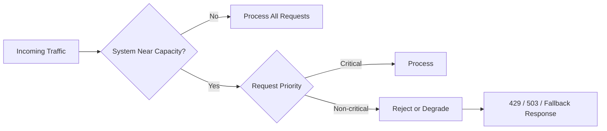
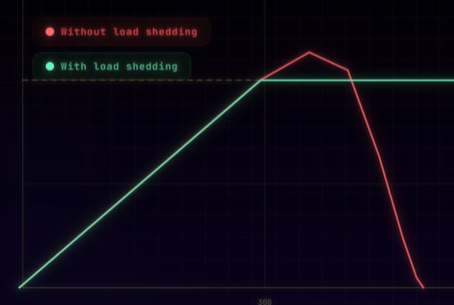
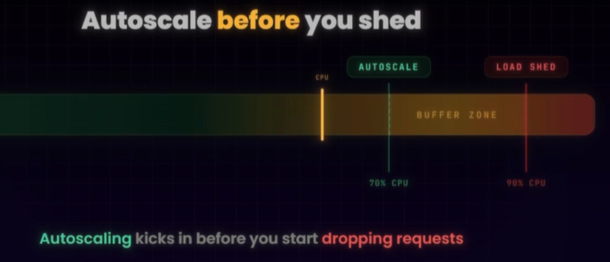
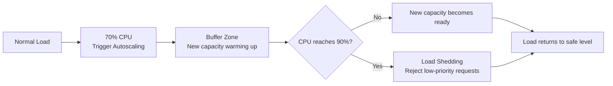

# Protection server  :: Load Shedding
- https://academy.bytemonk.io/products/system-design-mastery-beta/categories/2159577489/posts/2195511826

---
## Overview
> Rejecting 400 requests is better than accepting all 1,400 and causing every request to become slow or fail.

- It is better to successfully serve some requests, than to fail ALL requests by trying to serve everyone.
- **intentionally rejecting** some requests before the server becomes fully overloaded.
- The goal is to keep the system alive for the **most important traffic**, protect from death spiral
- **Graceful degradation**, better than complete rejection, in some case.

| Normal behavior              | Under heavy load             |
| ---------------------------- | ---------------------------- |
| Personalized recommendations | Show generic recommendations |
| Full search ranking          | Return simpler ranking       |
| High-resolution images       | Return lower-quality images  |
| Real-time analytics          | Delay analytics processing   |
| Full API response            | Return only essential fields |

```
=== Without load shedding:
Too many requests
→ queues grow
    → latency increases
        → timeouts occur
            → clients retry
                 → death spiral

=== With load shedding:
Too many requests
→ reject excess traffic early
    → protect CPU, threads and DB connections
        → critical requests continue working
```



---
## Startgies for rejection
- request priorities
- request cost
- LIFO over FIFO

## Autoscale Before You Shed ⭐

> - Set the autoscaling threshold lower than the load-shedding threshold.
> - The gap between the two thresholds gives autoscaling time to work.

