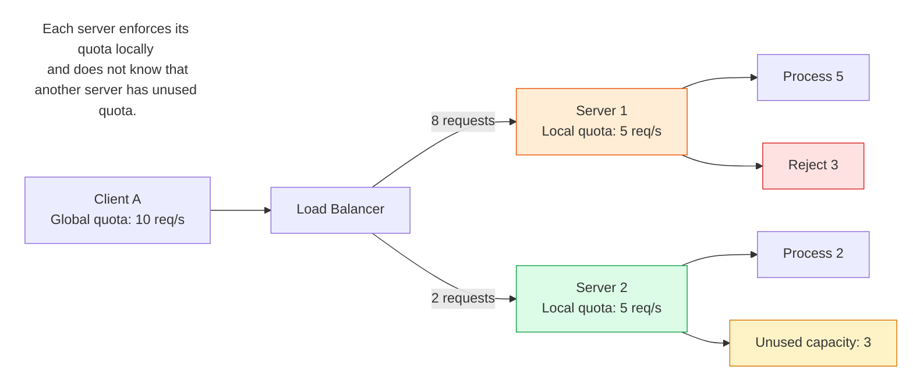
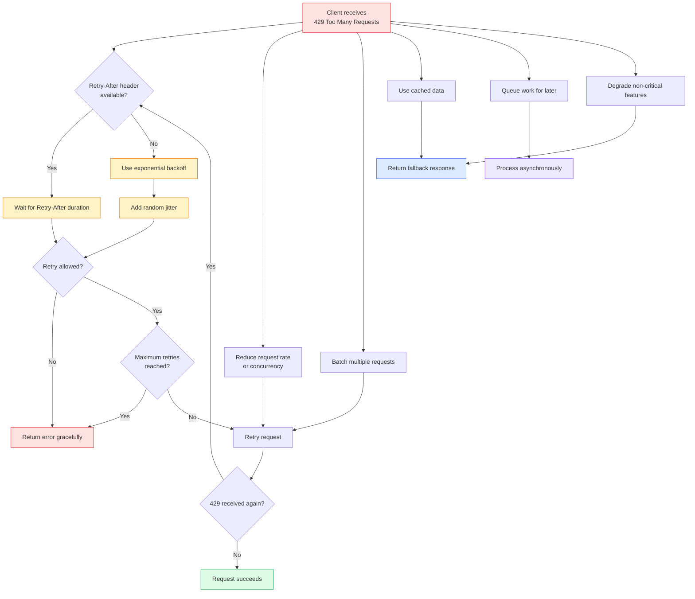

# Protection server :: (Throttling >> Rate limiting)
> Systems often implement both, starting with throttling and moving to rate limiting if capacity is still threatened
- https://academy.bytemonk.io/products/system-design-mastery-beta/categories/2158360644/posts/2190592399
- https://www.youtube.com/watch?v=_qNHROq0pGk | Overview
- https://youtube.com/watch?v=0yEeqggdQ9w | anthropic case study
- https://bytebytego.com/courses/system-design-interview/design-a-rate-limiter

---
## ️✔️Overview - Throttling
- **Slows down the rate of requests** by:
    - delaying them
    - or limiting processing resources,
- ,rather than **rejecting them outright**.
- Useful for maintaining service availability under heavy load,
- ensuring all requests are **eventually served**
- Type:
    - **Dynamic Throttling**: adjusts based on real-time metrics like CPU load
    - **Adaptive Throttling**: uses machine learning to predict spike


---
## ✔️Overview - Rate limiting
- Best place to implement is on : [📚API-gateway](02_api_02_apiGateway.md)
- Thresholds / **strict cap** on operations
  - ensuring that if a certain number of requests are exceeded within a given time frame.
  - Requests exceeding the limit are blocked or receive a `429` Too Many Requests error.
- safeguards systems, from: 
  - preventing brute-force attacks
  - Denial of Service (DoS) + DDOS
  
---  
## ✔️Rate limiting : Types/level
| Level            | Identified by               | Main purpose             |
| ---------------- | --------------------------- | ------------------------ |
| User-based       | User ID, API key, JWT       | Prevent individual abuse |
| Geographic-based | Country, region, IP range   | Control regional traffic |
| Server-based     | Service, instance, endpoint | Protect system capacity  |

### 1. user-based
- Limit requests per user, API key, client ID, or JWT subject.
- Example: `100 requests/minute per use`
- Use for: Preventing one user from abusing the API

### 2. geographic-based
- Limit traffic based on country, region, or CDN edge location.
- Example: `10,000 requests/minute from one region`
- Use for:
  - Controlling regional traffic spikes
  - Blocking or restricting unsupported locations


### 3. server-based
- Limit requests reaching a server, service, or endpoint
- Example: `5,000 requests/second per API server`
- Use for:
  - Preventing server overload
  - Maintaining system availability
---
## ✔️Rate Limiting : Algos (5)
### 1 Token bucket `(rate-limit)`
- bucket with token, refilled at interval  === **Refill rate**
- but with pre-defined capacity (to hold limited token)  === **Bucket size**
- have to tune these params well


---
### 2 Leaking bucket `(throttle)`
- no token thing.
- Bucket has **capacity** (to hold request)  === **Bucket size**
- bucket has **leak**, for constant rate processing === `FIFO queue`


---
### 3 Fixed window counter
- divides the timeline into fix-sized time windows 
- and assign a **threshold counter** ,  for each window
- Each request:
  - increments the counter by one.
  - NOT logging request-time 🔺
- Once the counter reaches the threshold, new requests are dropped **until a new time window starts.**
- problem:  **burst of traffic at the edges of time windows**
  - 

---
### 4 Sliding window log
- variation for above to fix that edge burst problem
- algo:
  - also **log** request-time, when any request comes.
  - when next window state, it clean-ups all logs older that interval (1 min)
  - this way we: 
    - start new window 
    - then slide it to left till time (last request in **log**)


---
## Noisy Neighbor Problem ⭐
### Overview
- https://academy.bytemonk.io/products/system-design-mastery-beta/categories/2159577489/posts/2195511825
- One workload should not be allowed to degrade everyone sharing the same infrastructure.
- A noisy neighbor occurs when one user, service, pod, or tenant consumes too many shared resources and slows down others.

```
One tenant spikes CPU / memory / DB connections
→ shared capacity gets exhausted
→ other tenants see high latency or failures
```

### Protection
- **Per-tenant rate limits**
- Resource quotas and Kubernetes limits
- Separate queues or worker pools
- Bulkheads
- Tenant isolation or dedicated resources for critical workloads

### local reinforcement of global quota
- Above **protection** does not handle non-uniform distribution by Load balance.


**Common solutions**
- Use **sticky routing** so a client consistently reaches the same server.
- Use a **centralized cache quota** store such as Redis.
  - or, distributed cache with consistent hashing
- Dynamically redistribute quota between servers.
- **Gossip protocol**, to share each other quota.

---
## what to do after 429
- **Retry** 
  - with exponential backoff + jitter 
  - stop after maximum retries
  - Retry only idempotent operations
- **Fallback Gracefully**
  - Cached data: return slightly stale data.
  - Queue for later: accept the request and process asynchronously.
  - Degrade: disable non-critical features or return a simpler response.
- **Batch Requests**: 
  - Combine multiple small requests into one request.



