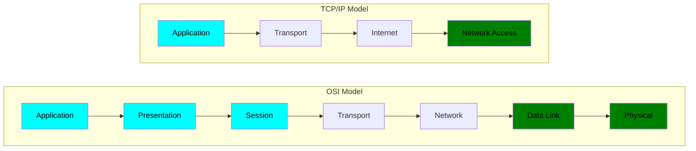
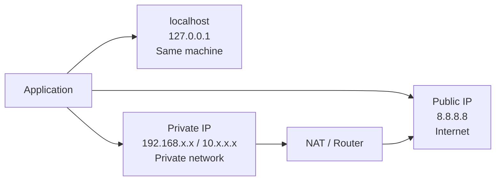
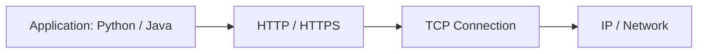
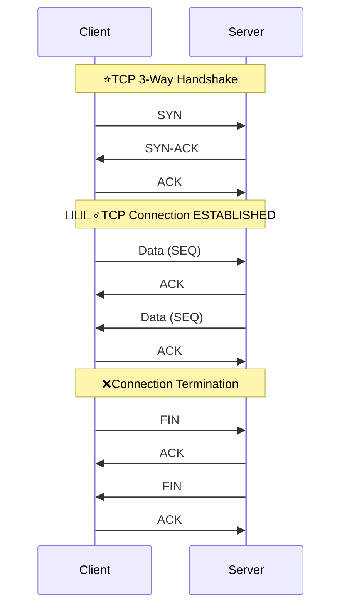
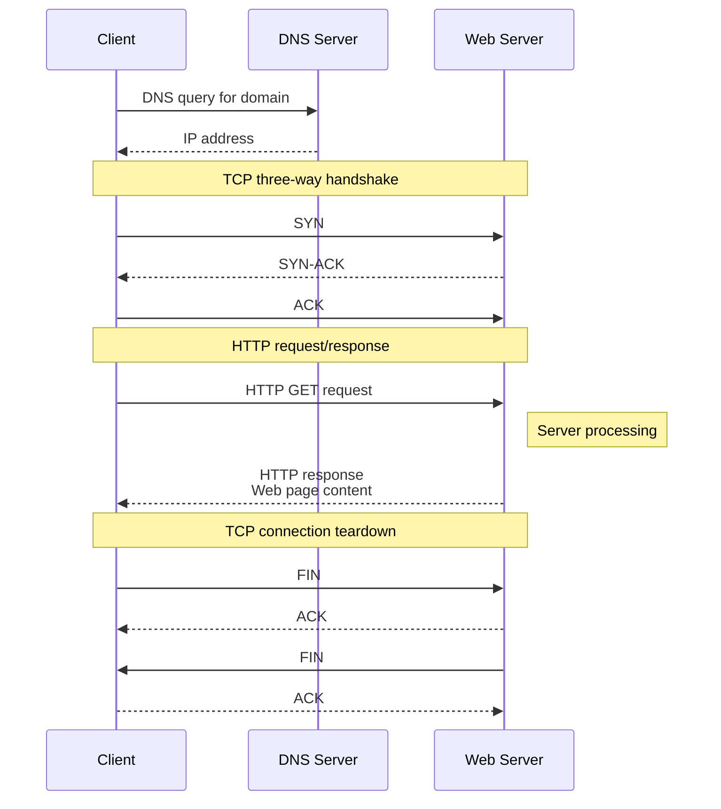

# Network - Essential protocols
## reference
- https://youtu.be/SHkbPm1Wrno | hi
- https://youtube.com/watch?v=tpgoQwMg__M | bm OSI
- https://youtube.com/watch?v=jQ6_XhsMwws | bm essential protocol
- [AWS :: networking complete guide](../../CE_02_AWS_SAA/04_network)

--- 
## Overview : OSI

```
Application   → HTTP,SMTP,TELNET/SSH, FTP,DNS request
Presentation  → TLS encryption, format (HTML,DOC,JPGG,etc)
Session       → communication/session management === SOCKET , RPC
Transport     → TCP or UDP "packet", source/destination ports
Network       → source/destination IP
Data Link     → source/destination MAC
Physical      → Wi-Fi/radio/cable bits, light pulses
```

| #     | Layer        | Main responsibility                                  | Common examples                 |
| ----- | ------------ | ---------------------------------------------------- |---------------------------------|
| **7** | Application  | Network services used by applications                | HTTP, HTTPS, DNS, SMTP, FTP     |
| **6** | Presentation | Data format, encoding, encryption, compression       | TLS/SSL, JSON, JPEG, UTF-8      |
| **5** | Session      | Establish/manage/close communication sessions        | RPC sessions, sockets concepts  |
| **4** | Transport    | End-to-end delivery, ports, reliability              | TCP , QUIC(Modern) , UDP        |
| **3** | Network      | IP addressing and routing                            | IPv4, IPv6, ICMP, routers       |
| **2** | Data Link    | Local-network delivery using MAC addresses           | Ethernet, Wi-Fi, switches, ARP* |
| **1** | Physical     | Transmits raw bits as electrical/radio/light signals | Cable, fiber, radio             |

> QUIC → transport protocol built on UDP that provides TCP-like reliability + TLS security with lower-latency connection setup.
>
> HTTP/3 → HTTP running on top of QUIC.


---
## TCP/IP vs OSI


---
## A.  ✔️Layer 3 : Network
### 1. IP
> IP by far the most common for system design interviews

- the protocol that handles routing and addressing.
- It's responsible for breaking the data into packets, handling packet forwarding between networks, and providing best-effort delivery to any destination IP address on the network. 
- Ipv4 (4.3 billion only)| Ipv6 (340 undecillion)
- OS is configured to switch over formats. socket.getHostByName('localhost') --> can resolve to ipv6 or ipv4
- **LocalHost**
    - localhost resolves to` 127.0.0.1/8` or `::1/8` (ipv6)| loopback interface
    - `c\:window\System32drivers\etc\host`


| Type                     | Example                        | What it means                                       |
| ------------------------ | ------------------------------ | --------------------------------------------------- |
| **Public IP**            | `8.8.8.8`, `104.26.9.238`      | Globally routable on the Internet                   |
| **Private IP**           | `192.168.1.1`, `192.168.1.100` | Used inside a private network such as your home/VPC |
| **Localhost / Loopback** | `127.0.0.1`                    | Refers back to the same machine                     |

**Dynamic Host Configuration Protocol (DHCP)**
- is a network management protocol used on Internet Protocol (IP) networks
- for automatically assigning IP addresses and other communication parameters to devices

### 2. InfiniBand
- which is used extensively for massive ML training workloads)

---
## B.  ✔️layer 4 : transport
> provide end-to-end communication services

```
    TCP = reliable pipe | UDP = Fast but Unreliable
    TLS = secure pipe
    HTTP = language spoken through the pipe
```
---
### 1. UDP (fast, but unreliable)
- best effort delivery, superfast, packet might get lost or unorder
- Browsers don't have widespread support for UDP, yet outside of **WebRTC**
```
Connectionless          : No handshake or connection setup 👈
No guarantee of delivery: Packets may be lost without notification
No ordering             : Packets may arrive in a different order than sent
Lower latency           : Less overhead means faster transmission

Dontt guarantee that a remote service will respond within a useful deadline
```
---
### 2. TCP (slow, reliable delivery)
> **QUIC** is a new protocol that aims to provide some of the same benefits of TCP with some modernization and performance benefits.

#### TCP connection
- TCP handshake
- TCP stateful connection  established | tunnel/stream
- TCP will ensure that recipients of messages acknowledge their receipt and, if they don't, will **retransmit** the message until it is acknowledged.

```
Connection-oriented : Establishes a dedicated connection before data transfer
Reliable delivery   : Guarantees that data arrives in order and without errors
Flow control        : Prevents overwhelming receivers with too much data
Congestion control  : Adapts to network congestion to prevent collapse
```
**Abstraction**
- http/https provides abstraction over TCP
- py, java, etc, all has lib to comm with http/https



#### TCP handshake⭐
- Connection starts with **3-way handshake**: SYN → SYN-ACK → ACK
- Identified by: Source IP + Source Port + Destination IP + Destination Port


---
### 3. QUIC

---
### 4. TCP vs UDP

| **Feature**        | **UDP**                      | **TCP**                                      |
| ------------------ | ---------------------------- | -------------------------------------------- |
| Connection         | Connectionless               | Connection-oriented                          |
| Reliability        | Best-effort delivery         | Reliable delivery                            |
| Ordering           | No ordering guarantee        | Maintains byte order                         |
| Flow Control       | No                           | Yes                                          |
| Congestion Control | No                           | Yes                                          |
| Header Size        | 8 bytes                      | 20–60 bytes                                  |
| Speed              | Usually lower overhead       | More overhead                                |
| Use Cases          | Streaming, gaming, VoIP, DNS | Web traffic, APIs, file transfer, email, SSH |


---
## C.  ✔️Layer 7: Application
### 1. DNS
- https://youtube.com/watch?v=Lsd80uR9Shs (skip)

---
### 2. HTTP/S
#### overview
- [http-evolution](../SD_08_API-Design/03_basic-concept/01_01_http-evolution.md)
- A stateless, text-based protocol commonly used for APIs, built on top of TCP
- HTTP connection : HTTP --> **TCP handshake**
- HTTPS connection : HTTP --> TCP handshake --> **TLS handshake**
    - Also **handshake/s takes time.**

#### connection-oriented
- between the client and server is a **state** that both the client and server must maintain.
- Unless we use features like **HTTP keep-alive or HTTP/2 multiplexing**,
- we need to repeat this connection setup process for every request,
- like, **short live stateless connection.** : open-close, open-close, ...


#### [TLS handshake⭐](../SD_24_security/03_protocol_https_tls.md)

#### [HTTP/S used over API ](../SD_08_API-Design)
While HTTP can be used directly to build websites,
- oftentimes system designs are concerned with the **communication between services via APIs.**
- 3 main API paradigms: `REST, GraphQL, and gRPC.`

---
### 4. stream protocols (TCP)
- [core concept :: socket](02_basic-concepts/01_concept_01_socket.md)
- [TCP based ](../SD_01_Foundation/05_IPC/02_01_streaming-sse.md#2-websocket--wss-) --> SSE + Websocket


---
### 5. video Streaming (UDP ?)
#### [ABS](../SD_01_Foundation/05_IPC/04_video-streaming.md#1-videos-streaming--abs)
#### [WebRTC⭐](../SD_01_Foundation/05_IPC/04_video-streaming.md#2-webrtc)