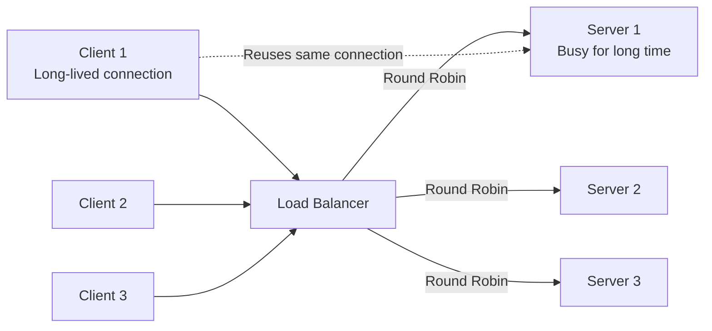
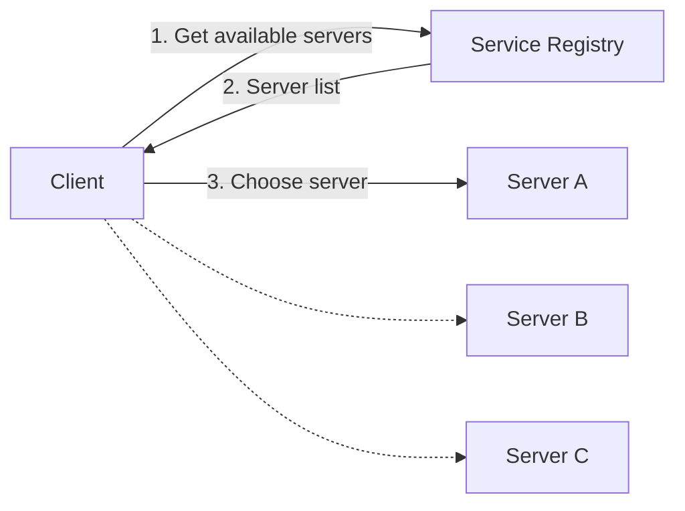
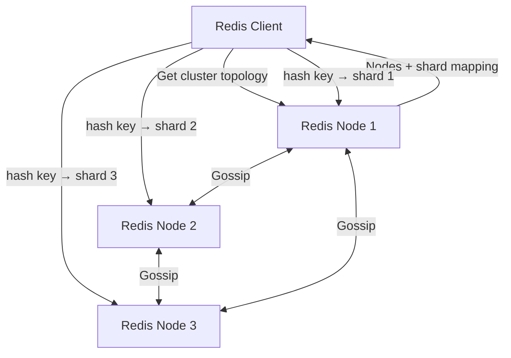
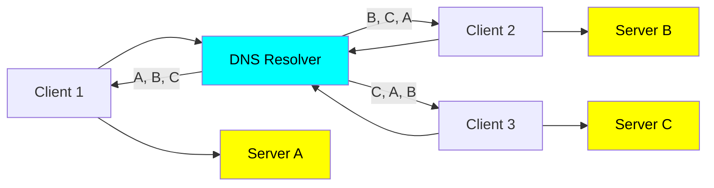
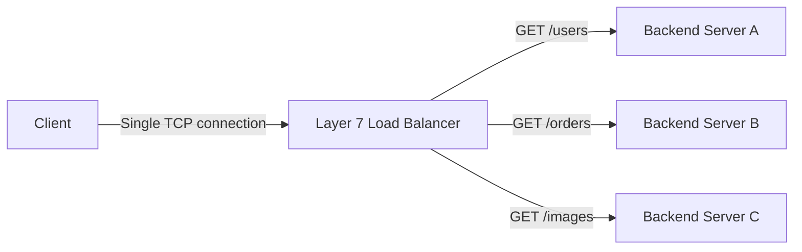

# Load balancer LB
## Reference
- https://academy.bytemonk.io/products/system-design-mastery-beta/categories/2158360644/posts/2190592578
- https://youtu.be/ZcNaOuxcuyA?si=9eTTSUfpUQzi112D bm 1
- https://www.youtube.com/watch?v=BWB-S0awDnA bm 2 | algorithm

## A. Overview
- **traffic cop** between clients and multiple servers
- **main job** is to evenly distribute client requests across available servers
- **continuously monitor** server 
  - availability and performance metric
  - redirecting traffic away from unhealthy servers until they recover.

| **Type**                   | **Examples**                                                      | **Description**                                                                                 |
| -------------------------- | ----------------------------------------------------------------- | ----------------------------------------------------------------------------------------------- |
| **Hardware Load Balancer** | F5 BIG-IP                                                         | Dedicated physical appliances designed specifically for high-performance traffic management     |
| **Software Load Balancer** | HAProxy, NGINX, Envoy                                             | Runs as software on servers/VMs/containers; flexible and commonly used in modern infrastructure |
| **Cloud Load Balancer**    | AWS ELB/ALB/NLB, Google Cloud Load Balancing, Azure Load Balancer | Fully managed load-balancing services provided by cloud platforms                               |

**Example**
- lb for frontend, 
- lb for backend-server
- lb for multi-DB reader instance
- lb for DNS server


---
## B. Algorithm / strategies

| **Algorithm**           | **How It Works**                                               | **Best For / Notes**                                 |
| ----------------------- | -------------------------------------------------------------- | ---------------------------------------------------- |
| **Round Robin**         | Sends requests sequentially across servers                     | Simple; good when servers have similar capacity      |
| **Random**              | Selects a server randomly for each request                     | Simple and often distributes load reasonably well    |
| **Least Connections**   | Sends traffic to the server with the fewest active connections | Good when requests have varying durations            |
| **Least Response Time** | Sends traffic to the server currently responding fastest       | Useful when backend performance varies               |
| **IP Hash**             | Hashes the client IP to consistently select a server           | Useful for **session persistence / sticky sessions** |


### B.1 Static
> round robin or random algorithm is appropriate, especially for stateless applications

#### Random
- Works well when All servers are identical in capacity and performance,
- and traffic is expected to be evenly distributed over time.
- **drawback** - Does not account for server load or capacity, 
  - potentially leading to uneven distribution,
  - slower server might still receive the same number of requests, causing delays.

#### Round Robin
- Distributes requests sequentially to each server in a loop.
- same drawback - Does not account for server load or capacity
- **variation-1: Weighted Round Robin** 
  - Similar to round-robin,
  - but assigns more requests/weight to more powerful servers.
- **variation-2: Sticky Round Robin**
  - if Applications requiring session consistency
  - eg: user browsing a shopping website
  - eg: user dashboard

> ⚠️ Problem: Round-robin balances new connections, not every request inside a persistent connection → can cause uneven load.



#### IP-based hashing
- Ensures requests from a specific client always go to the same server,
- useful for caching, session consistency
- hash(IP1) --> server-3
- hash(IP2) --> server-9
- ...


**URL Hashing**
- Similar to IP Hashing, but instead of the client's IP address, the URL path is hashed to decide the target server
- Works well for: Domain-specific workloads


---
### B.2 Dynamic
#### based on least connection
-  dynamic approach that routes incoming requests to the server with the fewest active connections

> For services that require a persistent connection (e.g. those serving SSE or WebSocket connections), 
> using Least Connections is a good idea because it avoids a situation where a single server gradually accumulates all of of the active connections

#### based on least response time (health)
- checks health 
- `dynamic algorithm` selects a servers, whose **average response**  was the lowest.


## C. Type
>Core idea:
> - Server-side LB: Client → Load Balancer → Server
> - Client-side LB: Client → discover servers → choose server directly

### Client Side



Advantages
- No extra load-balancer network hop
- Lower latency
- Client can choose based on locality, health, shard, etc.

Disadvantages
- More logic in the client
- Client must keep server information fresh

---
#### 💠Redix client example
 > The client learns the cluster topology, determines the shard for a key, and sends the request directly to the appropriate Redis node.

---
#### 💠kafka example
> Kafka uses client-side metadata-based routing, similar to redis
> - Producers and consumers learn cluster topology and communicate directly with the appropriate brokers,
> - avoiding a central request-level load balancer.

```
Producer → any broker: fetch metadata
Producer ← partition → leader mapping
Producer → correct leader broker directly
```
---
#### 💠 DNS
> Because each client gets a different ordering of IP addresses, 
> - they're also going to hit different servers. 
> - The DNS resolver is effectively doing client-side load balancing for us!


---
### Server-side dedicated LB
#### a. Layer 4 LB (fast)
feature:
- Layer 4 load balancers operate at the transport layer (TCP/UDP). 
- They make routing decisions based on network information like IP addresses and ports,
  - without looking at the actual content of the packets. 
- Maintain **persistent TCP connections** between client and server. 
  - hence, well-suited for protocols that require persistent connections, 
  - like WebSocket connections.
  
> - One TCP connection → one selected backend for the lifetime of that connection.
> - From the client/server point of view, it behaves almost as if the client had directly connected to Backend Server B in the first place.

use case:
- L4 load balancers are great for **WebSocket connections** and other protocols that require persistent connections.
- high-performance applications that don't require much application-level processing.

```
For example, if a client establishes a TCP connection through an L4 load balancer,
that same server will handle all subsequent requests within that TCP session
 
Client
   | 
   | TCP connection
   v
L4 Load Balancer
   |
   | chooses one backend
   v
Backend Server B

GET /users  ─────────> Backend B
GET /orders ─────────> Backend B
GET /images ─────────> Backend B

Whereas with L7, those HTTP requests could potentially be routed to different backends

Client ───── persistent TCP ─────► LB
                                  │
                                  └──── persistent TCP ─────► Server

```
---
#### b. Layer 7 LB
> L7 load balancing usually means two separate TCP connections: client↔LB and LB↔backend. 
> The LB adds a network hop and potentially connection overhead, but connection reuse/pooling minimizes the latency impact.

overview
- **Terminate** incoming connections and create **new ones** to backend servers.⭐
  - else do sticky-session, based on a cookie.
- examine the actual content of each request and make more intelligent routing |  (URL, headers, cookies, etc.) | flexible
- Client --> HTTPS --> L7 Load Balancer --> **HTTP (TLS termination)** --> Backend

**tradeoff**
- It requires more CPU/memory and adds more processing overhead than a Layer 4 load balancer.
- More CPU-intensive due to packet inspection.

**Overview**
- It can also terminate TLS/HTTPS
- Can route based on request content (URL, headers, cookies, etc.).
- So it supports **advanced routing**, for example:
  - /api/*     → API servers
  - /images/*  → Image servers
  - admin.com  → Admin servers
- 👉 client does not need to open a separate TCP connection to each backend
  - client can keep one TCP connection open to the Layer 7 load balancer, 
  - while the load balancer sends different HTTP requests from that connection to different backend servers


