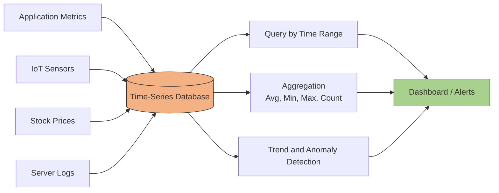

# NoSQL DB
- https://www.youtube.com/watch?v=6bZdMZb8xI8 | SQL
- https://academy.bytemonk.io/products/system-design-mastery-beta/categories/2158360645/posts/2190592401 | keyValue store

---
## overview
- no relation, no schema
- don't have a querying language
- only provide simple operations like get, put, and delete.

---
## A. key-value Store
> `dynamoDB (disk, eventual-consitency)`, `redix (inMemory)`, `Cassandra`, `apache ZooKeeper`
- one of the popular/simple NoSQL DB type.
- Stores data as a collection of key-value pairs, similar to a dictionary or map data structure.
    - key -> String. hashed to memoryLoc
    - value -> String, arrays, integer
- **flexible** due to their lack of imposed structure
- **Direct key-based access** leads to extremely fast **performance**. 
  - O(1)
  - offering low latency 
  - high throughput

| Use RDBMS when                             | Use Key-Value DB when                             |
|--------------------------------------------|---------------------------------------------------|
| Data has clear relationships               | Data is accessed mainly by a unique key           |
|                                            | data model is not **hierarchical**                |
| Complex joins are required                 | Joins are not required                            |
| Strong ACID transactions matter            | Very high throughput and low latency matter       |
| Schema is structured and stable            | Schema is flexible or values are opaque           |
| Complex filtering and reporting are needed | Simple `GET`, `PUT`, `DELETE` operations dominate |
| Example: banking, orders, inventory        | Example: sessions, carts, cache, user preferences |

---
## B. Specialized Store
### 1. BLOB Store

- Stores unstructured data like photos, audio, video files, and large text files.
- Behaves like key-value stores for data-access.
- **optimized for** :
  - Storing massive amounts of unstructured data 
  - storage classes option to save cost
  - highly scalable
  - reliable
  - available
- Examples: GCS,S3, Azure Blob Storage 
- [AWS_S3-1.md](../../CE_02_AWS_SAA/02_storage/03_S3-1.md)
- [AWS_S3-2.md](../../CE_02_AWS_SAA/02_storage/03_S3-2-more.md)

---
### 2. Time Series

**optimized for:**
  - for storing time-stamped data 
  - or events that occur at specific intervals (e.g., every millisecond).
  - high-volume sequential write

Example: `InfluxDB, dataDog, AWS CloudWatch, Prometheus`.

---
### 3. Graph DB
> A graph database traverses relationships directly instead of performing many joins.
- Built on a **graph data model** 
  - where relationships between data points are of prime importance.
  - datasets with many billions of interconnections
- **PGQL**
  - Simplifies complex queries 
  - and provides deeper insights into relationships with less effort
  - Excels at finding **shortest paths** between nodes
- Example: `Neo4j`

| Use case               | Why graph DB fits                      |
| ---------------------- | -------------------------------------- |
| Social networks        | Friends, followers, mutual connections |
| Recommendation systems | User → product → similar users         |
| Fraud detection        | Find suspicious relationship patterns  |
| Knowledge graphs       | Connect people, places, topics         |
| Network topology       | Servers, routers, dependencies         |
| Access control         | Users, roles, permissions              |

rdbms with lots of relation/s --> messy
