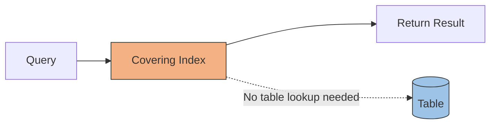
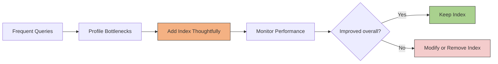

# Database Indexes
- https://academy.bytemonk.io/products/system-design-mastery-beta/categories/2158360645/posts/2193236998
- [http://youtube.com/post/Ugkx8-t9pQQqug7XlQCyEDpY2TGJtE1KuGPi?feature=shared](http://youtube.com/post/Ugkx8-t9pQQqug7XlQCyEDpY2TGJtE1KuGPi?feature=shared)

---
## Overview
> Index enough to make reads fast, but not so much that writes become slow and the database becomes bloated.
- An index is an additional data structure that helps the database locate rows faster without scanning the entire table.
- golden rule: index for query, not for table.
```
Without index: Full table scan → O(n)
With index:    Index lookup → usually O(log n)
```
## Types (by core data structure) 
| Index Type       | Structure              | Best for                          |
| ---------------- | ---------------------- | --------------------------------- |
| **B-Tree index** | Sorted tree            | `=`, `<`, `>`, `BETWEEN`, sorting |
| **Hash index**   | Hash table             | Exact `=` lookup                  |
| **Bitmap index** | Bitmaps                | Low-cardinality columns           |
| **GIN/GiST**     | Specialized structures | JSON, arrays, full-text, spatial  |

## Type (by creation)
- **primary** - on unique key, PK
- **secondary** - on additional col as per query need
- **GSI** on distributed DB


---
##  Types (by Specialized usecase)
| Index     | Main purpose                  |
| --------- | ----------------------------- |
| Unique    | Prevent duplicate values      |
| Full-text | Search words inside text      |
| Covering  | Avoid additional table lookup |

### Unique Index
- Ensures duplicate values cannot exist in the indexed column or column combination
- B-tree 

### Full-Text Index
- Optimized for searching words inside large text fields.
- not using b-tree
```sql
  CREATE INDEX idx_post_content
  ON posts
  USING GIN (to_tsvector('english', content));
```
### Covering Index
- index Contains all columns required by a query, 
- so the database may return the result directly from the index without reading the table

---
## Trade-off
Indexes improve read speed, but add cost:
- Extra storage
- Slower INSERT, UPDATE, DELETE
- Index maintenance and fragmentation

---
## when to create ✔️
- Columns used in WHERE
- Columns used in ORDER BY
- Columns used in JOIN / Foreign-key columns

## when to avoid ❔
| Situation                     | Why                                                                       |
| ----------------------------- | ------------------------------------------------------------------------- |
| **Small table**               | A full table scan may be faster than reading the index and then the table |
| **Low selectivity column**    | The value matches too many rows, so the index provides little benefit     |
| **Rarely queried column**     | Write and storage overhead are not justified                              |
| **Frequently updated column** | Every update may require index maintenance                                |

---
## Practical approach
1. Identify frequently executed queries
2. Profile them using EXPLAIN ANALYZE
3. Add indexes only where needed
4. Monitor read and write performance
5. Remove unused or duplicate indexes


---

