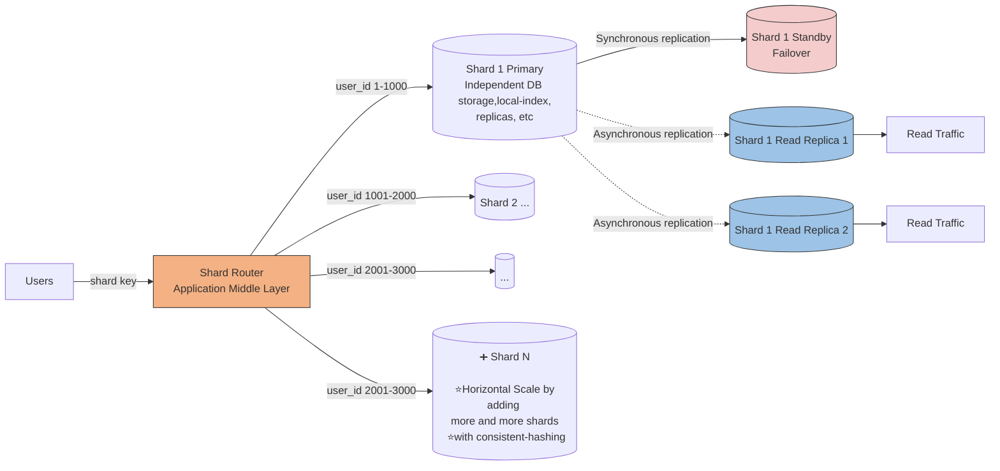
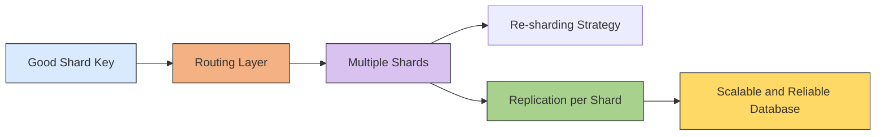

# Sharding
- [https://academy.bytemonk.io/products/system-design-mastery-beta/categories/2158360645/posts/2192332143](https://academy.bytemonk.io/products/system-design-mastery-beta/categories/2158360645/posts/2192332143)
> first component is system is DB, who needs scaling
---
## Overview
- Horizontal scaling (both read / write) of DB.
- Sharding = **horizontal** partitioning across **multiple database servers**.
- each shard is **independent Database server** with its own replication, index,etc
```
Partitioning → split data
Sharding     → place those partitions on different servers
```

**Highly available + fault-tolerant (replicas) + scalable (with consistent-hashing)**


## Choosing a good shard key.
Good shard key:
- evenly distributes data
- evenly distributes traffic
- supports common query patterns
- key should not change, else end up moving data across shards.

eg: **user_id - account ids - region identifier**

---
## Challenges
| Challenge   (Set-1)          |                                                                                                                                   |
|------------------------------| -------------------------------------------------------------------------------------------------------------------------------------------- |
| **Cross-shard transactions** | A transaction touching multiple shards may require distributed protocols such as two-phase commit, increasing latency and failure complexity |
| **Global secondary indexes** | Maintaining one searchable index across all shards requires coordination and can become expensive                                            |
| **Monitoring**               | Every shard must be monitored separately because load, storage, replication lag, and latency can vary                                        |

| Challenge (Set-2)            |                                                                 |
|------------------------------| --------------------------------------------------------------------- |
| **Hot shard**                | One shard receives most requests and becomes the bottleneck           |
| **Cross-shard queries**      | Requires scatter-gather across multiple databases                     |
| **Cross-shard joins**        | Expensive and difficult; often handled in application code            |
| **Rebalancing**              | Moving data when adding or removing shards is operationally expensive |
| **Failure handling**         | Each shard needs replicas, backups, monitoring, and failover          |
| **Routing complexity**       | Router must always know the correct shard mapping                     |

---
## Sharding Summary
1. Choose a strong shard key
2. Build a reliable routing layer
3. Plan for re-sharding
4. Combine sharding with replication


