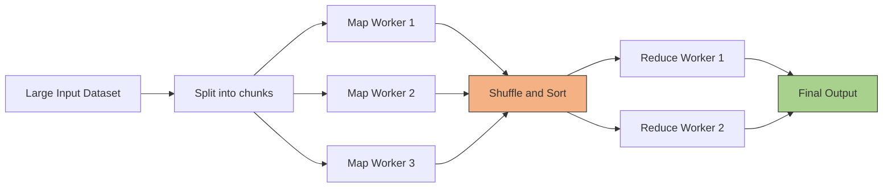
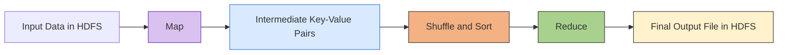
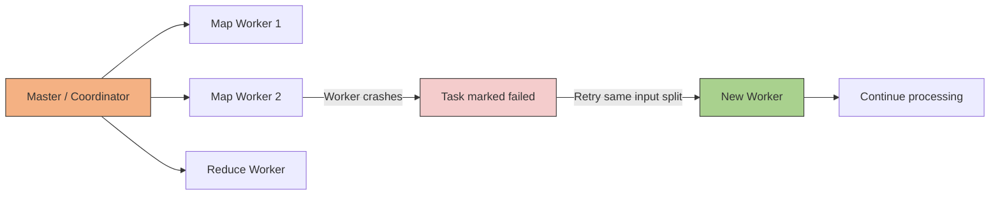
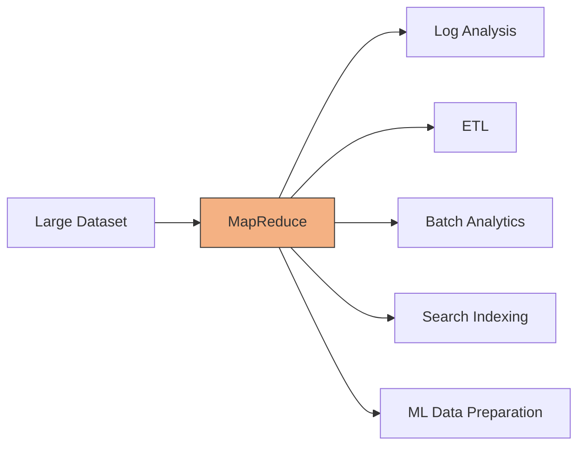
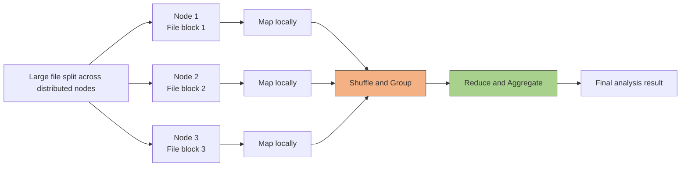

# Maps-reduce Framework
- https://academy.bytemonk.io/products/system-design-mastery-beta/categories/2158360645/posts/2190592402
- https://static.googleusercontent.com/media/research.google.com/en//archive/mapreduce-osdi04.pdf

---
## History
Google 2012:
- Faced the challenge of **processing huge volumes** of data collected 24/7
- **MapReduce** helps to **process massive distributed datasets** efficiently + **fault-tolerant manner**
- library implementations MapReduce `Hadoop, spark, pySpark`

---
## Overview
- Best for: batch processing, log analysis, aggregations, indexing, and large-scale ETL.
- MapReduce is a **distributed processing model** for handling very large datasets across many machines.


| Phase                | Purpose                                                     |
|----------------------| ----------------------------------------------------------- |
| **Map**  `idempotent`  | Process input records and emit intermediate key-value pairs |
| **Shuffle and Sort** | Group all values belonging to the same key                  |
| **Reduce**   `idempotent`        | Aggregate grouped values into final results                 |

```
Input: "hello world hello"

Map:
(hello, 1)
(world, 1)
(hello, 1)

Shuffle:
hello → [1, 1]
world → [1]

Reduce:
hello → 2
world → 1
```

---
## Fault Tolerance 
Model handles machine failures or network partitions
- Map and Reduce operations should ideally be deterministic and **idempotent**:
- hence, can reprocess them with new worker.


---
## key concepts
Distributed File System / cluster: 
- Assumes data is split into chunks, 
- replicated, and spread across many machines

Central Controller / coordinator: 
- A central component in the distributed file system 
- that knows where data chunks reside 
- and communicates with all machines

Map worker/s
- Map functions operate on data **locally**, 
- meaning map programs are sent to each node.
- instead of moving large datasets
- result into  intermediary key-value structure

Reduce worker/s
- Key-Value Structure are crucial for the reduce phase 
- allowing for commonalities and patterns to be identified and reduced

---
## Use cases
> NOT low-latency real-time processing.

| Use case                       | Example                                               |
| ------------------------------ | ----------------------------------------------------- |
| Large-scale log processing     | Count errors by service, region, or hour              |
| Word or event counting         | Count words, clicks, views, or transactions           |
| ETL and data transformation    | Clean and aggregate raw files before loading          |
| Search indexing                | Build inverted indexes for documents                  |
| Reporting and analytics        | Calculate daily sales, averages, totals               |
| Machine learning preprocessing | Prepare and aggregate huge training datasets          |
| Graph processing               | Compute links, connections, or PageRank-style metrics |




