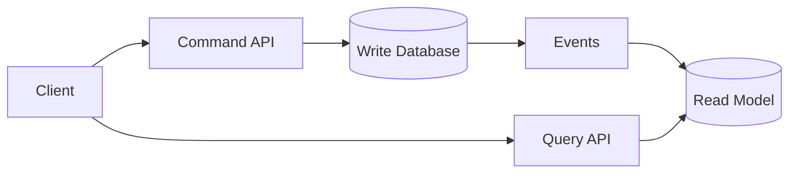
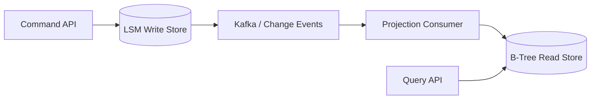

# CQRS
## Overview
Use it when:
- Reads and writes have very different scaling needs
- Read queries require heavy joins
- Domain rules are complex
- Different databases suit reads and writes
- Event-driven architecture already exists
  - Events must handle retries, ordering, and duplicates

Avoid it for simple CRUD systems because it adds :
- synchronization, 
- **eventual consistency,** 👈
- and operational complexity.
  

Example:
