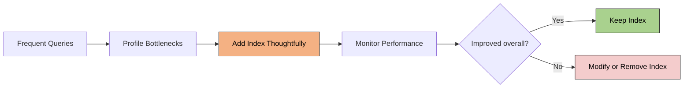
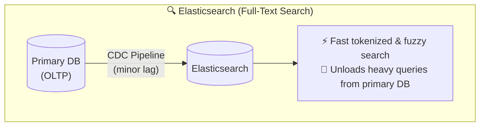
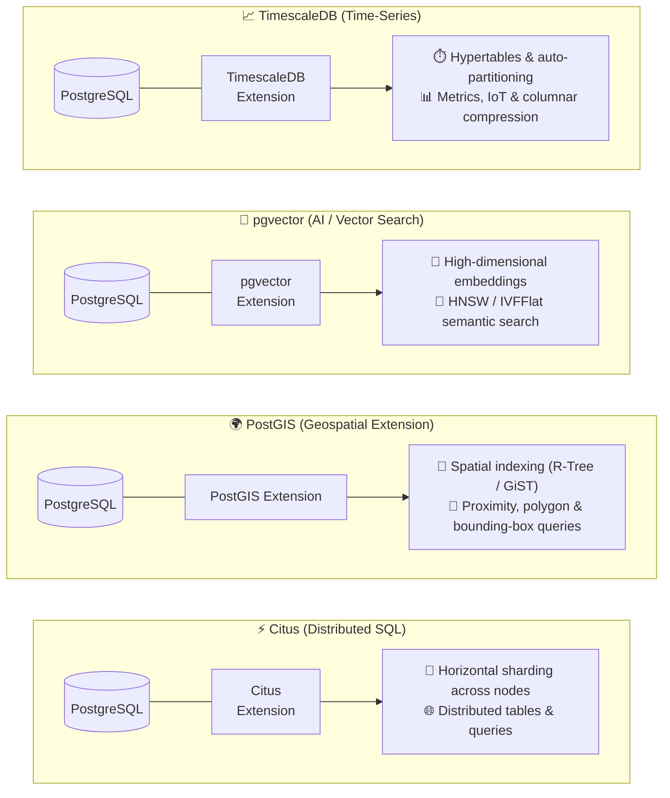
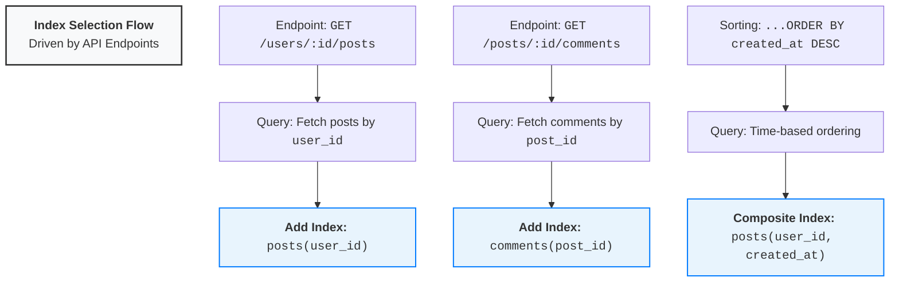

# Database Indexes
## Reference
- https://academy.bytemonk.io/products/system-design-mastery-beta/categories/2158360645/posts/2193236998
- [http://youtube.com/post/Ugkx8-t9pQQqug7XlQCyEDpY2TGJtE1KuGPi?feature=shared](http://youtube.com/post/Ugkx8-t9pQQqug7XlQCyEDpY2TGJtE1KuGPi?feature=shared)
- https://www.hellointerview.com/learn/courses/system-design/lesson/foundations/db-indexing

---
## Overview
> golden rule: index for query, not for table.

**Database performance**
- Database performance can make or break modern applications
- Modern databases have optimizations like **prefetching and caching** to make random access faster, but the point here still stands.
    - It's **too slow to scan** through every page of data sequentially.
- **Random access** vs **sequential access**
- system with SSD vs System with HDD
- core problem : Significant speed difference between RAM and disk storage with disks being much slower `100000 times`

**Index:**
- An index is an additional data structure that helps the database locate rows faster without scanning the entire table.
- in an interview, you'll typically want to **callout which columns are indexed and why**.

```
Without index: Full table scan → O(n)
With index:    Index lookup → usually O(log n)
```
**example**
```
Index on posts.user_id to quickly find all posts by a user
Index on posts.created_at to load recent posts chronologically
Composite index on (user_id, created_at) to efficiently load a user's recent posts
```
---
## when to create ✔️
- Columns used in WHERE
- Columns used in ORDER BY
- Columns used in JOIN / Foreign-key columns

## when to avoid ❔
| Situation                     | Why                                                                       |
| ----------------------------- | ------------------------------------------------------------------------- |
| **Small table**               | A full table scan may be faster than reading the index and then the table |
| **Low selectivity column**    | The value matches too many rows, so the index provides little benefit     |
| **Rarely queried column**     | Write and storage overhead are not justified                              |
| **Frequently updated column** | Every update may require index maintenance                                |

---
## Trade-off
Indexes improve read speed, but add cost:
- Extra storage ( sometimes nearly as much as the original data.)
- Slower INSERT, UPDATE, DELETE
- Index maintenance and fragmentation

it's still a good idea to closely monitor index usage and avoid creating unnecessary indexes that don't provide significant benefits.


**Practical approach**
1. Identify frequently executed queries
2. Profile them using EXPLAIN ANALYZE
3. Add indexes only where needed
4. Monitor read and write performance
5. Remove unused or duplicate indexes

## Type
- **primary** - on unique key, PK
- **secondary** - on additional col as per query need
- **GSI** on distributed DB


---
## indexes::Data structure
[01_design_03_indexes-2.md](01_04_indexes-2.md)

---
## External systems and extensions⭐
**Elasticsearch**
- primary database > CDC (will add some lag) > Elasticsearch (for full-text search)
- but worth lets you search in ways your main database can't handle.



**Postgres Extension**




---

## Interview 
Tip-1 : 
- connect your indexes directly to your API endpoints.
- shows you're thinking about real query performance.
- identify which columns belong in `WHERE` and `ORDER BY`



